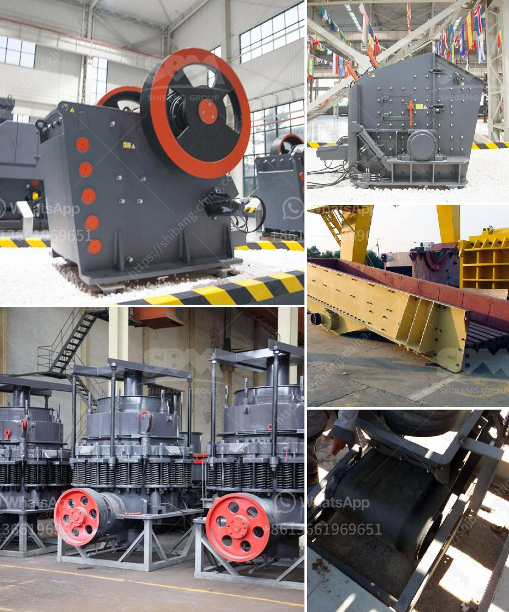

<h3>معدات التعدين لإنتاج الحجر الجيري للبيع</h3>
تعتبر معدات التعدين أدوات وآليات حاسمة لإنتاج الحجر الجيري، وهي تسهم في الحفاظ على جودة المنتج ورفع الإنتاجية وتحقيق الربحية. تشتمل هذه المعدات على مجموعة واسعة من الأدوات الميكانيكية والآليات المختلفة، سواء كانت ثقيلة أو خفيفة، وتستخدم في عمليات التنقيب والتعدين والتكسير والفرز والنقل.

أحد أهم المعدات في عمليات إنتاج الحجر الجيري هو الكسارة. تتوفر الكسارات بأحجام وأنواع مختلفة، ويتم تحديد الكسارة المناسبة بناءً على حجم الحجر الجيري المطلوب ومعدل التكسير المطلوب. تعمل الكسارات على تجزئة الصخور الكبيرة إلى قطع صغيرة من الحجم المطلوب للطحن والتكسير اللاحق.

بالإضافة إلى ذلك، يستخدم معدات التعدين المختلفة للتعامل مع عمليات تكسير وفرز الحجر الجيري المكسر كالغرابيل والناقلات. الغرابيل تهتز وتفرز الحجر الجيري وفقًا لحجم الجزيئات المطلوبة، في حين يتم استخدام الناقلات لنقل الحجر الجيري المكسر إلى المراحل التالية من العملية الإنتاجية.

بالإضافة إلى المعدات الميكانيكية، تشمل معدات التعدين أيضًا المعدات الكهربائية والإلكترونية. وتعتبر هذه المعدات مهمة جداً في ضمان تشغيل مستدام للمعدات الميكانيكية ورفع الإنتاجية. تشمل هذه المعدات لوحات التحكم والمفاتيح الكهربائية والأسلاك والكابلات وفرامل الطواحين وأجهزة الاستشعار وغيرها.

في النهاية، يمكن القول إن معدات التعدين هي العنصر الأساسي لإنتاج الحجر الجيري بجودة عالية وتحسين كفاءة العملية الإنتاجية. وتختار الشركات المتخصصة في صناعة الحجر الجيري معداتها بعناية تامة لضمان تلبية احتياجات العملاء وتحقيق أعلى معايير الجودة والأمان والاقتصاد. بفضل هذه المعدات المتطورة والمبتكرة، تزدهر صناعة الحجر الجيري وتستمر في تلبية الطلب المتزايد على هذا المواد الأساسية في البناء والصناعة.
<h3>Contact us</h3><ul><li><strong>Whatsapp:&nbsp;<a href="https://wa.me/8613661969651">+8613661969651</a></strong></li><li><a href="https://swt.shibang-china.com/?git&amp;zhl&amp;معدات التعدين لإنتاج الحجر الجيري للبيع"><strong>Online Service(chat now)</strong></a></li></ul><h3>Related</h3><ul><li><a href='الطحن بالكرات يعتمد على ماذا.md'>الطحن بالكرات يعتمد على ماذا</a></li><li><a href='تجهيزات تعدين الفحم للبيع في ألمانيا.md'>تجهيزات تعدين الفحم للبيع في ألمانيا</a></li><li><a href='آلات كسارة الحجر في هولندا.md'>آلات كسارة الحجر في هولندا</a></li><li><a href='مصنع زينيث للسحق.md'>مصنع زينيث للسحق</a></li><li><a href='مصنع معدات التعدين للذهب.md'>مصنع معدات التعدين للذهب</a></li></ul>