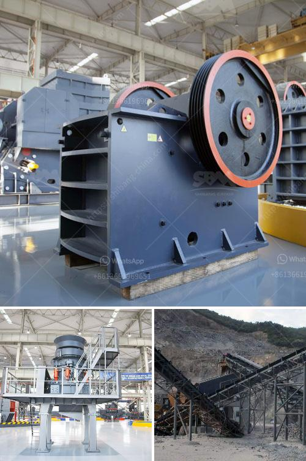

<h3>معدات التعويم للتعدين للبيع في جنوب أفريقيا</h3>
تُعد معدات التعويم من أهم الأدوات المستخدمة في صناعة التعدين، وتجد في جنوب أفريقيا مجموعة واسعة من هذه المعدات المتوفرة للبيع. تعد جنوب أفريقيا بلدًا غنيًا بالمعادن، حيث يتم استخراج العديد من الموارد الثمينة مثل الذهب والفحم والألماس والبلاتين والفوسفات والفاناديوم. ولتحقيق أقصى استفادة من هذه الموارد، يتطلب التعدين استخدام معدات متطورة وفعالة لتعويم واستخلاص المعادن من الصخور والمواد الأخرى.

تشمل معدات التعويم المتوفرة للبيع في جنوب أفريقيا مصافي التعويم (Flotation Cells) وآلات الفصل الجاذبية (Gravity Separators) ومجمعات الفقاعات (Bubble Generators) ونظم التحكم بالفقاعات (Bubble Control Systems) ومجمعات الزيوت (Oil Collectors). تتميز هذه المعدات بالقدرة على فصل المعادن المستهدفة من الصخور والمواد الغير مرغوب فيها، وهو ما يُعرف بعملية التعويم. تتضمن عملية التعويم إعداد المواد المعدنية المستهدفة عن طريق طحنها وتكسيرها، ثم إضافة المواد الكيميائية التي تُساعد في الفصل.

من المهم أن يتم تصنيع معدات التعويم وفقًا لمعايير عالية الجودة وتتوافر بتصميمات متقدمة تعزز كفاءتها وفاعليتها. يتجه المُشترين إلى الابتعاد عن المعدات غير القياسية وغير المجربة، ويفضلون الاعتماد على أجهزة مثبَتة بمجموعات نظام تحكم مبتكرة. هذا يعني أن الشركات المُصنعة تقدِم معدات ذات قيمة مضافة وتُركز على تلبية احتياجات العميل الفريدة.

ومن الجدير بالذكر أن جنوب أفريقيا توفر أيضًا خدمات ما بعد البيع المثلى لهذه المعدات. عند شراء معدات التعويم، يحتاج المشتري إلى الاهتمام بضمان الصيانة الدورية بواسطة مهندسين ذوي خبرة، فضلاً عن توفير قطع الغيار الأصلية. يُعتبر الحصول على الدعم الفني المطلوب جزءًا هامًا من الاستثمار الناجح في التعدين.

في الختام، تُعد معدات التعويم من الأدوات الحيوية لصناعة التعدين في جنوب أفريقيا. تتراوح معدات التعويم المتاحة للبيع في هذا البلد بين المصافي التعويم وآلات الفصل الجاذبية ومجمعات الفقاعات ونظم التحكم بالفقاعات ومجمعات الزيوت. يجب أن تتوفر معدات عالية الجودة وتحتوي على تقنيات حديثة لتلبية احتياجات صناعة التعدين في جنوب أفريقيا.
<h3>Contact us</h3><ul><li><strong>Whatsapp:&nbsp;<a href="https://wa.me/8613661969651">+8613661969651</a></strong></li><li><a href="https://swt.shibang-china.com/?git&amp;zhl&amp;معدات التعويم للتعدين للبيع في جنوب أفريقيا"><strong>Online Service(chat now)</strong></a></li></ul><h3>Related</h3><ul><li><a href='مصنع طحن الفحم من النوع الأسطواني.md'>مصنع طحن الفحم من النوع الأسطواني</a></li><li><a href='خطة عمل لإنتاج الطوب.md'>خطة عمل لإنتاج الطوب</a></li><li><a href='آلة طحن السلاغ الفرن العالي في الهند.md'>آلة طحن السلاغ الفرن العالي في الهند</a></li><li><a href='صيغة حساب قدرة كسارة الفك.md'>صيغة حساب قدرة كسارة الفك</a></li><li><a href='استئجار سير ناقل.md'>استئجار سير ناقل</a></li></ul>