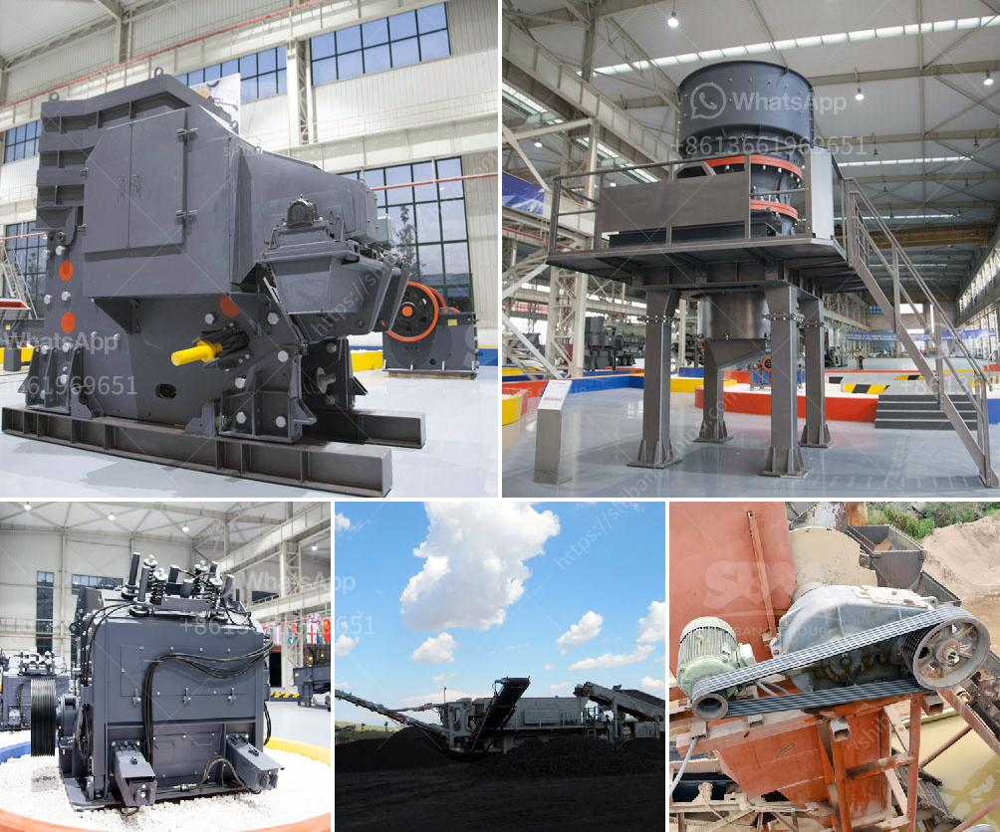

<h3>معدات الطحن بالكرات ووسائط الطحن</h3>
معدات الطحن بالكرات ووسائط الطحن هي أدوات هامة في صناعة الطحن وتستخدم على نطاق واسع في مجموعة متنوعة من التطبيقات الصناعية مثل صناعة المعادن والتعدين والكيماويات والمواد الغذائية. تهدف هذه المعدات إلى سحق المواد الخام إلى حجم أصغر وتحقيق الاستفادة القصوى من المواد المستخدمة.

واحدة من أهم العناصر في معدات الطحن بالكرات هي الكرات المستخدمة في عملية الطحن. تتراوح حجمات الكرات بين 1 إلى 50 ملم تقريبًا وتختلف حسب نوع المادة التي يتم طحنها. عادةً ما تكون الكرات مصنوعة من المعدن مثل الصلب أو الفولاذ، ولكن يمكن أيضًا أن تكون مصنوعة من المواد الأخرى مثل السيراميك أو الزجاج. تعتبر الكرات من وسائط الطحن الفعالة نظرًا لقدرتها على تكسير المواد الخام بفعالية وتحقيق طحن دقيق.

تعمل معدات الطحن بالكرات عن طريق إدخال المواد الخام إلى جهاز الطحن، والذي يحتوي على كرات داخله. عندما يتم تشغيل جهاز الطحن، تتحرك الكرات في داخله وتتصادم بسطح المادة الخام الموجودة. هذا التصادم يعمل على كسر المادة الخام وتحويلها إلى حجم أصغر. يتم تكسير المواد الخام بواسطة هذه الكرات بفضل قوة الاحتكاك والصدمة الناتجة عن حركتها السريعة وتصادمها المتكرر.

بالإضافة إلى الكرات، يستخدم العديد من معدات الطحن أيضًا وسائط الطحن الأخرى. تشمل هذه الوسائط الكرات المعدنية الأخرى مثل القضبان والأسطوانات، بالإضافة إلى الخرز والحبيبات الأخرى المصنوعة من المواد مثل السيراميك أو الزجاج. تستخدم هذه الوسائط الأخرى لأغراض محددة مثل السحق الدقيق للمواد الحساسة أو الحصول على تأثير طحن مختلف.

يتم اختيار نوع وكمية وسائط الطحن الصحيحة وفقًا لنوع المادة التي يتم طحنها وحجم الجسيمات النهائي المطلوب. بالإضافة إلى ذلك، يمكن ضبط عوامل أخرى مثل سرعة الطحن وزمن الطحن وحجم الجهاز لتحقيق أداء طحن مثلى.

إن معدات الطحن بالكرات ووسائط الطحن تلعب دورًا حاسمًا في صناعة الطحن. فهي تساعد في زيادة كفاءة عملية الطحن وتوفير الزمن والجهد. هذه المعدات ليست مهمة فقط في صناعة المعادن والتعدين، ولكنها أيضًا مهمة في الصناعات الكيماوية والغذائية وغيرها. إن استخدام معدات الطحن بالكرات ووسائط الطحن المناسبة يمكن أن يحسن التحكم في الحجم وتحسين جودة المنتجات النهائية.
<h3>Contact us</h3><ul><li><strong>Whatsapp:&nbsp;<a href="https://wa.me/8613661969651">+8613661969651</a></strong></li><li><a href="https://swt.shibang-china.com/?git&amp;zhl&amp;معدات الطحن بالكرات ووسائط الطحن"><strong>Online Service(chat now)</strong></a></li></ul><h3>Related</h3><ul><li><a href='عمليات كسارة وغسل الحجر.md'>عمليات كسارة وغسل الحجر</a></li><li><a href='معدات طحن في أستراليا.md'>معدات طحن في أستراليا</a></li><li><a href='ورقة تدفق معالجة الحجر الجيري.md'>ورقة تدفق معالجة الحجر الجيري</a></li><li><a href='سعر مطاحن الكرة.md'>سعر مطاحن الكرة</a></li><li><a href='عرض مصنع معالجة الجير.md'>عرض مصنع معالجة الجير</a></li></ul>