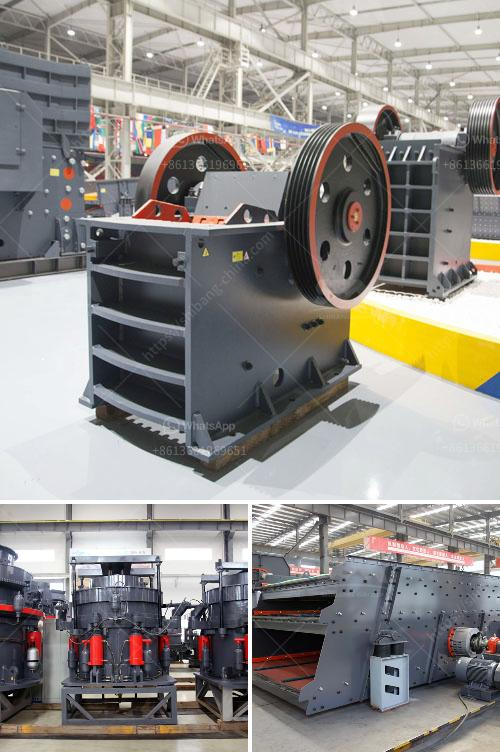

<h3>معدات الطحن والفرز للرمل والحصى</h3>
تعتبر معدات الطحن والفرز للرمل والحصى من الأدوات المهمة في صناعة البناء والإنشاءات. تستخدم هذه المعدات لفصل الرمل والحصى من الشوائب والأتربة والمواد العضوية الأخرى الموجودة بها، وتحويلها إلى مواد خام قابلة للاستخدام في البناء والأعمال الإنشائية.

يتم استخدام معدات الطحن والفرز للرمل والحصى في محاجر الحجر والمناجم ومحطات تكسير وغربلة الصخور. وتتضمن هذه المعدات مجموعة من الآلات المختلفة مثل الكسارات والغرابيل والمصافي والناقلات. تساهم هذه المعدات في تحسين جودة وتوزيع الكسارات وأحجامها وخصائص المنتج، بحيث يتم الحصول على مواد بناء عالية الجودة ومطابقة للمواصفات المطلوبة.

تعتبر الكسارات من أهم مكونات معدات الطحن والفرز، حيث تستخدم لتكسير الحجارة الكبيرة إلى أحجام صغيرة تسهل عملية الفرز والتحميل. تتميز الكسارات بالقدرة على تحمل الضغوط العالية وتوفير الطاقة والكفاءة العالية، وتتوفر بأنواع مختلفة مثل الكسارات الفكية والكسارات التصادمية والكسارات المخروطية.

الغرابيل هي معدات تستخدم لفصل الرمل والحصى من الشوائب وفقًا لأحجامها ومواصفاتها. يتم تصنيف الحصى والرمل إلى أحجام مختلفة باستخدام شبكات الغربلة الموجودة في الغرابيل، حيث تسمح هذه الشبكات بمرور الجسيمات ذات الأحجام المطلوبة وعدم مرور الجسيمات الأكبر أو الأصغر. توفر الغرابيل طريقة فعالة لفرز المواد بسرعة ودقة عالية وفقًا للاحتياجات المطلوبة.

تشمل المصافي والناقلات أيضًا جزءًا هامًا من معدات الطحن والفرز. تستخدم المصافي لفصل الرمل والحصى من بعضهما البعض وإزالة الأتربة والترسبات العضوية الأخرى. وتساعد الناقلات في نقل المواد من مرحلة إلى أخرى بطريقة سهلة وآمنة وفقًا للتدفق اللازم.

معدات الطحن والفرز للرمل والحصى تلعب دوراً حاسمًا في تحسين جودة المنتجات وزيادة كفاءة وسرعة الإنتاج. تجعل هذه المعدات العملية أكثر فعالية واقتصادية، وتسهم في تلبية الاحتياجات المتنوعة لقطاع البناء والإنشاءات. ومع الاهتمام المتزايد بجودة البناء والأعمال الإنشائية، يعتبر استخدام معدات الطحن والفرز ضروريًا للحصول على مواد بناء عالية الجودة ومطابقة للمواصفات المطلوبة.
<h3>Contact us</h3><ul><li><strong>Whatsapp:&nbsp;<a href="https://wa.me/8613661969651">+8613661969651</a></strong></li><li><a href="https://swt.shibang-china.com/?git&amp;zhl&amp;معدات الطحن والفرز للرمل والحصى"><strong>Online Service(chat now)</strong></a></li></ul><h3>Related</h3><ul><li><a href='شاشة تصنيف اهتزازية.md'>شاشة تصنيف اهتزازية</a></li><li><a href='محطم الحجر الجيري روتور.md'>محطم الحجر الجيري روتور</a></li><li><a href='صيانة مطحنة ريموند.md'>صيانة مطحنة ريموند</a></li><li><a href='كسارة الحجر ديربان.md'>كسارة الحجر ديربان</a></li><li><a href='عملية تصنيع كسارة الطين.md'>عملية تصنيع كسارة الطين</a></li></ul>