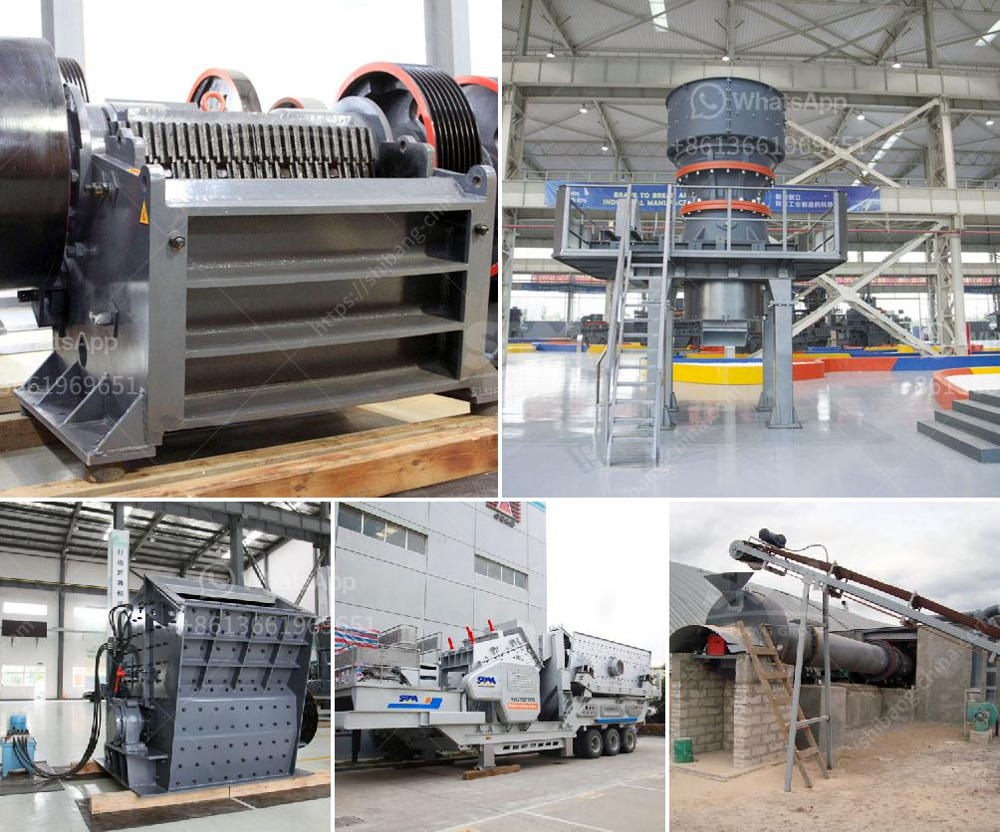

<h3>معدات الطحن</h3>
تعد معدات الطحن أحد أهم الأدوات المستخدمة في صناعة الغذاء والمواد الخام. فهي تستخدم لتحويل المواد الخام إلى مسحوق أو جسيمات صغيرة بحجم محدد. تستخدم هذه المعدات في عدة صناعات مثل صناعة الحبوب، والصناعات الكيماوية، والصيدلانية، وصناعة البلاستيك وغيرها.

تشمل معدات الطحن التقليدية المستخدمة في الماضي المطاحن اليدوية والحجارة الرحى. ولكن مع التطور التكنولوجي، ظهرت معدات طحن أكثر تقدما. فمن بين هذه المعدات، المطاحن الحديثة، وطواحين الكرة، والمطاحن العمودية، ومطاحن الأسطوانات.

تتميز المطاحن الحديثة بكفاءتها العالية وسرعة الطحن، حيث تستخدم قوة المحرك لتدوير الشفرات أو الأسطوانات بقوة عالية لتكسير المواد. وتتطلب هذه المطاحن أيضًا معرفة دقيقة لتجنب تدمير المواد الهشة أو إحداث أي تغيير في الخواص الفيزيائية للمواد.

أما طواحين الكرة، فهي تستخدم كروية معدنية تدور في وعاء، وبفعل قوة الاحتكاك المتولدة طحن المواد الموجودة بداخلها. طواحين الكرة تستخدم على نطاق واسع في صناعة الأسمدة والزجاج وصناعة الطلاء، وتعمل على طحن المواد إلى حجم نهائي دقيق.

أما المطاحن العمودية فهي طاحونة قائمة عمودياً وتعمل عن طريق تدوير الأسطوانة حول محور رأسي. تستخدم في صناعة الاسمنت والمواد الكيميائية حيث تطحن المواد إلى مسحوق دقيق.

وتعتبر مطاحن الأسطوانات من أكثر المطاحن استخدامًا، حيث تستخدم لطحن الحبوب والبن والتوابل والسكر والملح وغيرها من المواد الغذائية. تتكون مطاحن الأسطوانات من ثلاثة أسطوانات أفقية تدور على سرعات مختلفة. وتستخدم الأسطوانة المركزية للطحن، في حين يعمل الأسطوانتين الجانبيتين على تصفية المنتج وضبط سمك الطحين.

باختصار، تعد معدات الطحن أدوات أساسية في صناعة الغذاء والعديد من الصناعات الأخرى. تساهم في تحويل المواد الخام إلى مسحوق أو جسيمات صغيرة بحجم محدد، مما يزيد من سهولة تشكيل واستخدام هذه المواد في إعداد منتجات مختلفة.
<h3>Contact us</h3><ul><li><strong>Whatsapp:&nbsp;<a href="https://wa.me/8613661969651">+8613661969651</a></strong></li><li><a href="https://swt.shibang-china.com/?git&amp;zhl&amp;معدات الطحن"><strong>Online Service(chat now)</strong></a></li></ul><h3>Related</h3><ul><li><a href='سيور ناقلة للخرسانة.md'>سيور ناقلة للخرسانة</a></li><li><a href='استخدام مطحنة ريموند.md'>استخدام مطحنة ريموند</a></li><li><a href='مورد مصنع تكسير الحجر في الفلبين.md'>مورد مصنع تكسير الحجر في الفلبين</a></li><li><a href='موردين طاحونة الأسمنت.md'>موردين طاحونة الأسمنت</a></li><li><a href='تكلفة كسارة الأسطوانة.md'>تكلفة كسارة الأسطوانة</a></li></ul>