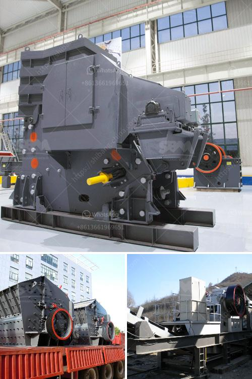

<h3>معدات المحجر للسكك الحديدية</h3>
تعتبر معدات المحجر أحد العوامل الرئيسية في عمليات إنشاء وصيانة السكك الحديدية. تهدف هذه المعدات إلى توفير الدعم والتسهيلات اللازمة لتنفيذ الأعمال في المناطق التي تمر بها السكة الحديدية. سنلقي الضوء في هذه المقالة على أهمية هذه المعدات وبعض الأمثلة عليها.

تلعب معدات المحجر دورًا حاسمًا في تنفيذ الأعمال الخاصة بالمسالك الحديدية. فهي تستخدم في عمليات الحفر والتنقيب والتجهيز للبناء والصيانة. تعمل المعدات على تحسين الإنتاجية وتقليل التكاليف وزيادة سرعة التنفيذ، وهي بذلك تلعب دورًا مهمًا في تطوير وتحسين شبكات السكك الحديدية.

تتنوع معدات المحجر وفقًا للمهمة التي يتم تنفيذها. فمثلا، توجد معدات للحفر والنقل والنقل الداخلي وتجهيز القطع وتحميلها. من أمثلة المعدات المستخدمة في عمليات المحجر، تجد المداحل والجرافات والشيول والحفارات وآلات نقل المواد الحجرية.

تعتبر الحفارات أحد المعدات الأساسية في المحاجر، حيث تستخدم للحفر والتنقيب وتجهيز المناطق قبل بناء السكك الحديدية. تتميز الحفارات بقدرتها على التعامل مع مجموعة متنوعة من التضاريس والمواد. تتميز الجرافات والشيول بقدرتها على نقل المواد الثقيلة بفعالية وسرعة. أما المداحل، فهي تقوم بسحق وتفتيت المواد الحجرية لتكون جاهزة للاستخدام في الإنشاء.

تلعب آلات نقل المواد الحجرية دورًا حاسمًا في عمليات المحجر. فهي تنقل المواد الثقيلة من المحجر إلى موقع البناء بكفاءة. تتضمن هذه الآلات الشاحنات والقوارب والقاطرات الخاصة بالمواد السائلة أو الجافة.

بالإضافة إلى ذلك، تُستخدم معدات المحجر للقيام بعمليات الصيانة الروتينية وتحديث السكك الحديدية. تشمل هذه المعدات آلات التحقق من المسار وآلات فحص القضبان وآلات معالجة العيوب. تعمل هذه المعدات على ضمان سلامة السكك الحديدية وتجنب المشاكل والعيوب الناتجة عن التآكل والاهتراء.

باختصار، تعتبر معدات المحجر أدوات حيوية للسكك الحديدية، حيث تساهم في تنفيذ وصيانة الشبكات الحديدية. توفر هذه المعدات الدعم والكفاءة اللازمة لإنجاز الأعمال بسرعة وفاعلية. وبفضل تطور التكنولوجيا، تستمر المعدات المستخدمة في المحاجر في التحسن والتطوير لتلبية احتياجات صناعة السكك الحديدية النامية.
<h3>Contact us</h3><ul><li><strong>Whatsapp:&nbsp;<a href="https://wa.me/8613661969651">+8613661969651</a></strong></li><li><a href="https://swt.shibang-china.com/?git&amp;zhl&amp;معدات المحجر للسكك الحديدية"><strong>Online Service(chat now)</strong></a></li></ul><h3>Related</h3><ul><li><a href='كسارة مخروطية بسعة 100 طن في الساعة.md'>كسارة مخروطية بسعة 100 طن في الساعة</a></li><li><a href='مطحنة أسمنت صغيرة مستعملة في الإمارات.md'>مطحنة أسمنت صغيرة مستعملة في الإمارات</a></li><li><a href='آلة حفر الحجر الجرانيت في الهند.md'>آلة حفر الحجر الجرانيت في الهند</a></li><li><a href='مطحنة طحن الحجر الصناعي.md'>مطحنة طحن الحجر الصناعي</a></li><li><a href='معدات مستخدمة في تعدين الفحم.md'>معدات مستخدمة في تعدين الفحم</a></li></ul>