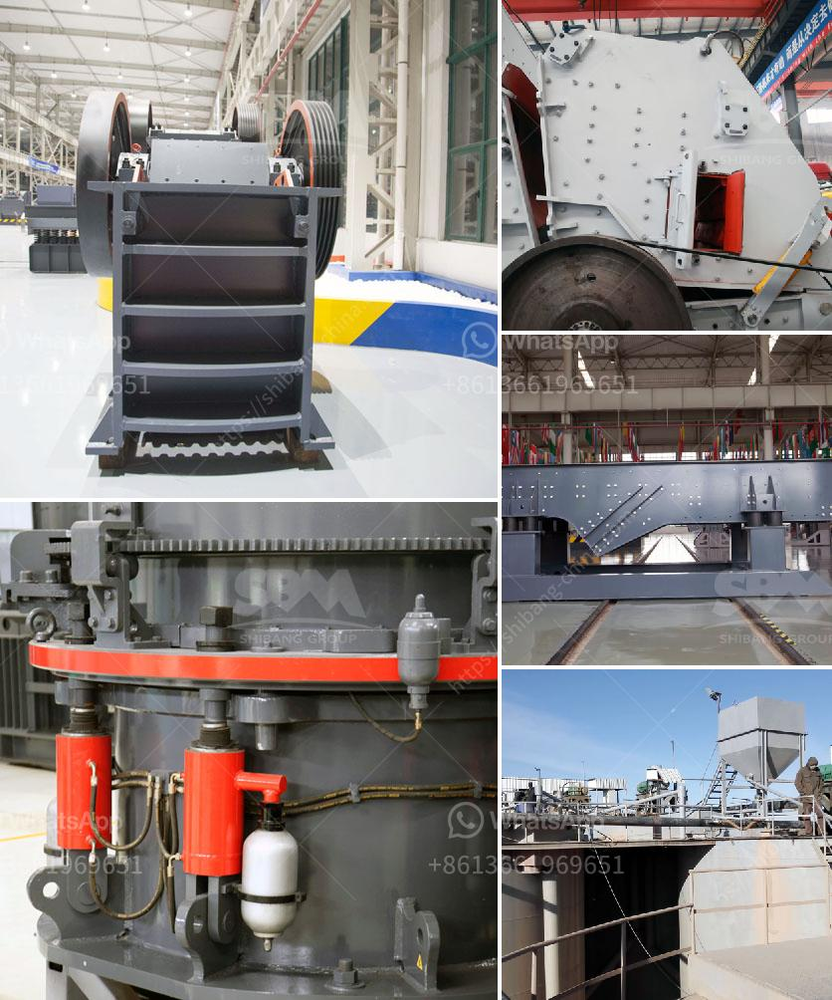

<h3>معدات تأثير المحجر</h3>
تأتي معدات تأثير المحجر في العديد من الأحجام والأشكال المختلفة وتستخدم لتحقيق أهداف متعددة في صناعة التعدين واستخراج المواد الخام من المحاجر. تعتبر هذه المعدات حجر الزاوية في عملية إنتاج المواد الخام للبناء والطرق والأسمنت والسيراميك والزجاج والتعدين الصناعي.

تشمل أنواع معدات تأثير المحجر الأساسية المطرقة الكبيرة والمطاحن والكسارات. تعمل المطارق بطريقة مشابهة للكسارات، حيث يتم تطبيق قوة الصدم لتكسير المواد الكبيرة إلى جزيئات أصغر تسهل عملية استخراجها. تعتبر المطارق أداة قوية وفعالة في عملية تكسير المواد الخام الصلبة وتزود الصناعات المختلفة بالمواد الضرورية.

من ناحية أخرى، الكسارات تعتبر أدوات متعددة الاستخدامات وتتوفر بأحجام وقدرات مختلفة. تعمل الكسارات على تكسير المواد الصلبة بواسطة القوة الميكانيكية. يمكن استخدام الكسارات لتكسير المواد الصلبة إلى أحجام مختلفة، ويمكن استخدامها في إعادة تدوير المواد الخلفية ومواد الهدم.

تعمل المطاحن على طحن المواد الخام إلى مسحوق ناعم. تعتمد عملية الطحن على الاحتكاك والضغط والاحتكام المتكرر بين المادة والجسم الطاحونة، مما يؤدي إلى تفتيت المادة الصلبة إلى حجم جزيئات أصغر. يعتمد نوع وحجم المطحنة على نوع وكثافة المادة المطحونة واستخدام المنتج النهائي.

أخيرًا، تعتبر معدات تأثير المحجر ضرورية لاستخراج المواد الخام بكفاءة وتوفير الوقت والجهد. تساعد هذه المعدات في تحقيق مستويات إنتاج عالية وتحسين جودة المنتج النهائي. تلعب هذه المعدات دورًا حاسمًا في دورة الإنتاج الصناعي، وتضمن تواجد مستمر للمواد الخام اللازمة للصناعات المختلفة.

تعتبر معدات تأثير المحجر مهمة جدًا في صناعة التعدين واستخراج المواد الخام. تشمل هذه المعدات المطارق والكسارات والمطاحن وتهدف جميعها إلى تكسير أو طحن المواد الخام. تلعب هذه المعدات دورًا حاسمًا في توفير المواد الخام اللازمة للصناعات المختلفة وتحسين إنتاجيتها وجودة المنتج النهائي.
<h3>Contact us</h3><ul><li><strong>Whatsapp:&nbsp;<a href="https://wa.me/8613661969651">+8613661969651</a></strong></li><li><a href="https://swt.shibang-china.com/?git&amp;zhl&amp;معدات تأثير المحجر"><strong>Online Service(chat now)</strong></a></li></ul><h3>Related</h3><ul><li><a href='مطحنة الكرة الثقيلة الوزن في الهند.md'>مطحنة الكرة الثقيلة الوزن في الهند</a></li><li><a href='قائمة الأسعار في زيمبابوي لمطاحن الكرة.md'>قائمة الأسعار في زيمبابوي لمطاحن الكرة</a></li><li><a href='مطرقة إندونيسيا للبيع.md'>مطرقة إندونيسيا للبيع</a></li><li><a href='أنواع الكسارات المستخدمة في التعدين pdf.md'>أنواع الكسارات المستخدمة في التعدين pdf</a></li><li><a href='مطحنة الكرة التجارية للمبيعات.md'>مطحنة الكرة التجارية للمبيعات</a></li></ul>