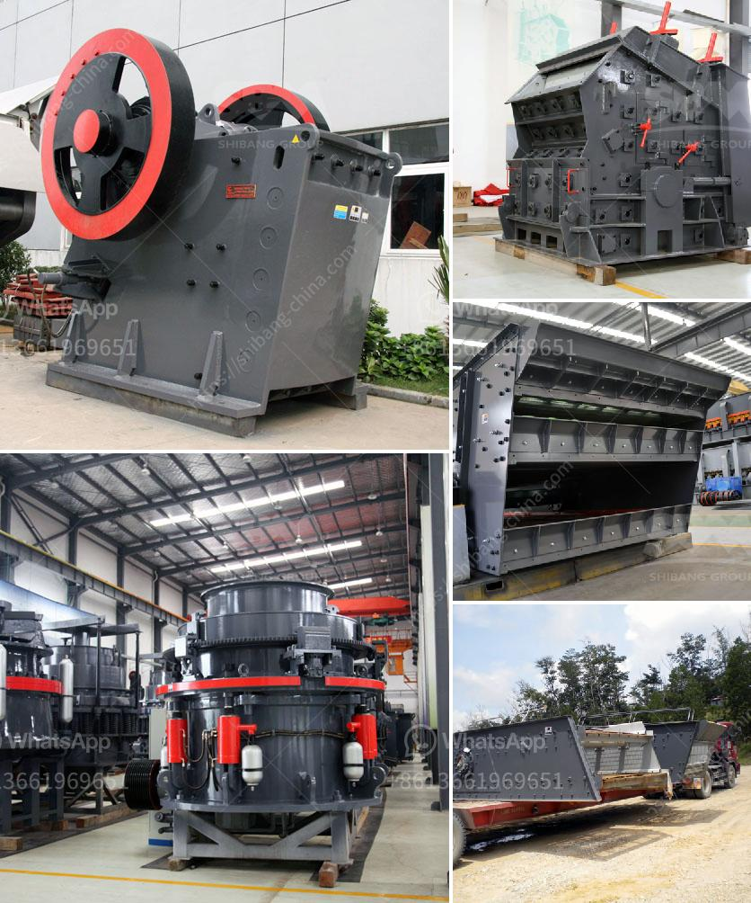

<h3>معدات تحسين خامات مختلفة في جميع أنحاء العالم</h3>
تلعب معدات تحسين الخامات دورًا حاسمًا في صناعة استخراج المواد الخام وتحويلها إلى منتجات نهائية قابلة للتسويق. تُستخدم هذه المعدات في عمليات مثل سحق وطحن الخامات الصلبة وتخمير الزيوت والمواد الكيميائية، وغيرها من العمليات التي تسهم في تغيير خواص المواد الخام لتلبية الاحتياجات المحددة لعملية التصنيع.

تنتشر معدات تحسين الخامات في جميع أنحاء العالم، وتستخدم في العديد من الصناعات مثل الصناعات البتروكيماوية والمعادن والأغذية والزيوت والمنسوجات، وغيرها. تعمل تلك المعدات على تحسين خواص المواد الخام، مثل تحسين نقاوة وتركيب المواد الكيميائية وتخفيض حجم الجسيمات وتغيير الفعالية الفسيكية، وتكوين متانة المنتجات النهائية. هذه التحسينات تساعد في تحسين جودة المنتج وتعزز تحقيق عوائد اقتصادية أكبر.

من المعدات التي تستخدم على نطاق واسع في مجال تحسين الخامات هي المطاحن والكسارات والفرز والفصل المغناطيسي والخلط والتجفيف والمبردات والفرن الدوار. تتميز هذه المعدات بقدرتها على معالجة الخامات بكفاءة ودقة، بغض النظر عن تعقيدها وتنوعها. وتتطور المعدات باستمرار وتتحسن تقنيتها، مما يؤدي إلى زيادة الإنتاجية وتوفير الوقت والجهد.

موجزة: تلعب معدات تحسين الخامات دورًا حاسمًا في صناعة استخراج المواد الخام وتحويلها إلى منتجات نهائية قابلة للتسويق. تستخدم هذه المعدات على نطاق واسع في مختلف الصناعات حول العالم، وتساهم في تحسين جودة المنتج وزيادة العائد الاقتصادي. تعتبر المطاحن والكسارات والفرز والفصل المغناطيسي والخلط والتجفيف والمبردات والفرن الدوار بعضًا من المعدات الشائعة التي تستخدم في مجال تحسين الخامات.
<h3>Contact us</h3><ul><li><strong>Whatsapp:&nbsp;<a href="https://wa.me/8613661969651">+8613661969651</a></strong></li><li><a href="https://swt.shibang-china.com/?git&amp;zhl&amp;معدات تحسين خامات مختلفة في جميع أنحاء العالم"><strong>Online Service(chat now)</strong></a></li></ul><h3>Related</h3><ul><li><a href='سعر كسارة الفك المحمولة.md'>سعر كسارة الفك المحمولة</a></li><li><a href='مطحنة الكرة للبيع.md'>مطحنة الكرة للبيع</a></li><li><a href='سعر كسارة الفك 400x600.md'>سعر كسارة الفك 400x600</a></li><li><a href='مطحنة معدنية إلى 300 ميكرون.md'>مطحنة معدنية إلى 300 ميكرون</a></li><li><a href='أسعار أحزمة الناقل.md'>أسعار أحزمة الناقل</a></li></ul>