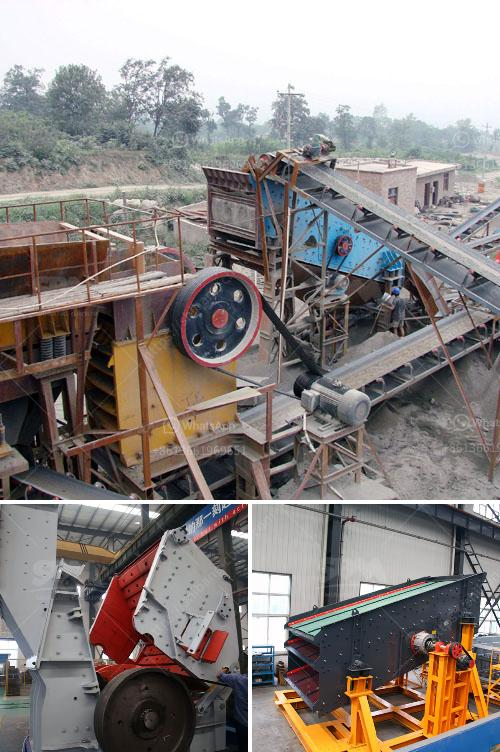

<h3>معدات تحميل وسائط مطحنة الكرة</h3>
تعد مطاحن الكرة من أهم المعدات اللازمة في صناعة الطحن، حيث تستخدم لطحن المواد الخام وتحويلها إلى حبيبات دقيقة. تتكون مطحنة الكرة من جسم أسطواني يحتوي على كرات فولاذية تستخدم للطحن. ومن أجل التحميل والتفريغ السهل والآمن للمواد الخام والكرات الفولاذية، يتم استخدام معدات متخصصة للتحميل والتفريغ.

تتضمن معدات تحميل وسائط مطحنة الكرة بعض العناصر المهمة، مثل المسامير البولتية، ورافعات الكرات الفولاذية، والناقلات الهوائية. المسامير البولتية هي مسامير مصممة خصيصًا للتثبيت الآمن لأغطية المطحنة وإحكام إغلاقها. توفر هذه المسامير البولتية الاحتكاك اللازم لمنع تسرب المواد الخام أو خروج الكرات الفولاذية من المطحنة أثناء عملية الطحن.

ورافعات الكرات الفولاذية هي معدات تستخدم لتحميل وتفريغ الكرات الفولاذية داخل وخارج مطحنة الكرة. تعمل هذه الرافعات بشكل سلس وآمن لتوفير عملية تحميل وتفريغ سريعة وفعالة. تأتي هذه الرافعات بأحجام وطاقات مختلفة لتناسب احتياجات المطاحن المختلفة.

أما الناقلات الهوائية، فهي معدات استخدمت عادة في الصناعات الثقيلة لنقل المواد الخام بشكل سريع وفعال. تعمل هذه الناقلات بواسطة تدفق الهواء المرتفع الضغط، وتستخدم لنقل الكرات الفولاذية إلى ومن مطحنة الكرة بسرعة كبيرة وبدقة عالية.

تعتبر معدات تحميل وسائط مطحنة الكرة ضرورية لضمان سلامة وفاعلية وعملية الطحن. إذ تساعد هذه المعدات في تحميل وتفريغ المواد الخام والكرات الفولاذية بسهولة وسرعة وأمان. وبالتالي، تساهم في تحسين إنتاجية المطحنة وجودة المنتج النهائي. كما ينبغي الإشارة إلى أنه يتعين على المطاحن توفير صيانة ورعاية دورية لهذه المعدات، بما في ذلك التحقق من التآكل والأضرار، وتقديم الصيانة الوقائية لضمان استمرارية عملها بكفاءة عالية.

باختصار، معدات تحميل وسائط مطحنة الكرة تلعب دورًا حاسمًا في عملية الطحن. فإذا تم استخدامها بشكل صحيح وتم صيانتها بانتظام، فإنها ستعمل على تحسين كفاءة العملية وفعاليتها وسلامتها. وبالتالي، فإن استثمار في معدات تحميل وسائط مطحنة الكرة يعتبر استثمارًا حكيمًا للشركات التي تعتمد على صناعة الطحن لتحقيق النجاح والتفوق في السوق.
<h3>Contact us</h3><ul><li><strong>Whatsapp:&nbsp;<a href="https://wa.me/8613661969651">+8613661969651</a></strong></li><li><a href="https://swt.shibang-china.com/?git&amp;zhl&amp;معدات تحميل وسائط مطحنة الكرة"><strong>Online Service(chat now)</strong></a></li></ul><h3>Related</h3><ul><li><a href='نماذج كسارات الحجر في ماليزيا.md'>نماذج كسارات الحجر في ماليزيا</a></li><li><a href='مطحنة هامر ديزل في جنوب أفريقيا.md'>مطحنة هامر ديزل في جنوب أفريقيا</a></li><li><a href='كسارة الحجر في إندونيسيا.md'>كسارة الحجر في إندونيسيا</a></li><li><a href='مصنع غسيل وفرز للتأجير في جنوب أفريقيا.md'>مصنع غسيل وفرز للتأجير في جنوب أفريقيا</a></li><li><a href='سعر كسارة الفك.md'>سعر كسارة الفك</a></li></ul>