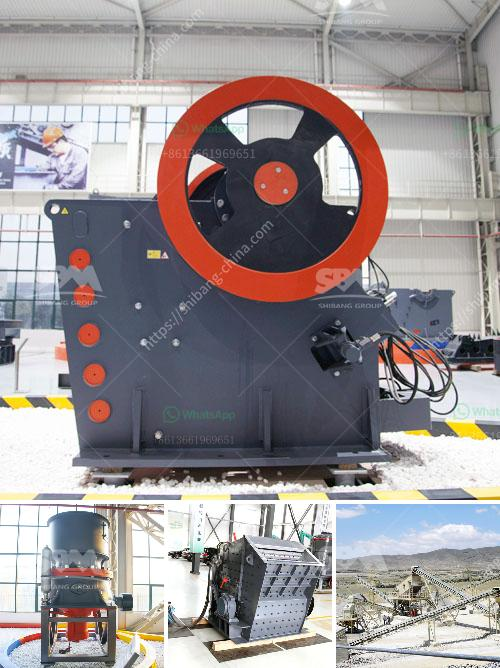

<h3>معدات ترقية خام الحديد</h3>
تعتبر صناعة ترقية خام الحديد من أهم الصناعات التي تؤثر في عمليات تصنيع الحديد والصلب. تنتج هذه الصناعة خامات الحديد ذات الجودة العالية التي تستخدم في العديد من الصناعات الأخرى مثل صناعة السيارات والبناء والطيران.

تحتاج هذه الصناعة إلى معدات متطورة وعالية الأداء لتحقيق عمليات ترقية الخام. تهدف عمليات الترقية إلى زيادة نسبة الحديد في الخام وخفض الشوائب الموجودة به. يتم ذلك عن طريق عدة خطوات رئيسية تتضمن التكسير، والطحن، وعمليات التركيز والفصل.

تعتبر معدات التكسير والطحن أحد العناصر الأساسية في عملية ترقية خام الحديد. لتحقيق ذلك، تُستخدم آلات الكسارة والطاحونة لتكسير الخام إلى حجم صغير ومن ثم طحنه إلى مسحوق ناعم. تساعد هذه العمليات على جعل الخام سهل التعامل معه واستخلاص الحديد المنتج بكفاءة أفضل.

تهدف عمليات التركيز إلى زيادة نسبة الحديد في الخام وتقليل الشوائب الموجودة به. يتم ذلك من خلال استخدام معدات مثل الفاصل المغناطيسي والفاصل الثقيل. يتم استخدام الفاصل المغناطيسي لفصل المعادن غير المغناطيسية الأخرى عن خام الحديد. بينما يعمل الفاصل الثقيل على فصل الشوائب الخفيفة عن الحديد المرغوب به.

تعد معدات ترقية خام الحديد من الأنواع عالية التقنية لضمان الحصول على نتائج دقيقة وفعالة. تستخدم التكنولوجيا الحديثة مثل الأشعة السينية والأشعة فوق البنفسجية في عمليات التصفية والتركيز لضمان فصل دقيق للشوائب عن الحديد. كما تستخدم أيضًا تقنيات التحكم بالحجم الحبيبي والتحكم الآلي لزيادة الكفاءة وتقليل الهدر.

في النهاية، تلعب معدات ترقية خام الحديد دورًا حاسمًا في تحسين جودة الحديد المنتج وزيادة ربحية الصناعة. من خلال استخدام تلك المعدات الحديثة والمتطورة، يمكن للشركات تحقيق تحسينات في عملية التصنيع وتحقيق توازن بين التكلفة والجودة. كما أن استخدام تلك المعدات يسهم في تقليل الآثار البيئية والحفاظ على الموارد الطبيعية.
<h3>Contact us</h3><ul><li><strong>Whatsapp:&nbsp;<a href="https://wa.me/8613661969651">+8613661969651</a></strong></li><li><a href="https://swt.shibang-china.com/?git&amp;zhl&amp;معدات ترقية خام الحديد"><strong>Online Service(chat now)</strong></a></li></ul><h3>Related</h3><ul><li><a href='آلة سحق محمولة من إسبانيا.md'>آلة سحق محمولة من إسبانيا</a></li><li><a href='كسارة الفك الجرانيت.md'>كسارة الفك الجرانيت</a></li><li><a href='مصنع غسيل الطين الجيري.md'>مصنع غسيل الطين الجيري</a></li><li><a href='كسارات الطوب للبيع في أستراليا.md'>كسارات الطوب للبيع في أستراليا</a></li><li><a href='مصنع لوحات الجبس الجديد في الهند.md'>مصنع لوحات الجبس الجديد في الهند</a></li></ul>