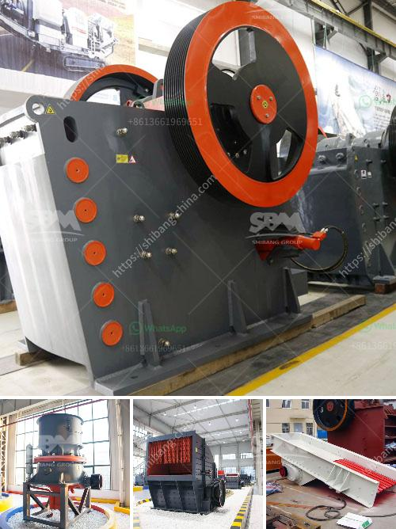

<h3>معدات تصنيع لوحات الجبس</h3>
تعتبر لوحات الجبس أحد أهم مكونات البناء المعماري والديكور الداخلي، حيث يتم استخدامها في تشغيل الجدران الداخلية والأسقف. ولإنتاج هذه اللوحات، يتم استخدام معدات تصنيع خاصة تتضمن عدة عمليات لتحويل المكونات الرئيسية للوحة إلى منتج نهائي عالي الجودة. سأتحدث في هذه المقالة عن بعض هذه المعدات وأهميتها.

أولاً، يتم استخدام مفسس الرولات في عملية تشكيل الجبس. يتم تحميل الجبس الخام إلى المفسس حيث تتم عملية ضغط الجبس المبلل وفرده على سطح المفسس بشكل مستقيم. يتم بعد ذلك ادخال السلك الفولاذي إلى الصفيحة لتعزيز قوتها ومقاومتها. يتم بعد ذلك لف الجبس على شكل لفات متتالية وتخزينها للاستخدام المستقبلي.

ثانياً، يتم استخدام مصفاة الجبس في عملية تجهيز الجبس النهائي. وتعمل هذه المعدة على فرز الجبس الخام وتنقيته من الشوائب والجزئيات الغريبة الموجودة فيه. بعد أن يتم تجهيز الجبس، يتم استخدامه في عملية التصنيع التالية.

ثالثاً، يستخدم القالب المعلق لتشكيل الجبس في الأشكال المختلفة. يتم تحميل الجبس داخل القالب وتمهيد السطح بالتساوي. يتم بعد ذلك استخدام جهاز الفك في إزالة الهواء المحتبس داخل القالب وضمان تشكيل رائع للجبس.

رابعاً، يتم استخدام الفرن لتجفيف اللوحات الجبسية بعد تشكيلها. يتم وضع اللوحات في درجات حرارة مرتفعة لإزالة الماء الموجود في الجبس. يعتبر هذا الفرن جزءًا أساسيًا لضمان جفاف اللوحات بسرعة وبشكل متساوٍ.

أخيراً، يتم استخدام آلة تلميع الأسطح لإعطاء اللوحات الجبسية اللمعان والانتهاء النهائي. يتم تشغيل اللوحات الجبسية في آلة تلميع الأسطح حيث يتم تلميعها باستخدام فرش معدنية خاصة. يساعد هذا على تقليل الخدوش وتحقيق سطح أملس ولامع للوحة.

باختصار، يوجد العديد من المعدات التي يتم استخدامها في تصنيع لوحات الجبس، بدءًا من مفسس الرولات وصولًا إلى آلة تلميع الأسطح. هذه المعدات تلعب دورًا حاسمًا في إنتاج لوحات الجبس عالية الجودة والتي تستخدم على نطاق واسع في مشاريع البناء والديكور الداخلي. تساهم هذه المعدات في تحسين الكفاءة ودقة العمل ، مما يؤدي إلى توفير الوقت والجهد للعاملين في صناعة لوحات الجبس.
<h3>Contact us</h3><ul><li><strong>Whatsapp:&nbsp;<a href="https://wa.me/8613661969651">+8613661969651</a></strong></li><li><a href="https://swt.shibang-china.com/?git&amp;zhl&amp;معدات تصنيع لوحات الجبس"><strong>Online Service(chat now)</strong></a></li></ul><h3>Related</h3><ul><li><a href='آلة كسارة الحجر في المملكة العربية السعودية.md'>آلة كسارة الحجر في المملكة العربية السعودية</a></li><li><a href='مطحنة عمودية للأسمنت.md'>مطحنة عمودية للأسمنت</a></li><li><a href='مصنع البنتونيت في الهند.md'>مصنع البنتونيت في الهند</a></li><li><a href='مصنع معالجة ملح الصخور.md'>مصنع معالجة ملح الصخور</a></li><li><a href='سعر كسارة الخرسانة في بنجلاديش.md'>سعر كسارة الخرسانة في بنجلاديش</a></li></ul>