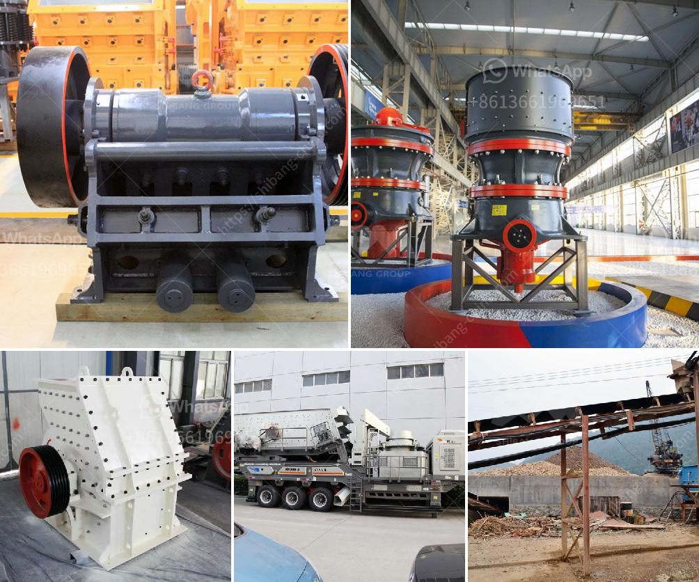

<h3>معدات تعدين الذهب الطبيعي في الصين</h3>
تُعتبر الصين واحدة من أكبر الدول المنتجة للذهب في العالم، حيث تستخدم تقنيات حديثة ومتطورة لاستخراج الذهب من مناجمها. تمتلك الصين العديد من معدات التعدين المتطورة التي تساهم في زيادة إنتاجية صناعة التعدين للذهب الطبيعي.

تعتمد معدات التعدين في الصين على تقنية استخراج الذهب بالكيانتيد، وهو تقنية تساهم في زيادة الكفاءة وتقليل التكاليف بشكل كبير. يتم استخدام كيانيد الصوديوم (NaCN) في هذه العملية، حيث يساعد على انحلال الذهب من الصخور والرمال المحتوية على الذهب. يتم استخدام السدادات لتخمير الصخور وفصل الذهب عنها، وإجراء معالجة إضافية لاستخلاص الذهب بشكل نقي.

وتشمل المعدات الرئيسية المستخدمة في عملية تعدين الذهب في الصين المطارق الهيدروليكية وآلات الكسارة والمطاحن الكروية. تساهم هذه المعدات في سحق الصخور وتكسيرها إلى جسيمات صغيرة تحتوي على الذهب. وبعد ذلك، يتم إجراء عملية التعويم للفصل بين الذهب والشوائب الأخرى في الخام. تستخدم عملية التعويم المواد الكيميائية لتشكيل فقاعات تعويم تلتقط الذهب وتفصله عن المواد الأخرى.

وإلى جانب ذلك، تستخدم الصين معدات تعدين متقدمة مثل المعدات الجرافيكية ثلاثية الأبعاد وتقنيات الإستشعار عن بُعد وتقنيات الروبوتات في التعدين. تستخدم التصوير ثلاثي الأبعاد وتكنولوجيا الماسحات الضوئية لتحليل الصخور وتحديد مواقع فروائض الذهب بدقة، مما يساهم في زيادة كفاءة التعدين وتقليل نسبة الخطأ.

في الختام، تستفيد الصين من التقنيات الحديثة والمعدات المتطورة في عمليات تعدين الذهب الطبيعي. تلك التكنولوجيا تساهم في زيادة الإنتاجية وتحسين الفعالية في صناعة التعدين بشكل عام، الأمر الذي يدعم الاقتصاد الصيني ويحافظ على مكانة البلاد كواحدة من أكبر مستوردي ومصدري الذهب في العالم.
<h3>Contact us</h3><ul><li><strong>Whatsapp:&nbsp;<a href="https://wa.me/8613661969651">+8613661969651</a></strong></li><li><a href="https://swt.shibang-china.com/?git&amp;zhl&amp;معدات تعدين الذهب الطبيعي في الصين"><strong>Online Service(chat now)</strong></a></li></ul><h3>Related</h3><ul><li><a href='تكلفة الحزام الناقل لكل متر.md'>تكلفة الحزام الناقل لكل متر</a></li><li><a href='موردين تكسير الكوارتز في أوروبا.md'>موردين تكسير الكوارتز في أوروبا</a></li><li><a href='جزء من مطحنة الكرة ومبدأ عمله.md'>جزء من مطحنة الكرة ومبدأ عمله</a></li><li><a href='كسارات الكرة في كينيا.md'>كسارات الكرة في كينيا</a></li><li><a href='سعر مصنع التكسير والفرز في جنوب أفريقيا.md'>سعر مصنع التكسير والفرز في جنوب أفريقيا</a></li></ul>