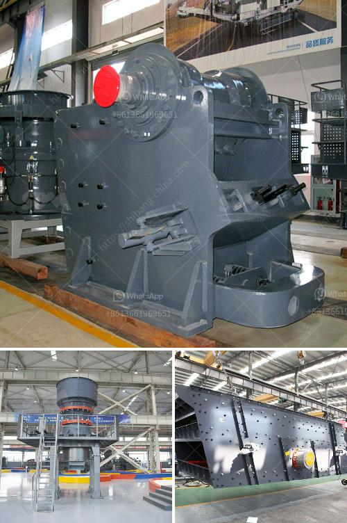

<h3>معدات تعدين الذهب للبيع في نيجيريا</h3>
تعتبر التعدين من أهم القطاعات الاقتصادية في نيجيريا، حيث تمتلك البلاد موارد طبيعية غنية بالذهب والعديد من المعادن الثمينة الأخرى. ومن أجل استغلال هذه الموارد وزيادة الإنتاجية، يعتمد المنقبون في نيجيريا على مجموعة متنوعة من معدات التعدين الحديثة والمتطورة.

توفر السوق النيجيرية العديد من معدات تعدين الذهب المتاحة للشراء، وتتراوح هذه المعدات في الأحجام والأشكال والمواصفات المختلفة. كما تتراوح الأسعار أيضًا بين 200-400 دولار أمريكي، وتختلف باختلاف الطرازات والنماذج.

من بين المعدات الأساسية المستخدمة في تعدين الذهب في نيجيريا هي "الأعمدة الصينية"، وهي مجموعة من الأدوات والمعدات المصممة خصيصًا لتجميع الذهب من التربة والرمال. تشمل هذه المجموعة الأعمدة، وحزم التجميع، والجرافات اليدوية لنقل التربة، والغرابيل لفصل الذهب عن المواد الأخرى. كما تتضمن المعدات الأخرى المستخدمة في عملية التعدين، مثل الكسارات والطواحين والفاصلات المغناطيسية لفصل المعادن الأخرى عن الذهب.

وتعمل هذه المعدات على تسهيل وتسريع عملية التعدين واستخراج الذهب بكفاءة أعلى. وتلعب دورًا مهمًا في زيادة الإنتاج وتقليل الجهد البشري المطلوب. فهي تقلل من تكاليف الإنتاج وتزيد من ربحية عمليات التعدين.

وتستخدم هذه المعدات الحديثة في مجموعة متنوعة من مناجم الذهب في نيجيريا، بما في ذلك ولاية زامفارا وولاية كبي وولاية أوشون. وتعتبر هذه المناطق من أهم مناطق التعدين في البلاد، حيث يجري استخراج كميات كبيرة من الذهب سنويًا.

باختصار، توفر نيجيريا العديد من معدات تعدين الذهب المتاحة للشراء، وتتراوح الأسعار بين 200-400 دولار أمريكي. تستخدم هذه المعدات في عمليات استخراج الذهب من تربة ورمال المناجم، وتزيد من كفاءة عمليات التعدين وتحسن الإنتاجية. وتستخدم هذه المعدات في العديد من مناجم الذهب الرئيسية في نيجيريا، وتلعب دورًا حاسمًا في تعزيز الاقتصاد وزيادة الإيرادات من صادرات الذهب.
<h3>Contact us</h3><ul><li><strong>Whatsapp:&nbsp;<a href="https://wa.me/8613661969651">+8613661969651</a></strong></li><li><a href="https://swt.shibang-china.com/?git&amp;zhl&amp;معدات تعدين الذهب للبيع في نيجيريا"><strong>Online Service(chat now)</strong></a></li></ul><h3>Related</h3><ul><li><a href='عملية تصنيع هيدروتون الحصى الطيني.md'>عملية تصنيع هيدروتون الحصى الطيني</a></li><li><a href='محرك مطحنة الإسمنت للبيع في المملكة المتحدة.md'>محرك مطحنة الإسمنت للبيع في المملكة المتحدة</a></li><li><a href='آلة فصل خام النحاس.md'>آلة فصل خام النحاس</a></li><li><a href='كسارة الخرسانة للبيع في نيجيريا.md'>كسارة الخرسانة للبيع في نيجيريا</a></li><li><a href='مصنع تحسين خام الحديد الموردين.md'>مصنع تحسين خام الحديد الموردين</a></li></ul>