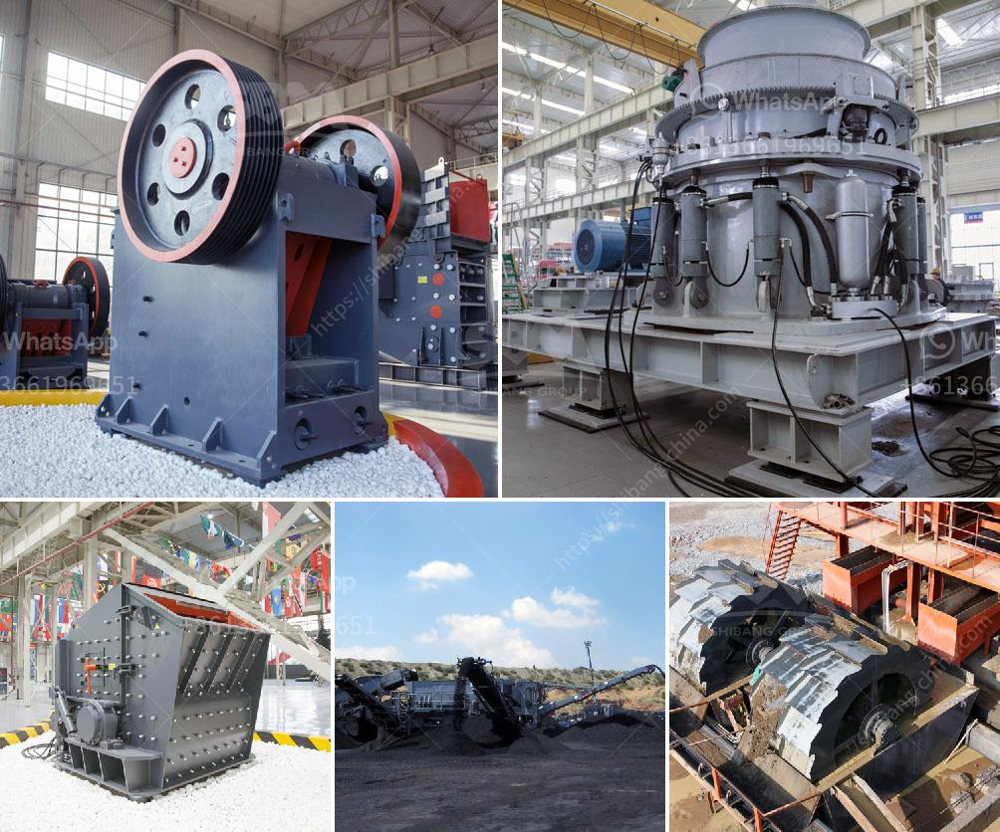

<h3>معدات تعدين الذهب</h3>
تعتبر صناعة تعدين الذهب من الصناعات الرئيسية في عدة دول حول العالم، وتعد المعدات المستخدمة في هذه الصناعة العنصر الأساسي لضمان الحصول على إنتاجية عالية ونوعية ممتازة. يهدف تعدين الذهب إلى استخراج المعدن النفيس من باطن الأرض بطرق تقليل الأضرار البيئية بأقل تكلفة ممكنة، ولذلك يمتلك المنقبون والمستثمرون في هذا القطاع مجموعة واسعة من المعدات الحديثة والتقنيات المبتكرة للوفاء بتلك المتطلبات.

الأدوات اليدوية المستخدمة في عمليات تعدين الذهب تختلف بناءً على حجم وتعقيد الموقع وكمية الذهب المتواجدة. العتاد الأكثر شيوعا يتضمن جرافات صغيرة وحفارات للتنقيب وتكسير الصخور، وآلات الغسل والتصفية لفصل الذهب عن الرمال والحصى. 

على الصعيد العالمي، استخدمت المعدات التعدينية الميكانيكية في عمليات تعدين الذهب تكنولوجيا متطورة مثل الحفارات الهيدروليكية، ومعدات النقل مثل الشاحنات والجرافات الكبيرة، والكسارات الثابتة والمتحركة التي تساعد في تكسير الصخور وفصل الذهب عن المواد الأخرى بكفاءة أعلى.

تضم المعدات المستخدمة في تعدين الذهب أيضًا التقنيات المبتكرة مثل تحقيق الإنتاجية العالية من خلال استخدام الليزر والرادار لاستكشاف واكتشاف الأماكن المحتملة للذهب بأعماق أكبر. تستخدم أيضًا الطائرات بدون طيار لجمع البيانات وإنتاج صور ثلاثية الأبعاد للمناطق المشبوهة بالذهب للمساعدة في عمليات التنقيب.

إضافةً إلى ذلك، يعتبر استخلاص الذهب من المحلول المستخدم في عملية التعدين أمرًا حاسمًا. تعتمد هذه العملية على فصل الذهب المذاب من المواد الأخرى المستخدمة في العملية. تستخدم في هذه العملية تقنيات مثل التحليل الكهروكيميائي واستخلاص الذهب بالكربون المنشط.

باختصار، تعدين الذهب هو صناعة تعتمد بشكل كبير على المعدات المبتكرة والتقنيات الحديثة لتحقيق الإنتاجية العالية والكفاءة في تحقيق الأرباح. يواصل الباحثون تطوير المعدات التعدينية لتحسين طرق الاستكشاف والاستخراج، مما يسهم في تحقيق تقدم مستدام في هذا القطاع الحيوي.
<h3>Contact us</h3><ul><li><strong>Whatsapp:&nbsp;<a href="https://wa.me/8613661969651">+8613661969651</a></strong></li><li><a href="https://swt.shibang-china.com/?git&amp;zhl&amp;معدات تعدين الذهب"><strong>Online Service(chat now)</strong></a></li></ul><h3>Related</h3><ul><li><a href='خطة عمل محجر الجرانيت.md'>خطة عمل محجر الجرانيت</a></li><li><a href='سعر مصنع خام الحديد للبيع في المكسيك.md'>سعر مصنع خام الحديد للبيع في المكسيك</a></li><li><a href='محجر مستعمل بشكل معقول في نيجيريا.md'>محجر مستعمل بشكل معقول في نيجيريا</a></li><li><a href='معدات تعدين النحاس.md'>معدات تعدين النحاس</a></li><li><a href='خطة التحكم في تصنيع مطحنة الكرة.md'>خطة التحكم في تصنيع مطحنة الكرة</a></li></ul>