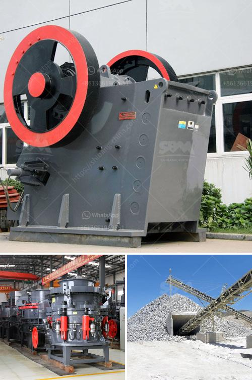

<h3>معدات تعدين الرمال في ماليزيا</h3>
تعتبر ماليزيا واحدة من البلدان التي تشتهر بصناعة تعدين الرمال. تقع عديد من القطاعات الصناعية في البلاد على سواحلها، وتوجد بها كميات كبيرة من الرمال التي تمتاز بجودتها العالية وفائدتها الكبيرة في الاستخدامات المختلفة.

تتضمن معدات تعدين الرمال في ماليزيا مجموعة متنوعة من الأدوات والآلات التي تستخدم في عمليات التنقيب واستخراج الرمال. تشمل هذه المعدات الحفارات والمضخات والسده والحواجز الجافة ومضخات الطين والغرابيل الاهتزازية والناقلات وغيرها الكثير.

تعد الحفارات الآلية واحدة من الأدوات الرئيسية في عملية تعدين الرمال. تستخدم لحفر الأرض واستخلاص الرمال من قاع البحيرات والأنهار والمحيطات. تمتاز هذه المعدات بقدرتها على العمل في بيئات مائية صعبة وإزالة كميات كبيرة من الرمال في وقت قصير.

إلى جانب الحفارات، تعتمد معدات تعدين الرمال في ماليزيا على السده والحواجز الجافة لتحويل تيار المياه وتجميع الرمال. تستخدم هذه المعدات لإعاقة تدفق المياه وتوجيهها نحو مكان الاستخلاص، ما يسهم في زيادة كفاءة عمليات التعدين.

بعد استخراج الرمال، يتم استخدام معدات إعداد الرمال لفصلها وتحضيرها للأغراض المختلفة. تشمل هذه المعدات الناقلات والغرابيل الاهتزازية ومضخات الطين. تتميز هذه المعدات بالقدرة على فصل الرمال عن الماء والشوائب وتحضيرها للاستخدام في الصناعات المختلفة مثل صناعة الزجاج والبناء.

من المهم أن نشير إلى أن تعدين الرمال قد يترتب عليه آثار بيئية سلبية. يجب أن يتم تنفيذ عمليات التعدين وفقًا للمعايير الصارمة والإشراف البيئي للحفاظ على البيئة الطبيعية وحماية الأنهار والبحيرات من التلوث.

باختصار، تتمتع ماكينات تعدين الرمال في ماليزيا بأهمية كبيرة في الصناعة المحلية والعالمية. توفر هذه المعدات اللازمة لاستخراج وتحضير الرمال بكفاءة عالية، مما يلبي احتياجات مجموعة متنوعة من الصناعات التي تستخدم الرمال في عملياتها. على الرغم من ذلك، يجب أن تتم عمليات التعدين بشكل مسؤول وفقًا للمعايير البيئية للحفاظ على البيئة الطبيعية.
<h3>Contact us</h3><ul><li><strong>Whatsapp:&nbsp;<a href="https://wa.me/8613661969651">+8613661969651</a></strong></li><li><a href="https://swt.shibang-china.com/?git&amp;zhl&amp;معدات تعدين الرمال في ماليزيا"><strong>Online Service(chat now)</strong></a></li></ul><h3>Related</h3><ul><li><a href='سعر مصنع التكسير والفرز في جنوب أفريقيا.md'>سعر مصنع التكسير والفرز في جنوب أفريقيا</a></li><li><a href='تقرير مشروع مصنع كسارة الحجر بتنسيق PDF.md'>تقرير مشروع مصنع كسارة الحجر بتنسيق PDF</a></li><li><a href='مواصفات معدات مصنع طحن الحجر.md'>مواصفات معدات مصنع طحن الحجر</a></li><li><a href='تجار الكسارات المحمولة في جنوب أفريقيا.md'>تجار الكسارات المحمولة في جنوب أفريقيا</a></li><li><a href='تصميم مطحنة الهامر.md'>تصميم مطحنة الهامر</a></li></ul>