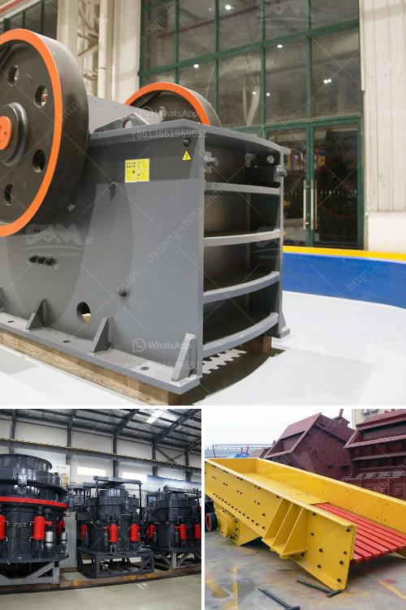

<h3>معدات تعدين الرمال والحصى للبيع</h3>
تعتبر معدات تعدين الرمال والحصى من أهم الأدوات التي يحتاجها قطاع التعدين والبناء. فهذه المعدات تساعد في استخراج المواد الخام من الأرض بطريقة سريعة وفعالة، وتلعب دورًا حاسمًا في تلبية احتياجات الصناعة.

بعد استخراج الرمال والحصى من المحاجر أو النهر، يتم نقلها إلى مصانع المعالجة أو المحاجر الأخرى بواسطة المعدات المناسبة. من بين هذه المعدات المهمة هناك القلابات الضخمة التي تتمتع بقدرة عالية على حمل المواد الثقيلة ونقلها. كما تتضمن المعدات الأخرى الناقلات الحزامية والأجهزة المصنفة لفصل المواد المختلفة حسب حجمها ونوعها.

تتميز معدات تعدين الرمال والحصى بأنها قوية ومتينة، مع تصميم محسن يساعد في تحقيق أعلى مستويات الأداء والإنتاجية. هذه المعدات تأتي بمختلف الأحجام والأشكال بما يتناسب مع احتياجات العملاء. بالإضافة إلى ذلك، فإنها قابلة للتطوير والتخصيص للتكيف مع متطلبات المشروعات المختلفة.

توفر الشركات المصنعة لمعدات التعدين الرمل والحصى عروضًا متنوعة من المنتجات بأسعار مختلفة تتراوح بين 200 و 400 دولار. وتشمل هذه المنتجات الكسارات والمطاحن والغسالات، إلى جانب المعدات المذكورة سابقًا. فعلى سبيل المثال، يمكن شراء كسارة هيدروليكية بأداء عالي بسعر معقول، تقوم بتكسير الحصى والصخور بكفاءة كبيرة.

وبغض النظر عن نوع المعدات المطلوبة، يجب أن يتم شراؤها من الشركات المعروفة والموثوقة لضمان الجودة والأداء العالي. يفضل أيضًا شراء المعدات المستعملة من ضمن المصادر الموثوقة التي تقدم ضمانات وصيانة دورية للمنتج.

باختصار، تعد معدات تعدين الرمال والحصى من الأدوات الضرورية في قطاع التعدين والبناء، حيث تساهم في تحقيق أعلى مستويات الإنتاج والكفاءة. وبالتالي، فإن اختيار معدات ذات جودة عالية وأداء ممتاز يلعب دورًا رئيسيًا في نجاح المشروعات وتحقيق الأرباح المرجوة.
<h3>Contact us</h3><ul><li><strong>Whatsapp:&nbsp;<a href="https://wa.me/8613661969651">+8613661969651</a></strong></li><li><a href="https://swt.shibang-china.com/?git&amp;zhl&amp;معدات تعدين الرمال والحصى للبيع"><strong>Online Service(chat now)</strong></a></li></ul><h3>Related</h3><ul><li><a href='خط إنتاج الجرانيت.md'>خط إنتاج الجرانيت</a></li><li><a href='كيفية إعداد شركة محجر حجر.md'>كيفية إعداد شركة محجر حجر</a></li><li><a href='كيف يعمل مطحنة الطحن.md'>كيف يعمل مطحنة الطحن</a></li><li><a href='آلة كسارة الباريت.md'>آلة كسارة الباريت</a></li><li><a href='معدات لتركيز خام الذهب.md'>معدات لتركيز خام الذهب</a></li></ul>