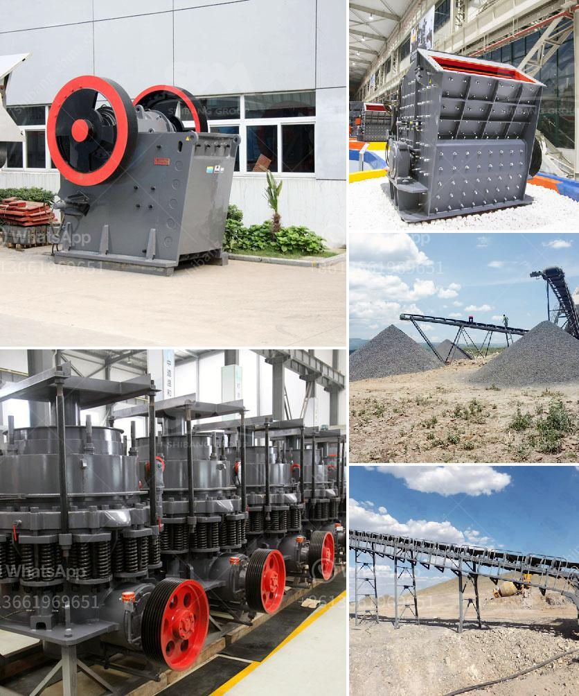

<h3>معدات تعدين الفحم في جنوب أفريقيا</h3>
تُعتبر جنوب أفريقيا واحدة من أبرز دول العالم في صناعة تعدين الفحم. حيث تحظى الصناعة بإشادة واهتمام كبيرين نظراً لمساهمتها الهامة في الاقتصاد الوطني وتوفير فرص العمل. ولضمان أداء عمليات التعدين بكفاءة عالية وتحقيق الأرباح المرجوة، يعتمد القطاع على مجموعة من المعدات التكنولوجية المتطورة والمتخصصة.

أحد الأدوات الأساسية التي تستخدم في تعدين الفحم هو الحفار الدوراني (Rotary mining shovel). يتم استخدام الحفار الدوراني للحفر في الأرض وتجريف الفحم من التربة. يحتوي الحفار على ذراع تمتد وتنزلق لأعماق كبيرة وتستخرج الفحم بقوة فائقة. كما تتوفر المولدات الديزلية أو الكهربائية لتزويد الحفار بالطاقة اللازمة.

بعد استخراج الفحم من الأرض، يتعين نقله إلى المنشآت القريبة للمعالجة والتحضير. ولتحقيق ذلك، تستخدم شاحنات النقل (Haul trucks)، وهي عبارة عن شاحنات ضخمة مصممة لنقل الفحم بكميات كبيرة. تحتوي هذه الشاحنات على حوض قادر على استيعاب العديد من الأطنان من الفحم، وتعوق الشاحنات عجلات ضخمة لنقل الحمولة بكفاءة وسرعة عالية.

بمجرد وصول الفحم إلى المنشآت اللازمة، يتم تحميله على قطارات النقل. وتستخدم الآلات المحملة (Loader) لنقل الفحم من المستودعات إلى العربات القطار وتحميلهما بكفاءة وسرعة. تعتبر هذه الآلات مهمة لضمان سرعة عملية الشحن وتجهيز الفحم للتصدير أو استخدامه في الصناعات المحلية.

ولا يمكن الحديث عن معدات تعدين الفحم بجنوب أفريقيا بدون ذكر معدات التنقيب والاستكشاف. فتعتمد شركات التعدين على معدات مثل آلات الحفر الأفقي والرأسية والإشعاعية وآلات الفحص لتحديد أماكن تواجد الفحم وتقييم جودته وكميته.

يجب أن نذكر أيضًا أن تعدين الفحم له تأثير بيئي سلبي، حيث يتطلب استخراجه تخريب الطبيعة وتلوث المياه والهواء. ولمواجهة هذه التحديات، يجب على شركات التعدين الالتزام بممارسات صارمة للحد من التأثير البيئي والتخطيط الجيد لعملية التعدين واستخدام التكنولوجيا الحديثة للسيطرة على الانبعاثات الضارة.

باستخدام معدات تعدين الفحم المتطورة والتزام شركات التعدين بالحفاظ على البيئة، يمكن تحقيق أرباح كبيرة وتوفير فرص العمل في جنوب أفريقيا. كما يمكن استغلال الفحم المُستخرَج بشكل فاعل ومُستدام والاستفادة منه في توليد الطاقة والصناعات المحلية المختلفة.
<h3>Contact us</h3><ul><li><strong>Whatsapp:&nbsp;<a href="https://wa.me/8613661969651">+8613661969651</a></strong></li><li><a href="https://swt.shibang-china.com/?git&amp;zhl&amp;معدات تعدين الفحم في جنوب أفريقيا"><strong>Online Service(chat now)</strong></a></li></ul><h3>Related</h3><ul><li><a href='خط تكسير الحجر الجرانيت.md'>خط تكسير الحجر الجرانيت</a></li><li><a href='آلة تكسير الحجر نيجيريا.md'>آلة تكسير الحجر نيجيريا</a></li><li><a href='كسارة للبيع في نيبال.md'>كسارة للبيع في نيبال</a></li><li><a href='كسارة الجرانيت المحمولة.md'>كسارة الجرانيت المحمولة</a></li><li><a href='مصنع كامل لكسارة الحجر الجرانيت.md'>مصنع كامل لكسارة الحجر الجرانيت</a></li></ul>