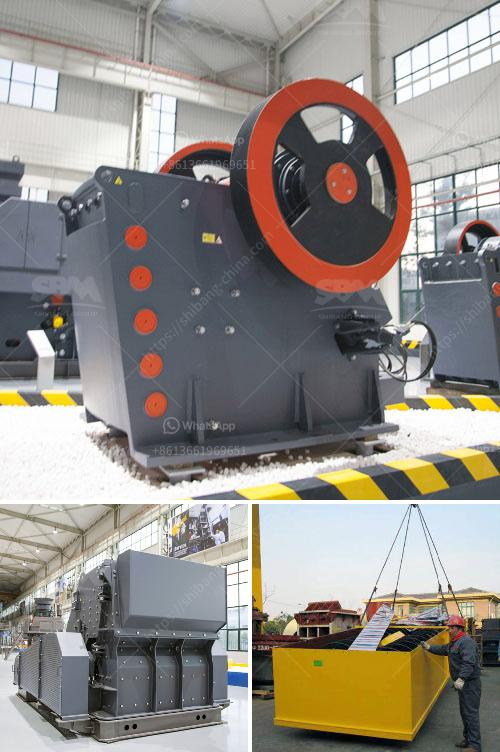

<h3>معدات تعدين الكروم للبيع في جنوب أفريقيا</h3>
تعتبر جنوب أفريقيا واحدة من أكبر الدول المنتجة للكروم في العالم، حيث تمتلك احتياطيات هائلة من هذا المعدن الثمين. وبالتالي، توفر العديد من الشركات في جنوب أفريقيا معدات تعدين الكروم عالية الجودة للبيع، والتي تساعد على تحقيق الإنتاجية العالية وتعزيز الكفاءة في عمليات التعدين.

تتوفر معدات تعدين الكروم في جنوب أفريقيا بمجموعة متنوعة من الأحجام والأنواع، مما يتيح للشركات اختيار الجهاز المناسب حسب احتياجاتها وميزانيتها. بعض المعدات الشائعة المتوفرة للبيع في السوق تشمل:

1. الحفارات: تُستخدم الحفارات في عمليات الحفر والتنقيب عن الكروم في المناجم. تتوفر حفارات ذات حجم مختلف، وتتميز بقدرتها على التعامل مع التضاريس الصعبة والحفر في الصخور الصلبة.

2. الآليات الثقيلة: تتوفر العديد من الآليات الثقيلة مثل الجرافات والشاحنات والمكابس وغيرها، والتي تُستخدم في نقل الكروم من المناجم إلى المصانع للمعالجة اللاحقة. تتميز هذه الآليات بقوتها وسرعتها في تنفيذ المهام الثقيلة.

3. الكسارات والغرابيل: تعتبر الكسارات والغرابيل أدوات مهمة في عمليات التعدين، حيث تستخدم لفصل خام الكروم عن الصخور الأخرى وتحويله إلى قطع صغيرة قابلة للمعالجة. تتوفر بعض الكسارات والغرابيل بتقنيات حديثة مثل الفحص الاهتزازي وفحص الأشعة السينية لتحسين دقة الفصل.

4. آلات المعالجة: بعد استخراج الكروم، يتم تصنيعه وتكريره للحصول على منتجات نهائية ذات جودة عالية. توفر السوق المحلية والعالمية آلات المعالجة المتقدمة للبيع، بما في ذلك معدات الطحن والفصل والتركيب والتصفية وغيرها. تعزز هذه الآلات كفاءة العملية وتقلل من الفاقد من المنتجات النهائية.

تشتهر الشركات المصنعة لمعدات التعدين في جنوب أفريقيا بالجودة العالية والتقنية المتقدمة، وهو ما يجعلها مصدرًا مفضلًا للشركات العالمية التي تبحث عن معدات تعدين الكروم عالية الأداء. بالإضافة إلى ذلك، يوفر قطاع تعدين الكروم في جنوب أفريقيا فرصًا واسعة للشركات الصغيرة والمتوسطة للاستثمار وشراء المعدات المناسبة والبدء في مشاريع التعدين.

وبخلاصة، تعتبر جنوب أفريقيا واحدة من أهم الوجهات لشراء معدات تعدين الكروم عالية الجودة، حيث توفر السوق العديد من الخيارات للشركات لتلبية احتياجاتها الفردية، سواء كانت صغيرة أو كبيرة. يمكن أن تساعد هذه المعدات الشركات على تحقيق الإنتاجية العالية وتعزيز الكفاءة في تعدين الكروم، مما يشجع على نمو وازدهار صناعة التعدين في جنوب أفريقيا.
<h3>Contact us</h3><ul><li><strong>Whatsapp:&nbsp;<a href="https://wa.me/8613661969651">+8613661969651</a></strong></li><li><a href="https://swt.shibang-china.com/?git&amp;zhl&amp;معدات تعدين الكروم للبيع في جنوب أفريقيا"><strong>Online Service(chat now)</strong></a></li></ul><h3>Related</h3><ul><li><a href='محطات الكسارات للبيع في باكستان.md'>محطات الكسارات للبيع في باكستان</a></li><li><a href='معدات تكسير وطحن التلك.md'>معدات تكسير وطحن التلك</a></li><li><a href='غسيل الذهب وآلة الألماس.md'>غسيل الذهب وآلة الألماس</a></li><li><a href='مصنع صنع مسحوق الجبس.md'>مصنع صنع مسحوق الجبس</a></li><li><a href='معدات تعدين مستعملة للبيع في غانا.md'>معدات تعدين مستعملة للبيع في غانا</a></li></ul>