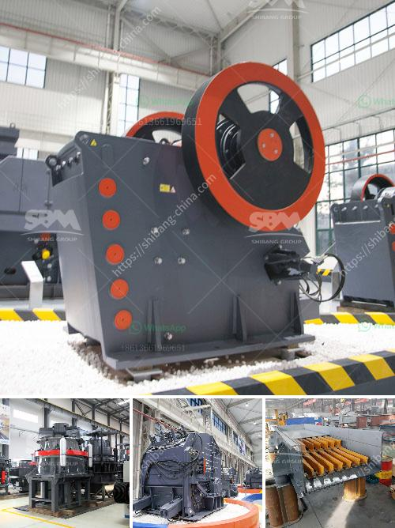

<h3>معدات تعدين الكسارة في تنزانيا</h3>
تنزانيا هي واحدة من الدول الأفريقية التي تمتلك موارد طبيعية غنية ومتنوعة، وتتميز بقطاع التعدين القوي الذي يشكل نسبة كبيرة من الناتج المحلي الإجمالي للبلاد. وفيما يلي سنركز على معدات تعدين الكسارة التي تستخدم في تنزانيا لاستخراج المعادن.

معدات تعدين الكسارة هي أدوات أساسية في عملية استخراج المعادن، وتستخدم في تفتيت المواد الخام بحجم صغير قبل تنقيتها ومعالجتها بمعدات أخرى. وتنقسم معدات تعدين الكسارة إلى عدة أنواع حسب المهمة المراد تحقيقها.

أحد أنواع معدات تعدين الكسارة هو الكسارة الفكية، وهي تستخدم عادة في المراحل الأولى من عملية التعدين. تعمل الكسارات الفكية عن طريق تطبيق الضغط على المادة الخام، وبالتالي تقوم بتكسيرها إلى قطع صغيرة. وتتميز الكسارات الفكية بأنها قادرة على تكسير المواد بأحجام كبيرة مثل الصخور الصلبة.

كما تتضمن معدات تعدين الكسارة أيضًا الكسارة المخروطية. تعمل الكسارة المخروطية بشكل مشابه للكسارة الفكية، حيث تستخدم لتكسير المواد الصلبة إلى قطع أصغر. وتتميز الكسارات المخروطية بقدرتها على توليد قطع عديدة ومتنوعة من الحجم.

علاوة على ذلك، يتم استخدام معدات تعدين الكسارة في تنزانيا في تعدين المعادن مثل الذهب والفحم واليورانيوم والنحاس. فمثلا، يتم استخدام الكسارات الفكية والمخروطية لتحطيم الصخور الصلبة التي تحتوي على نسبة عالية من الذهب قبل استخلاصها بواسطة عملية الجرف النهري.

أخيرا، يجب أن نذكر أن توفر معدات تعدين الكسارة في تنزانيا يعد عاملًا مهمًا لتعزيز قطاع التعدين في البلاد وزيادة إنتاج المعادن. ومن المهم تأمين معدات تعدين الكسارة عالية الجودة والتي تستوفي المعايير الدولية، كما يجب توفير تدريب ودعم فني للعاملين على هذه المعدات للحفاظ على سلامتهم وتعزيز كفاءتهم.

باختصار، معدات تعدين الكسارة تلعب دورًا أساسيًا في عملية استخراج المعادن في تنزانيا. وتشمل هذه المعدات الكسارات الفكية والمخروطية، وتستخدم لتفتيت المواد الصلبة إلى قطع صغيرة. تأمين معدات تعدين الكسارة عالية الجودة وتوفير الدعم الفني المناسب يسهم في تعزيز قطاع التعدين في البلاد وتحقيق نمو اقتصادي مستدام.
<h3>Contact us</h3><ul><li><strong>Whatsapp:&nbsp;<a href="https://wa.me/8613661969651">+8613661969651</a></strong></li><li><a href="https://swt.shibang-china.com/?git&amp;zhl&amp;معدات تعدين الكسارة في تنزانيا"><strong>Online Service(chat now)</strong></a></li></ul><h3>Related</h3><ul><li><a href='مطحنة هامر مختبرية.md'>مطحنة هامر مختبرية</a></li><li><a href='مجفف رمل مستعمل للبيع.md'>مجفف رمل مستعمل للبيع</a></li><li><a href='الكسارة الرئيسية للرخام.md'>الكسارة الرئيسية للرخام</a></li><li><a href='تحجيم هيدروليكي لمصنع كسارة رمل السيليكا.md'>تحجيم هيدروليكي لمصنع كسارة رمل السيليكا</a></li><li><a href='معدات سحق الصناعات الثقيلة في ماليزيا.md'>معدات سحق الصناعات الثقيلة في ماليزيا</a></li></ul>