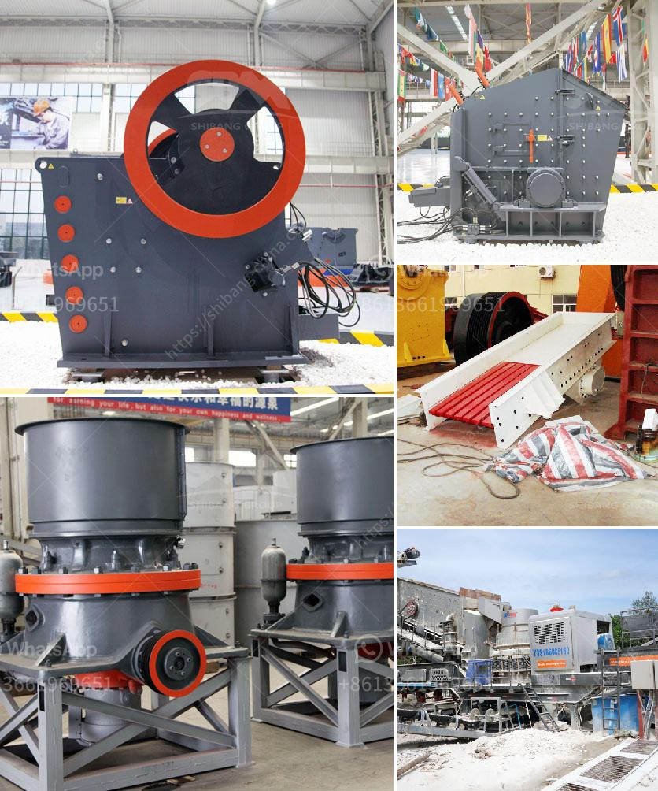

<h3>معدات تعدين في اليابان</h3>
تعتبر اليابان واحدة من الدول الرئيسية في صناعة التعدين العالمية. تمتلك البلاد موارد طبيعية غنية ومتنوعة تشمل الفحم والنحاس والزنك والرصاص والذهب والفضة واليورانيوم. تعود بدايات صناعة تعدين اليابان إلى ألفي عام قبل الميلاد، حيث تم استخدام النحاس والفضة في صناعة الأدوات والمجوهرات.

تتميز معدات التعدين في اليابان بالتكنولوجيا المتقدمة والجودة العالية. تستخدم العديد من الشركات المعدات المتطورة مثل آلات التحميل والحفر والحفر العميق والتفتيش الصناعي. هذه المعدات تجعل عمليات التعدين في اليابان سريعة وفعالة وآمنة.

تعد شركة كوماتسو ويكي هي الشركة الرائدة في صناعة معدات التعدين في اليابان. تقدم الشركة مجموعة واسعة من المعدات بما في ذلك آلات الحفر وآلات التحميل وآلات النقل والكسارات والأجهزة الثقيلة الأخرى. تعمل هذه المعدات بجودة عالية ودقة لتحقيق أفضل النتائج في عمليات التعدين.

تهدف الشركات التعدينية في اليابان إلى تحسين أداء معدات التعدين وتوفير طاقة وموارد أكثر فعالية. قامت بعض الشركات بتطوير معدات حديثة تعمل بوقود أقل وتقلل من انبعاثات الكربون. بالإضافة إلى ذلك، تسعى الشركات إلى تحسين أمان العمال والحد من الحوادث عن طريق استخدام تقنيات متقدمة في معدات التعدين، مثل الحساسات والمنظومات الآلية للكشف عن المخاطر.

بفضل التكنولوجيا المتقدمة والتركيز على الاستدامة والأمان، تظل معدات التعدين في اليابان على رأس قائمة الشركات العالمية في هذا المجال. تحظى الشركات اليابانية بسمعة عالية فيما يتعلق بالجودة والابتكار، وتشتهر بمعداتها المتطورة والموثوقة على مستوى العالم. إنها تلبي احتياجات صناعة التعدين وتساهم في تطوير وازدهار القطاع في اليابان وخارجها.
<h3>Contact us</h3><ul><li><strong>Whatsapp:&nbsp;<a href="https://wa.me/8613661969651">+8613661969651</a></strong></li><li><a href="https://swt.shibang-china.com/?git&amp;zhl&amp;معدات تعدين في اليابان"><strong>Online Service(chat now)</strong></a></li></ul><h3>Related</h3><ul><li><a href='مصانع غسيل الذهب للبيع في غانا.md'>مصانع غسيل الذهب للبيع في غانا</a></li><li><a href='شراء كسارة الحجر sbm في الفلبين.md'>شراء كسارة الحجر sbm في الفلبين</a></li><li><a href='كيف يعمل مطحنة الطحن.md'>كيف يعمل مطحنة الطحن</a></li><li><a href='آلات مستخدمة في مصنع الفحم المسحوق.md'>آلات مستخدمة في مصنع الفحم المسحوق</a></li><li><a href='كسارات مستعملة في نيجيريا.md'>كسارات مستعملة في نيجيريا</a></li></ul>