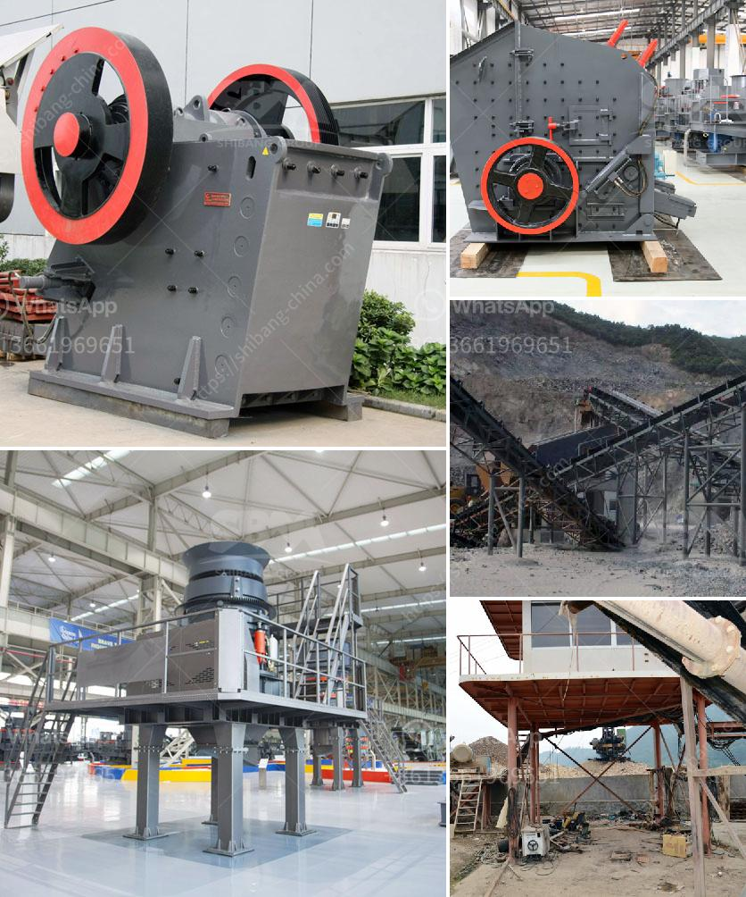

<h3>معدات تعدين كاملة في أكرا، غانا</h3>
تعد غانا واحدة من الدول الرئيسية في قارة أفريقيا في مجال التعدين وتمتلك أحد أكبر احتياطيات الذهب في العالم. ومن بين المناطق الأكثر شهرة في التعدين في غانا هي أكرا، عاصمة البلاد.

تستخدم معدات التعدين في أكرا لاستخراج وتصفية المعادن الثمينة مثل الذهب والماس والبوكسيت وأخرى. الشركات في أكرا تعمل بجد لتجهيز العديد من المعدات التعدينية التي تسهم في تعزيز القدرة التنافسية للصناعة.

تشمل المعدات المستخدمة في التعدين في أكرا الحفارات والكسارات والمناخل والمحطات الكهربائية والآلات المختلفة الأخرى. تتراوح هذه المعدات في حجمها وقوتها حسب نوع المعدن الذي يتم استخراجه.

علاوة على ذلك، يتم استخدام الشاحنات والحافلات لنقل المعدات والمواد من وإلى المواقع التعدينية. هذه الشاحنات غالبًا ما تتميز بقدرتها على التسلق على التضاريس الوعرة والتحرك بسلاسة على الطرق الوعرة التي قد تكون غير معبدة.

من الجدير بالذكر أن الشركات التي تعمل في مجال التعدين في أكرا تسعى جاهدة لتطوير تقنيات ومعدات أكثر فعالية وكفاءة لزيادة الإنتاجية وتقليل التكاليف. ويتم ذلك عن طريق استخدام أحدث التقنيات والأدوات لضمان تشغيل مستدام وفعال.

بالاستفادة من الخبرة الواسعة في مجال التعدين والتصنيع، توفر هذه الشركات معدات تعدين كاملة تناسب احتياجات العملاء، سواء كانت ذات طابع صغير للتعدين النهري أو ذات طابع كبير للتعدين الجبلي.

بشكل عام، يمكن القول إن أكرا في غانا تنعم بالمعدات التعدينية الحديثة والمتقدمة التي تلبي معايير الجودة العالمية. تعمل هذه المعدات على تحسين عمليات التعدين والاستفادة القصوى من الموارد الطبيعية في المنطقة.

وبفضل توفر هذه المعدات الكاملة، أصبحت أكرا بمثابة مركز رئيسي للتعدين في غانا وأفريقيا بشكل عام. وتعزز وجود هذه المعدات الاقتصاد المحلي وتوفر وظائف للعديد من السكان المحليين، وتساهم في تحقيق النمو الاقتصادي المستدام والاستدامة البيئية في المنطقة.
<h3>Contact us</h3><ul><li><strong>Whatsapp:&nbsp;<a href="https://wa.me/8613661969651">+8613661969651</a></strong></li><li><a href="https://swt.shibang-china.com/?git&amp;zhl&amp;معدات تعدين كاملة في أكرا، غانا"><strong>Online Service(chat now)</strong></a></li></ul><h3>Related</h3><ul><li><a href='معدات في ماليزيا لسحق المحمولة.md'>معدات في ماليزيا لسحق المحمولة</a></li><li><a href='أسعار أحزمة الناقل.md'>أسعار أحزمة الناقل</a></li><li><a href='سعر مطحنة ريموند الفائقة الدقة.md'>سعر مطحنة ريموند الفائقة الدقة</a></li><li><a href='سعر كسارة الطاحونة الصناعية.md'>سعر كسارة الطاحونة الصناعية</a></li><li><a href='سعر كسارة الهامر للطن الواحد في الساعة.md'>سعر كسارة الهامر للطن الواحد في الساعة</a></li></ul>