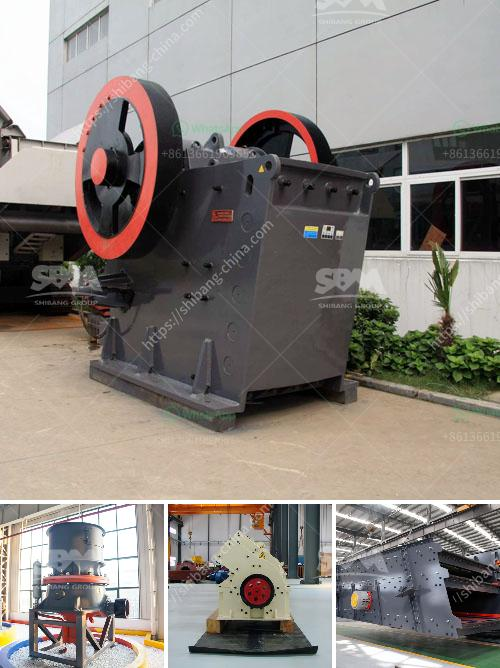

<h3>معدات تعدين مستخدمة</h3>
تعدين الألغام هو عملية استخراج المواد القيمة من القشرة الأرضية. تعتمد نجاح عملية التعدين على استخدام معدات فعالة وذات كفاءة عالية. هنا بعض المعدات التعدين المستخدمة في صناعة التعدين.

1- الحفارات: في صناعة التعدين، يتم استخدام الحفارات لحفر الأرض واستخراج المادة المعدنية. تتميز الحفارات بقوتها وسرعتها في الحفر وقدرتها على التحرك في التضاريس الوعرة.

2- المضخات: في بعض أنواع التعدين، مثل تعدين الذهب الجاف، يحتاج المنقبون إلى استخدام المضخات لسحب وتنقية الرمال والأحجار لاستخراج الذهب. تعمل المضخات باستخدام الطاقة الهيدروليكية لسحب المياه والمواد الأخرى من الأرض.

3- الكسارات: تعتبر الكسارات جزءًا مهمًا في عملية التعدين حيث تستخدم لتكسير الصخور الكبيرة إلى قطع أصغر من الحجم المطلوب. يتم استخدام الكسارات في تعدين الفحم وتعدين الحجر وتعدين الفلزات الثقيلة.

4- معدات الفصل: بمجرد استخراج المواد المعدنية من باطن الأرض، يتم استخدام معدات الفصل لفصل المواد المعدنية المستخرجة عن المواد الغير ذات قيمة. يتم استخدام تقنيات مختلفة مثل الغرابيل والغسل لتكوين المواد المعدنية وفصلها.

5- الشاحنات والحافلات: في التعدين السطحي، يتطلب نقل المواد الخام من موقع التعدين إلى مناطق المعالجة استخدام شاحنات وحافلات ضخمة. هذه المركبات غالباً ما تكون ذات إطارات كبيرة ومصممة للتحرك في التضاريس الوعرة.

باستخدام هذه المعدات وغيرها العديد من المعدات المتقدمة، يمكن لصناعة التعدين تحقيق كفاءة عالية في استخراج المواد القيمة من باطن الأرض. إن التكنولوجيا المتقدمة في معدات التعدين تسهم في زيادة الإنتاجية وتقليل التكاليف وتحسين سلامة العمال في مواقع التعدين.
<h3>Contact us</h3><ul><li><strong>Whatsapp:&nbsp;<a href="https://wa.me/8613661969651">+8613661969651</a></strong></li><li><a href="https://swt.shibang-china.com/?git&amp;zhl&amp;معدات تعدين مستخدمة"><strong>Online Service(chat now)</strong></a></li></ul><h3>Related</h3><ul><li><a href='آلة طحن دقيقة في الصين.md'>آلة طحن دقيقة في الصين</a></li><li><a href='خدمة تأجير الكسارة والغربال.md'>خدمة تأجير الكسارة والغربال</a></li><li><a href='عملية التحول للأسمنت.md'>عملية التحول للأسمنت</a></li><li><a href='آلات الطحن لتكلفة مطحنة الدال.md'>آلات الطحن لتكلفة مطحنة الدال</a></li><li><a href='معدات كسارة الذهب.md'>معدات كسارة الذهب</a></li></ul>