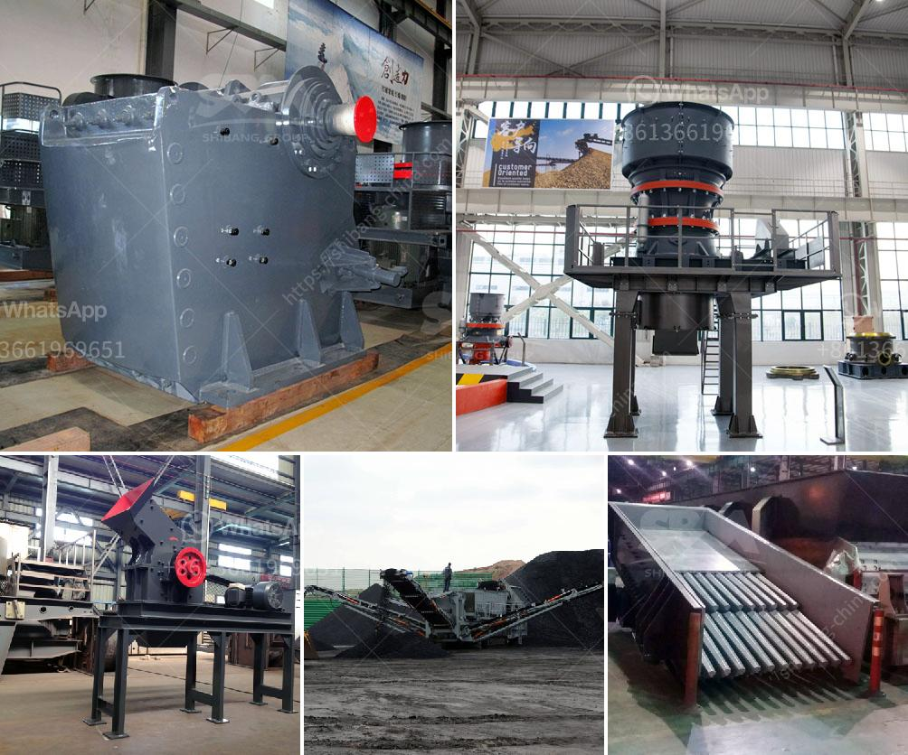

<h3>معدات تعدين مستعملة للبيع في غانا</h3>
تعتبر صناعة التعدين واحدةً من القطاعات الرئيسية في غانا، حيث تعد الذهب والماس من الموارد الطبيعية الرئيسية في البلاد. ومع تزايد الطلب على هذه الموارد الثمينة، يتزايد الاهتمام بشراء معدات تعدين مستعملة في غانا بسعر مناسب.

يتوفر العديد من أنواع معدات التعدين المستعملة المتاحة للبيع في غانا، ويمكن أن تشمل هذه المعدات الحفارات الهيدروليكية، وآلات فرز الرمل والزلط، ومعدات التكسير والفرز، وماكينات الحفر، والناقلات اللولبية، وغيرها.

تحتاج العديد من الشركات والمؤسسات التعدينية في غانا إلى تجديد معداتها من وقت لآخر، مما يتيح فرصًا لشراء معدات تعدين مستعملة. وعلى الرغم مما أنها مستعملة، إلا أن هذه المعدات قد تكون في حالة جيدة وموثوقة، وذلك يعتمد على الصيانة والعناية التي تمت فيها خلال الاستخدام السابق.

إذا كنت تبحث عن معدات تعدين مستعملة للبيع في غانا، فمن المهم أن تأخذ بعض العوامل في الاعتبار. قم بإجراء بحث دقيق للتحقق من سجل المعدات والاطلاع على الاستعمال السابق للمعدات وحالتها الفنية. قد تحتاج إلى استعانة بخبراء في المجال لتقييم المعدات وضمان أنها تعمل بكفاءة وبدون مشاكل.

يمكن أن يكون السعر أحد المعيارين الرئيسيين عندما تبحث عن معدات تعدين مستعملة. يمكن أن تتراوح الأسعار من 200 إلى 400 دولار، وهذا يعتمد على عدة عوامل، مثل نوع المعدة وحالتها الفنية وعامل العرض والطلب في السوق.

يوجد العديد من وكالات السوق ومواقع البيع عبر الإنترنت التي توفر معدات تعدين مستعملة للبيع في غانا، يمكنك تصفح هذه المواقع للعثور على المعدات المناسبة لاحتياجاتك. يمكنك أيضًا التواصل مع الموردين والبائعين المحليين في غانا للحصول على تفاصيل إضافية ومعلومات حول المعدات التي يتوفرون عليها للبيع.

في الختام، يمكن القول أن شراء معدات تعدين مستعملة في غانا يمكن أن يكون خيارًا جيدًا للشركات والأفراد الذين يبحثون عن الاستثمار في هذه الصناعة. يجب القيام بالبحث والتحقق من حالة المعدات قبل الشراء والانتقال للتفاصيل المالية للعملية.
<h3>Contact us</h3><ul><li><strong>Whatsapp:&nbsp;<a href="https://wa.me/8613661969651">+8613661969651</a></strong></li><li><a href="https://swt.shibang-china.com/?git&amp;zhl&amp;معدات تعدين مستعملة للبيع في غانا"><strong>Online Service(chat now)</strong></a></li></ul><h3>Related</h3><ul><li><a href='عملية مصنع الأحجار الكوارتز 3080.md'>عملية مصنع الأحجار الكوارتز 30-80</a></li><li><a href='سعر آلة طحن الرخام.md'>سعر آلة طحن الرخام</a></li><li><a href='كسارات الحجر في غانا.md'>كسارات الحجر في غانا</a></li><li><a href='كيماويات تعويم تحسين الفحم في الهند.md'>كيماويات تعويم تحسين الفحم في الهند</a></li><li><a href='سعر الكسارة 30 طن.md'>سعر الكسارة 30 طن</a></li></ul>