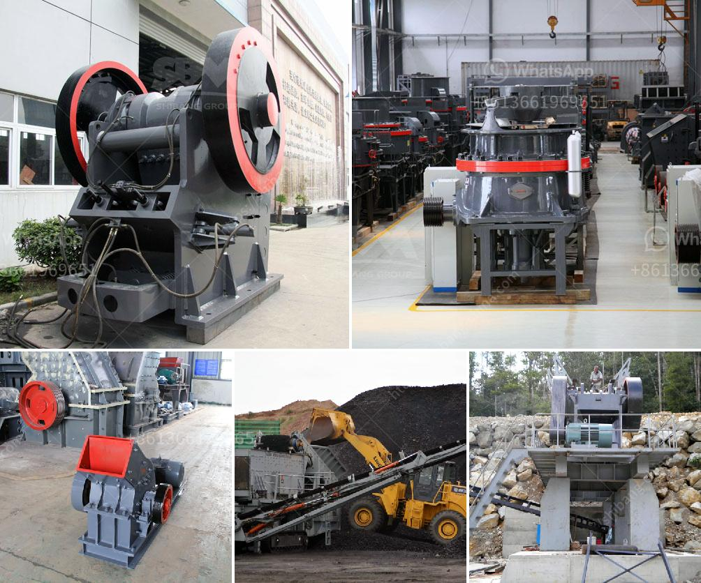

<h3>معدات تكسير الخرسانة</h3>
معدات تكسير الخرسانة هي أدوات هامة في صناعة البناء والهدم. تُستخدم هذه المعدات لتدمير الخرسانة بطريقة فعالة وآمنة، مما يتيح إعادة استخدام المواد الأساسية في إنتاج جديد ويساهم في الحفاظ على البيئة وتقليل النفايات.

أحد المعدات الشائعة هو الكسارة الفكية أو الكسارة الصخرية، وهي تستخدم لتكسير الخرسانة بطريقة هشة باستخدام قوة الضغط. تتألف الكسارة الفكية من فكين متحركين، يتم تحريكهما بواسطة محرك، ومساحة تكسير صغيرة بينهما. يتم وضع الخرسانة في فتحة التكسير وتتحرك الفكوك بطريقة تكسر الخرسانة إلى قطع صغيرة.

ثمة أيضًا المطرقة الهيدروليكية، وهي مناسبة لتحطيم الخرسانة في المباني والأماكن الضيقة. تعمل المطارق الهيدروليكية بقوة هيدروليكية عالية لتوفير ضغط قوي. تتكون المطارق الهيدروليكية من أسطوانة ضغط تحمل الكمية الهائلة من الضغط، والتي ينتقل الضغط منها إلى الجزء القصير الذي يتلامس مع الخرسانة ويتسبب في تحطيمها.

كسارة الصدم أو المطرقة الدوارة تُستخدم كثيرًا في تكسير الخرسانة. تعتمد هذه الكسارة على قوة الصدم العالية والسرعة العالية لتكسير الخرسانة. تتألف من جسم دوار يدور بسرعة عالية، ومطرقة ثابتة تتألف من بطانة صدم مقاومة للتآكل. عندما يلامس الجسم الدوار الخرسانة، تحدث صدمة عنيفة، ما يؤدي إلى تكسيرها.

بالإضافة إلى ذلك، هناك أجهزة تكسير الخرسانة الهيدروليكية، والتي تستخدم لتكسير الخرسانة السميكة والصلبة. تتميز هذه الأجهزة بالقوة الهيدروليكية العالية والمرونة في التحكم، مما يسهل استخدامها في أماكن الصعوبة والأماكن الضيقة. توفر هذه الأجهزة قدرة إضافية لتحطيم الخرسانة بطريقة سريعة وفعالة.

يعتبر استخدام المعدات المذكورة أعلاه في صناعة البناء والهدم ضروريًا لتوفير كفاءة عالية في العمل وإعادة استخدام المواد الأساسية. كما أنه يساهم في حماية البيئة وتقليل النفايات، مما يجعله استثمارًا مستدامًا واقتصاديًا في صناعة البناء.
<h3>Contact us</h3><ul><li><strong>Whatsapp:&nbsp;<a href="https://wa.me/8613661969651">+8613661969651</a></strong></li><li><a href="https://swt.shibang-china.com/?git&amp;zhl&amp;معدات تكسير الخرسانة"><strong>Online Service(chat now)</strong></a></li></ul><h3>Related</h3><ul><li><a href='كسارة محمولة في المملكة العربية السعودية.md'>كسارة محمولة في المملكة العربية السعودية</a></li><li><a href='مصنع غسيل محمول للفحم.md'>مصنع غسيل محمول للفحم</a></li><li><a href='مصنع كسارة للبيع في جنوب أفريقيا.md'>مصنع كسارة للبيع في جنوب أفريقيا</a></li><li><a href='نظام مصنع البنتونيت.md'>نظام مصنع البنتونيت</a></li><li><a href='منتجات آلات الكتل الطينية.md'>منتجات آلات الكتل الطينية</a></li></ul>