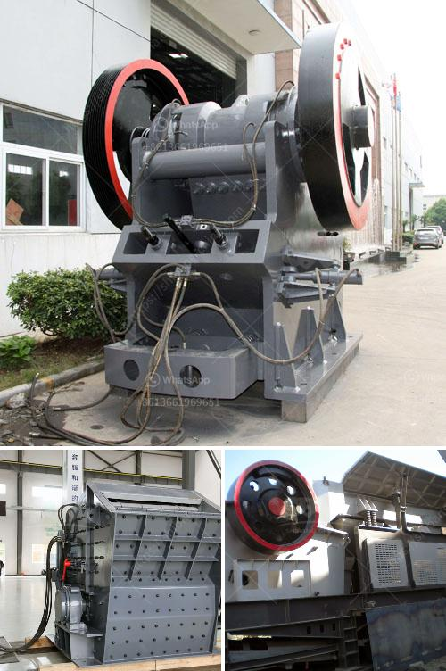

<h3>معدات تكسير الكالسايت</h3>
تكسير الكالسايت  هو عملية تحويل الكالسايت ، وهو نوع من الصخور الكربونية ، إلى شكلها النهائي للاستخدام في مجموعة متنوعة من التطبيقات الصناعية. الكالسايت يعتبر أحد المواد الخام الهامة في صناعة البناء والهندسة المدنية ، حيث يتم استخدامه في إنتاج الأسمنت والحجر الجيري والدقيقة ، بالإضافة إلى العديد من التطبيقات الأخرى.

لتكسير الكالسايت ، يستخدم المصنعون معدات خاصة تعرف بمعدات تكسير الكالسايت. هذه المعدات تشمل عادة كسارة الفك ، كسارة المخروط ، كسارة الصدم ، وغيرها من المعدات المتخصصة التي تعمل بكفاءة عالية وفعالية.

أولاً ، كسارة الفك تعتبر أحد أهم المعدات في عملية التكسير ، حيث تقوم بكسر الكالسايت الخام إلى قطع صغيرة تحتوي على حجم محدد. تستخدم كسارة الفك عادة لتقليل الحجم الكبير من الصخور الكالسايت ، حيث يتم سحقها بواسطة ضغط قوي تطبقه حركة الفك الداخلية والخارجية.

ثانياً ، تستخدم كسارة المخروط لطحن وسحق الكالسايت إلى قطع أصغر بواسطة الضغط. تتميز كسارة المخروط بتصميمها الفريد الذي يسمح بتوزيع الضغط بالتساوي على جميع أجزاء الصخور المكسورة ، مما يمنح نتائج موحدة وجودة عالية.

وأخيرًا ، تستخدم كسارة الصدم في عملية تكسير الكالسايت بواسطة ضربات قوية. يتم تحويل الكالسايت الخام إلى أجزاء أصغر تحت تأثير ضربات الصدم العالية السرعة. تُستخدم هذه الكسارة عادة في التطبيقات التي تتطلب مستويات عالية من التكسير ، مثل صناعة الرمل والحصى.

بصفة عامة ، معدات تكسير الكالسايت تلعب دورًا حيويًا في صناعة البناء والهندسة المدنية. تحتاج العديد من الصناعات إلى الكالسايت المكسرة لإنتاج منتجاتها ، ومن ثم فإن وجود معدات فعالة وعالية الجودة هو ضروري لضمان الإنتاجية والجودة في عملية التكسير.
<h3>Contact us</h3><ul><li><strong>Whatsapp:&nbsp;<a href="https://wa.me/8613661969651">+8613661969651</a></strong></li><li><a href="https://swt.shibang-china.com/?git&amp;zhl&amp;معدات تكسير الكالسايت"><strong>Online Service(chat now)</strong></a></li></ul><h3>Related</h3><ul><li><a href='كسارة الحجر الصغيرة للبيع في الفلبين.md'>كسارة الحجر الصغيرة للبيع في الفلبين</a></li><li><a href='مطحنة المطرقة للجبس.md'>مطحنة المطرقة للجبس</a></li><li><a href='دراسة جدوى لمصنع سحق الكروم الفير.md'>دراسة جدوى لمصنع سحق الكروم الفير</a></li><li><a href='مطحنة MTM ترابيزيوم.md'>مطحنة MTM ترابيزيوم</a></li><li><a href='مصنعون لمصانع التكسير المتنقلة.md'>مصنعون لمصانع التكسير المتنقلة</a></li></ul>