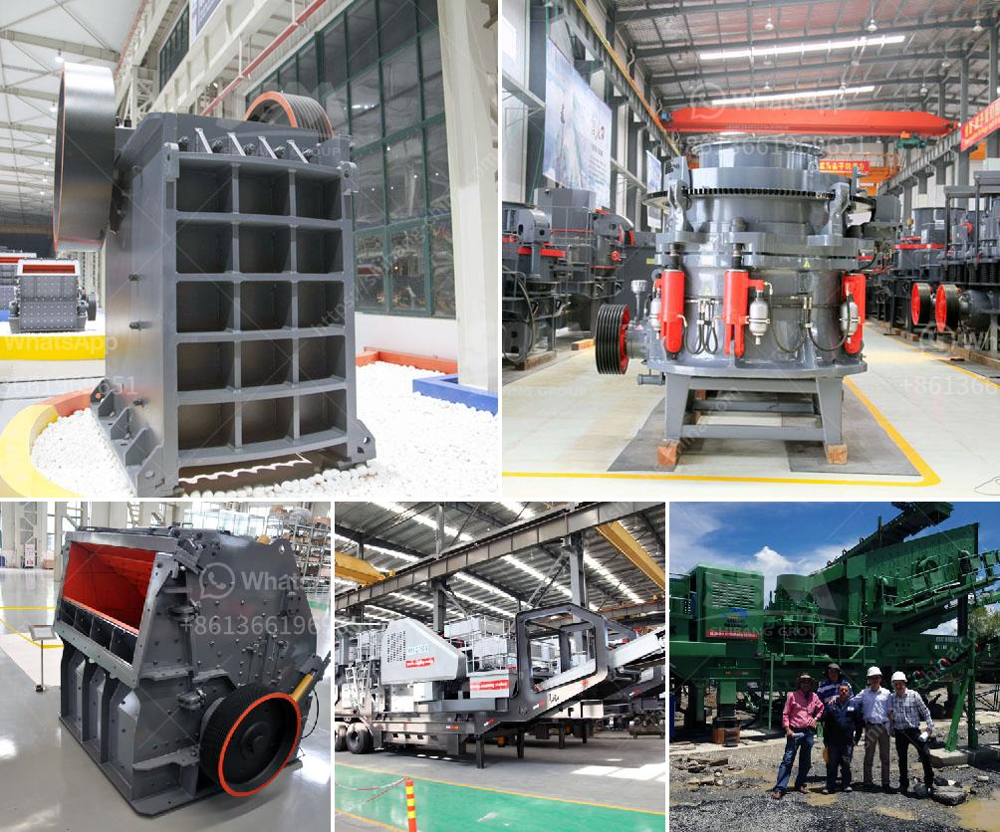

<h3>معدات تكسير خام الكروم المستخدمة</h3>
تعد خامات الكروم من المواد الهامة التي تستخدم في العديد من الصناعات، مثل صناعة الفولاذ والسبائك والزجاج والمواد الكيميائية. لضمان استخراج الكمية المثلى من الكروم من الخام، يتم استخدام معدات تكسير خام الكروم المتطورة.

أحد الأدوات الرئيسية في عملية تكسير خام الكروم هو الكسارة الفكية. تستخدم الكسارة الفكية بشكل رئيسي لتكسير الكتل الكبيرة من الخامات إلى قطع صغيرة. تتكون الكسارة الفكية من صفيحة تكسير ثابتة وصفيحة تكسير متحركة. تتحرك الصفيحة المتحركة لأعلى ولأسفل لسحق الخام، بينما تبقى الصفيحة الثابتة ثابتة. تُستخدم ربيعات توازن في الكسارة الفكية لتجنب الأضرار التي قد تحدث نتيجة الضغط الزائد على الخام.

كثيرًا ما تستخدم الكسارة المخروطية للتعامل مع الكتل الكبيرة من الخامات بشكل أكثر تفصيلا. تعمل الكسارة المخروطية عن طريق ضغط الخام بين سطحين مخروطيين. يتم تحقيق ضغط الخام بواسطة أسطوانة هيدروليكية. إن الحجم الصغير للخامات المكسورة يجعلها أكثر توافقًا مع العملية التالية لاستخلاص الكروم.

لضمان تكسير الخام بشكل أكثر دقة ودقة، تُستخدم الكسارة الصدمية المدمجة في العديد من المصانع. تتألف الكسارة الصدمية من غرفة تكسير مركزية ومطرقة دوارة. يتم إدخال الخامات عبر الفجوة بين الصدفة والغرفة المركزية، وتنكسر هناك بواسطة المطرقة الدوارة. تتميز الكسارة الصدمية بقدرتها على تكسير الخام بشكل أكثر كفاءة وتوفير الطاقة.

تُستخدم هذه المعدات في مصانع تكسير خام الكروم. ومع ذلك، يجب إدراك أن العملية بأكملها تتطلب الكثير من الاهتمام والصيانة المنتظمة لزيادة كفاءة عملية التكسير وضمان جودة الكروم الناتجة. يجب أيضًا ارتداء ملابس واقية للعاملين واستخدام وسائل الحماية الشخصية لتقليل أي مخاطر عملية التكسير.

باختصار، تعتبر معدات تكسير خام الكروم ضرورية لاستخراج وتجهيز الكروم بطريقة فعالة وفعالة تكنولوجيًا. يجب الاهتمام بصيانة المعدات والسلامة الشخصية لضمان تشغيل آمن وفعال.
<h3>Contact us</h3><ul><li><strong>Whatsapp:&nbsp;<a href="https://wa.me/8613661969651">+8613661969651</a></strong></li><li><a href="https://swt.shibang-china.com/?git&amp;zhl&amp;معدات تكسير خام الكروم المستخدمة"><strong>Online Service(chat now)</strong></a></li></ul><h3>Related</h3><ul><li><a href='شاشة تصنيف اهتزازية.md'>شاشة تصنيف اهتزازية</a></li><li><a href='مصنع إنتاج مسحوق الجبس في أوروبا.md'>مصنع إنتاج مسحوق الجبس في أوروبا</a></li><li><a href='مصنع مطحنة الكرة في باكستان.md'>مصنع مطحنة الكرة في باكستان</a></li><li><a href='سعر الأسطوانات للمطاحن الصناعية.md'>سعر الأسطوانات للمطاحن الصناعية</a></li><li><a href='آلة سحق البلاد.md'>آلة سحق البلاد</a></li></ul>