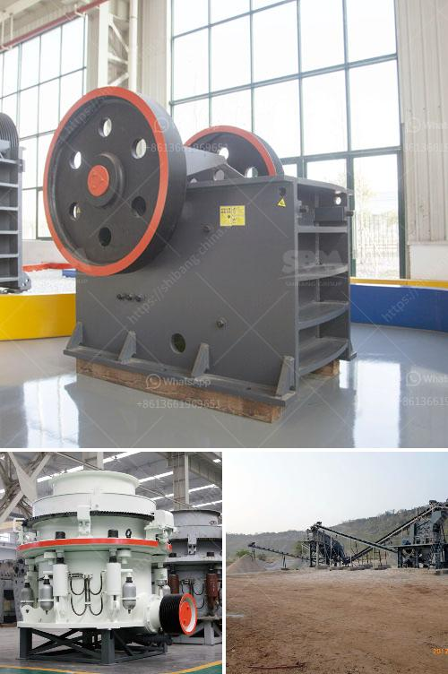

<h3>معدات تكسير وطحن التلك</h3>
تعتبر معدات تكسير وطحن التلك جزءًا أساسيًا في عملية تصنيع المنتجات المحتوية على التلك. التلك هو معدن ناعم يتألف من ترسبات مكونة أساسا من المغنيسيوم والسيليكون والأكسجين. يتم استخراج التلك من مناجمها وتكسيرها وطحنها إلى مسحوق ناعم لاستخدامه في الصناعات المختلفة.

إن تكسير التلك يتطلب استخدام معدات متخصصة لتحقيق النتائج المطلوبة. في المقام الأول، يتم تكسير التلك الخشن إلى قطع أصغر باستخدام آلات التكسير. في هذه العملية، يتم تكسير قطع التلك الكبيرة باستخدام الصدم أو الضغط لتحقيق الحجم المطلوب. بعد ذلك، يتم نقل التلك المكسور إلى آلة طحن.

تتطلب عملية طحن التلك معدات ذات مستوى عالٍ من الدقة والكفاءة للحصول على التلك المطلوب. تشتمل المعدات المستخدمة في هذه العملية على مطاحن الكرات والمطاحن العمودية والمطاحن الحلزونية. تتميز هذه المعدات بقدرتها على طحن التلك إلى حجم جسيمات مناسب. عملية الطحن تعتمد على تكسير الجسيمات الكبيرة إلى جسيمات صغيرة وتقليل حجم الجسيمات المطلوب.

بعد الانتهاء من عملية الطحن، يتم فصل الجسيمات الدقيقة عن باقي المواد. يتم استخدام أجهزة الفصل الجاذبية لفصل الجسيمات الدقيقة من غيرها من المواد. يتم استخدام تقنيات متقدمة مثل البواخر الجذابة والأجهزة التي تعتمد على مبدأ الوزن الجزيئي للفصل بين الجسيمات الدقيقة والشوائب الأخرى.

يُعتبر التلك مادة هامة في صناعة مجموعة واسعة من المنتجات مثل مساحيق التجميل والأدوية ومواد البلاستيك والدهانات والورق والمختلفة. لذلك، يلعب تكسير وطحن التلك دورًا حيويًا في تحويل هذا المعدن الطبيعي إلى منتجات نهائية تلبي احتياجات السوق.

في الختام، يمكننا القول بأن معدات تكسير وطحن التلك تلعب دورًا حاسمًا في صناعة المنتجات التي تحتوي على التلك. من خلال استخدام معدات متخصصة وعملية فصل فعالة، يمكن أن يتم تحويل التلك الخام إلى مادة نهائية ذات جودة عالية ومطابقة لمتطلبات العملاء. إن تكسير وطحن التلك يُعتبر عملية معقدة تتطلب مهارة وتخصصًا عاليًا لتحقيق نتائج مرضية.
<h3>Contact us</h3><ul><li><strong>Whatsapp:&nbsp;<a href="https://wa.me/8613661969651">+8613661969651</a></strong></li><li><a href="https://swt.shibang-china.com/?git&amp;zhl&amp;معدات تكسير وطحن التلك"><strong>Online Service(chat now)</strong></a></li></ul><h3>Related</h3><ul><li><a href='كسارة الحجر الجيري للبيع.md'>كسارة الحجر الجيري للبيع</a></li><li><a href='مطحنة الكرة مطرقة مطحنة مطحنة أسطوانية آلة.md'>مطحنة الكرة مطرقة مطحنة مطحنة أسطوانية آلة</a></li><li><a href='سعر كسارة الأسطوانة.md'>سعر كسارة الأسطوانة</a></li><li><a href='سعر آلة كسارة الفك.md'>سعر آلة كسارة الفك</a></li><li><a href='مصنع تركيز النحاس الصغير.md'>مصنع تركيز النحاس الصغير</a></li></ul>