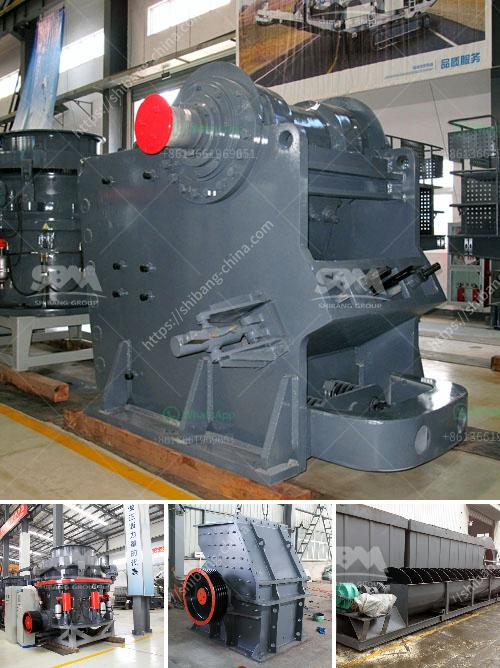

<h3>معدات تنظيف الرمال في الصغيرة</h3>
تعتبر معدات تنظيف الرمال في الصغيرة أدوات ضرورية للحفاظ على النظافة والصحة في المناطق الرملية الصغيرة مثل الحدائق, الملاعب, الشواطئ والحدائق العامة. تلعب هذه المعدات دورًا هامًا في إزالة الترسبات والأوساخ من الرمال والحفاظ على مظهرها الجميل وخالية من المخاطر.

تتكون معدات تنظيف الرمال في الصغيرة عادةً من آليات صغيرة وفعالة تستخدم لجمع وتصفية الرمال. تجمع الآليات بسهولة الترسبات والقاذورات المختلفة مثل الأوراق المتساقطة والفضلات العضوية والحجارة الصغيرة. تحتوي هذه الآليات على شفرات حادة أو أسطوانات للتخلص من القمامة وتصفية الرمال بشكل فعال.

تعتبر أجهزة تنظيف الرمال في الصغيرة سهلة الاستخدام وذات كفاءة عالية. يحتاج المشغلون إلى التوجيه والتحكم في حركة الآلية فقط، حيث تعمل الشفرات أو الأسطوانات على جمع المخلفات وتصفية الرمال. بعض المعدات تأتي مزوّدة بفلاتر لإزالة الجسيمات الدقيقة ومواد التلوث، مثل النفايات البلاستيكية والتربة الملوثة.

تعتبر معدات تنظيف الرمال في الصغيرة مثالية للاستخدام في المناطق العامة ذات الاستخدام العالي حيث يتردد عليها العديد من الأشخاص يوميًا. وتعتبر أيضًا خيارًا موفرًا للوقت والجهد حيث يكون العمل اليدوي التقليدي مكلفًا ومضنيًا.

تعتبر معدات تنظيف الرمال في الصغيرة أيضًا ضرورية للحد من الاختناقات والحوادث. فعندما يتراكم القمامة والأوساخ في الرمال، فإنها قد تتسبب في إحداث مشاكل صحية وسببًا للإصابة أو السقوط على المستخدمين. إذا تم استخدام معدات التنظيف بانتظام، يمكن الحد من هذه المخاطر وضمان أماكن نظيفة وآمنة للجميع.

وفي الختام، تعد معدات تنظيف الرمال في الصغيرة أدوات حيوية للحفاظ على الرمال نظيفة وصحية في المناطق الصغيرة. تساعد في إزالة القمامة والأوساخ والترسبات الضارة وتحسن مظهر المناطق وتقلل من المخاطر. يجب على المستخدمين استخدامها بشكل منتظم للحفاظ على الرمال نظيفة وآمنة، وضمان النظافة والجاذبية في المناطق الرملية الصغيرة.
<h3>Contact us</h3><ul><li><strong>Whatsapp:&nbsp;<a href="https://wa.me/8613661969651">+8613661969651</a></strong></li><li><a href="https://swt.shibang-china.com/?git&amp;zhl&amp;معدات تنظيف الرمال في الصغيرة"><strong>Online Service(chat now)</strong></a></li></ul><h3>Related</h3><ul><li><a href='كسارة الحجر من النوع الصغير.md'>كسارة الحجر من النوع الصغير</a></li><li><a href='كسارات الفك المستعملة في إسبانيا.md'>كسارات الفك المستعملة في إسبانيا</a></li><li><a href='تكلفة طاحونة الكوارتز.md'>تكلفة طاحونة الكوارتز</a></li><li><a href='بيان طريقة لناقلات الحزام.md'>بيان طريقة لناقلات الحزام</a></li><li><a href='مطاحن الكرة للحجر الجيري في ماليزيا.md'>مطاحن الكرة للحجر الجيري في ماليزيا</a></li></ul>