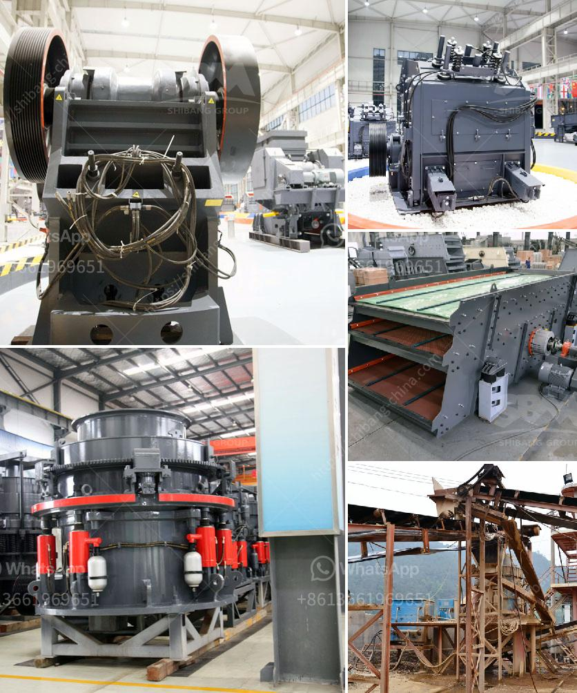

<h3>معدات جص صنع الجدار الخرساني في ألمانيا</h3>
تعد صناعة البناء من الصناعات الحيوية في ألمانيا، وتتطلب العديد من المعدات الحديثة والمتطورة لضمان جودة الأعمال وتقليل الوقت والجهد المبذول. واحدة من المعدات الرئيسية التي تستخدم في صناعة البناء هي معدات جص صنع الجدار الخرساني.

معدات جص صنع الجدار الخرساني هي مجموعة معدات تستخدم لتطبيق الجص على الجدران الخرسانية لتحسين المظهر النهائي والحماية من التآكل. تتكون هذه المعدات عادةً من آلة تطبيق الجص ومضخة الجص وخلاطة الجص.

آلة تطبيق الجص هي الجزء الرئيسي من معدات جص صنع الجدار الخرساني، حيث تقوم برش الجص على الجدران بشكل متساوٍ ومتسق للحصول على تغطية متماسكة وجميلة. غالبًا ما تكون هذه الآلات قابلة للتحرك وتعمل بواسطة الكهرباء أو الهواء المضغوط.

أما مضخة الجص فتستخدم لضخ الجص من خلاطة الجص إلى آلة تطبيق الجص. تتميز مضخة الجص بقدرتها على ضخ كميات كبيرة من الجص بسرعة وكفاءة. كما توفر هذه المضخات وسائل الأمان لمنع تسرب الجص أو توقفها عن العمل بسبب الانسداد.

أخيرًا، يستخدم خلاط الجص لخلط المواد الخام المستخدمة في تحضير الجص. يمكن أن تكون مادة الجص نفسها أو تكنولوجيا الجص المعدلة - حسب متطلبات المشروع. يجب أن يكون الخلاط قويًا وفعالًا لضمان خلط المواد بشكل صحيح وسريع.

تعتبر معدات جص صنع الجدار الخرساني في ألمانيا عالية الجودة وتتسم بالمتانة والموثوقية. تستخدم العديد من الشركات المتخصصة في البناء هذه المعدات لتنفيذ المشاريع بشكل أفضل وأسرع. وبالإضافة إلى ذلك، فإن استخدام هذه المعدات الحديثة يعني تقليل تكاليف العمالة والوقت، مما يجعلها خيارًا اقتصاديًا وفعالًا.

باختصار، تعتبر معدات جص صنع الجدار الخرساني في ألمانيا أدوات حديثة وضرورية في صناعة البناء. تساهم في تحسين جودة الأعمال وزيادة الكفاءة وتحقيق الاقتصاد في التكاليف. تعتبر ألمانيا رائدة في هذا المجال، وتقدم تكنولوجيا حديثة ومتطورة، مما يجعلها محط اهتمام الشركات في جميع أنحاء العالم.
<h3>Contact us</h3><ul><li><strong>Whatsapp:&nbsp;<a href="https://wa.me/8613661969651">+8613661969651</a></strong></li><li><a href="https://swt.shibang-china.com/?git&amp;zhl&amp;معدات جص صنع الجدار الخرساني في ألمانيا"><strong>Online Service(chat now)</strong></a></li></ul><h3>Related</h3><ul><li><a href='كسارة النحاس للبيع في ماليزيا.md'>كسارة النحاس للبيع في ماليزيا</a></li><li><a href='مطحنة الكرة الثقيلة الوزن في الهند.md'>مطحنة الكرة الثقيلة الوزن في الهند</a></li><li><a href='ميزات كسارة الفك.md'>ميزات كسارة الفك</a></li><li><a href='مورد كسارة الحجر الجيري.md'>مورد كسارة الحجر الجيري</a></li><li><a href='كسارة تأثير الحجر الجيري.md'>كسارة تأثير الحجر الجيري</a></li></ul>