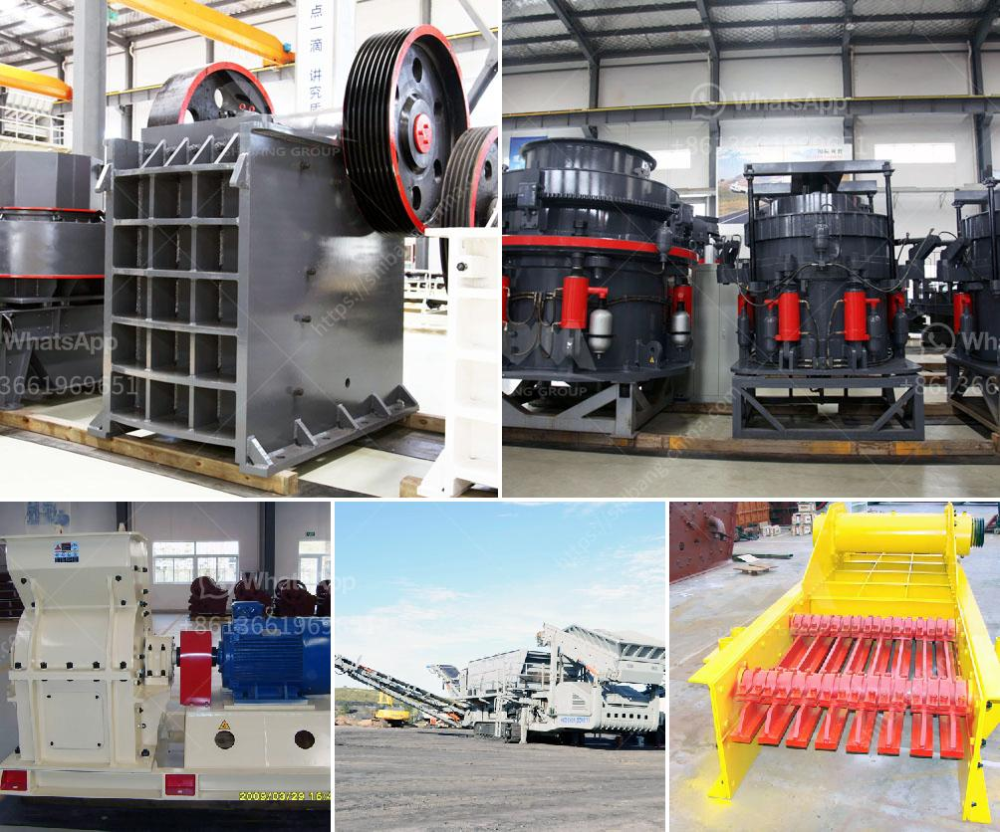

<h3>معدات خط إنتاج كبريتات المغنيسيوم</h3>
تعتبر معدات خط إنتاج كبريتات المغنيسيوم أحد الأدوات الأساسية في صناعة المغنيسيوم. يتم استخدام هذه المعدات لتحويل خام المغنيسيت إلى مسحوق الكبريتات المغنيسيوم النقي.

يتكون خط إنتاج كبريتات المغنيسيوم عادة من عدة مراحل. في المرحلة الأولى، يتم سحق خام المغنيسيت إلى حجم صغير باستخدام كسارات خاصة. يتم ثم خلط المغنيسيت المكسور بالماء لتشكيل معجون المغنيسيوم. يتم تفريغ هذا المعجون في خزانات خاصة للتخزين والتهيئة للمرحلة التالية.

في المرحلة الثانية، يتم استخدام معدات خاصة لفصل الماء عن معجون المغنيسيوم. يتم تقسيم المعجون في الجهاز إلى مرحلتين: مرحلة تسمى مرحلة الفصل الأولي ومرحلة تسمى مرحلة الفصل الثانوي. تتم في هاتين المرحلتين عمليات التعويم والترشيح لفصل الجسيمات الصلبة عن الماء.

بعد الانتهاء من عمليات الفصل، يتم التركيز على المعجون المتبقي باستخدام معدات التركيز. يتم ضخ ماء إضافي للمعجون وتحريكه باستخدام خلاطات خاصة لفصل الشوائب الأخرى عن المادة النقية.

في المرحلة النهائية، يتم تحويل المعجون المركز إلى صورة نهائية من مسحوق الكبريتات المغنيسيوم. يتم استخدام أفران خاصة لتجفيف المعجون وتحويله إلى شكل مسحوق. تعتبر هذه الأفران أحد أجزاء الصهر النهائي للمعجون، وتحتاج إلى تنظيم درجات الحرارة والضغط بشكل صحيح للحصول على مسحوق عالي الجودة.

باستخدام معدات خط إنتاج كبريتات المغنيسيوم الحديثة، يمكن تحقيق إنتاجية عالية وجودة ممتازة للمنتج النهائي. تعتبر هذه المعدات ضرورية لصناعة المغنيسيوم وتعتبر مساهمة هامة في صناعة السبائك والصناعات الكيماوية الأخرى.

في الختام، تعتبر معدات خط إنتاج كبريتات المغنيسيوم أداة أساسية لإنتاج مسحوق الكبريتات المغنيسيوم بجودة عالية. من خلال استخدام هذه المعدات، يمكن تحقيق إنتاجية عالية وخفض تكاليف الإنتاج وتلبية احتياجات السوق المتزايدة للمغنيسيوم.
<h3>Contact us</h3><ul><li><strong>Whatsapp:&nbsp;<a href="https://wa.me/8613661969651">+8613661969651</a></strong></li><li><a href="https://swt.shibang-china.com/?git&amp;zhl&amp;معدات خط إنتاج كبريتات المغنيسيوم"><strong>Online Service(chat now)</strong></a></li></ul><h3>Related</h3><ul><li><a href='تعدين المحاجر ومعدات البناء.md'>تعدين المحاجر ومعدات البناء</a></li><li><a href='مصنع الحجر الجيري والآلات في تاميل نادو للبيع.md'>مصنع الحجر الجيري والآلات في تاميل نادو للبيع</a></li><li><a href='سعر مصنع معالجة الحجر الجيري.md'>سعر مصنع معالجة الحجر الجيري</a></li><li><a href='كسارة تأثير صناعية.md'>كسارة تأثير صناعية</a></li><li><a href='تقرير مشروع التعدين الكاولين المصغر.md'>تقرير مشروع التعدين الكاولين المصغر</a></li></ul>