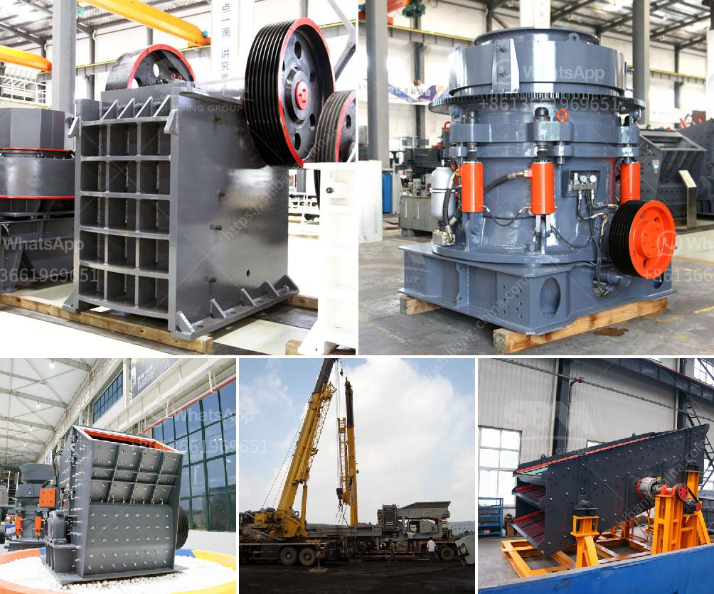

<h3>معدات زراعية للبيع بأسعار مناسبة</h3>
إن الزراعة هي العملية الحيوية التي يعتمد عليها الإنسان منذ العصور القديمة لتلبية احتياجاته الغذائية. ولكن في هذا العصر الحديث، تم تطوير تقنيات زراعية جديدة تستخدم المعدات الزراعية لتحسين الكفاءة وزيادة الإنتاجية. وبالتالي، أصبحت المعدات الزراعية ضرورة لكل مزارع محترف يبحث عن طرق مستدامة لإدارة مزرعته.

وعندما يتعلق الأمر بشراء المعدات الزراعية، يعتبر اختيار المعدات المناسبة بأسعار معقولة أمراً هاماً. ومع ظهور العديد من الشركات المتخصصة في تصنيع المعدات الزراعية، أصبح من الممكن العثور على مجموعة واسعة من المعدات بأسعار تناسب مختلف المزارعين.

أولاً، يمكن إيجاد المعدات الزراعية للبيع في المتاجر المحلية. يمكن للمزارع التوجه إلى المتاجر المتخصصة في بيع المعدات الزراعية المستعملة أو الجديدة. تتراوح الأسعار في هذه المتاجر عادة بين 200 و 400 دولار حسب نوع المعدة وحجمها. ومن الممكن العثور على معدات مثل الحراثات والمزارع والرشاشات وغيرها بأسعار جيدة جداً.

ثانياً، يمكن للمزارعين البحث عن المعدات الزراعية للبيع عبر الإنترنت. وفي هذا العصر الرقمي، أصبح البحث عبر الإنترنت أحد الخيارات الأكثر راحة وشيوعاً للعثور على المعدات الزراعية. هناك العديد من مواقع الويب المتخصصة في بيع المعدات الزراعية المستعملة والجديدة. يمكن للمزارعين تصفح هذه المواقع والبحث عن المعدات التي يحتاجونها ومقارنة الأسعار بين المختلفة. تتيح هذه المواقع أيضاً الاطلاع على تقييمات المستخدمين السابقين والاستفسار عن أي تفاصيل إضافية قد تحتاجها قبل إجراء الشراء.

بالإضافة إلى ذلك، يمكن أيضاً شراء المعدات الزراعية عن طريق المزادات العلنية. تُعقد المزادات العلنية في العديد من البلدان ويتم عرض مجموعة واسعة من المعدات الزراعية بأسعار تناسب المشترين. يعد هذا الخيار مناسباً للمزارعين الذين يبحثون عن صفقات قيمة للحصول على معدات زراعية عالية الجودة بتكلفة معقولة.

في الختام، يمكن القول أنه بفضل التطور التكنولوجي الحديث، أصبحت المعدات الزراعية أكثر توفراً بأسعار مناسبة للمزارعين. يحظى الباحثون عن المعدات الزراعية بالعديد من الخيارات لاختيار المعدة التي تناسب احتياجاتهم وميزانياتهم. إذا كنت تبحث عن معدات زراعية بأسعار معقولة، يُنصح بزيارة المتاجر المحلية أو استكشاف الخيارات المتاحة عبر الإنترنت أو التوجه إلى المزادات العلنية.
<h3>Contact us</h3><ul><li><strong>Whatsapp:&nbsp;<a href="https://wa.me/8613661969651">+8613661969651</a></strong></li><li><a href="https://swt.shibang-china.com/?git&amp;zhl&amp;معدات زراعية للبيع بأسعار مناسبة"><strong>Online Service(chat now)</strong></a></li></ul><h3>Related</h3><ul><li><a href='مصنع كسارة كامل للبيع في جنوب أفريقيا.md'>مصنع كسارة كامل للبيع في جنوب أفريقيا</a></li><li><a href='كسارة محمولة للبيع.md'>كسارة محمولة للبيع</a></li><li><a href='تبطين أنابيب مطحنة فحم الحجر.md'>تبطين أنابيب مطحنة فحم الحجر</a></li><li><a href='مصنع كرة الاسمنت المواد والطاقة.md'>مصنع كرة الاسمنت المواد والطاقة</a></li><li><a href='كسارة باكستان كسارة الجرانيت.md'>كسارة باكستان كسارة الجرانيت</a></li></ul>