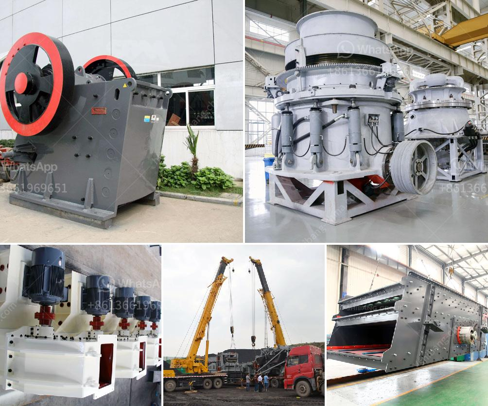

<h3>معدات سحق الجرانيت</h3>
تعد معدات سحق الجرانيت جزءًا أساسيًا في صناعة تحويل الجرانيت إلى مواد مسحوقة أو قشور صغيرة التي يمكن استخدامها في العديد من التطبيقات المختلفة. تتألف هذه المعدات عادةً من الكسارات (الفكية والتصادمية) والمطاحن المختلفة (الكروية والرأسية). الغرض الرئيسي من هذه المعدات هو سحق الجرانيت إلى أحجام مختلفة حسب متطلبات العميل. سنتعرف في هذه المقالة على أهمية وفوائد استخدام معدات سحق الجرانيت.

أولاً وقبل كل شيء، يتطلب استخدام معدات سحق الجرانيت وجود معدات قوية وفعالة من حيث الأداء، لأن الجرانيت هو خام صلب ومتماسك يصعب سحقه. يتم استخدام الكسارات الفكية والتصادمية ذات القدرة العالية على التحمل لهذا الغرض. تعتبر مطاحن الكرة والمطاحن الرأسية ضرورية لطحن الجرانيت إلى حجم أصغر.

ثانيًا، يساهم استخدام معدات سحق الجرانيت في زيادة كفاءة الإنتاج وتحسين جودة المواد النهائية. بفضل قوة المعدات وقدرتها على سحق الجرانيت بسرعة وكفاءة، يمكن للشركات المصنعة تحقيق إنتاجية أعلى. كما أن استخدام معدات الطحن المناسبة يمكن أن يؤدي إلى زيادة الانتاج وتحسين جودة المواد المسحوقة.

ثالثًا، من المهم التأكد من استخدام معدات سحق الجرانيت الآمنة وصديقة للبيئة. يجب أن تلتزم الشركات المصنعة بمعايير السلامة المعترف بها والتشريعات البيئية لضمان سلامة العمال وصحتهم وحماية البيئة. يجب على المعدات أن تكون سهلة الاستخدام وصيانتها وتتضمن إجراءات أمان مناسبة.

في النهاية، يمكن القول إن معدات سحق الجرانيت أداة حاسمة لتحويل الجرانيت إلى منتجات مفيدة وعالية الجودة في صناعة البناء والتشييد. استخدام هذه المعدات يساعد على زيادة الإنتاجية وتحسين جودة المواد النهائية. علاوة على ذلك، يجب أن تكون هذه المعدات آمنة وصديقة للبيئة لضمان سلامة العمال والحفاظ على البيئة الطبيعية.
<h3>Contact us</h3><ul><li><strong>Whatsapp:&nbsp;<a href="https://wa.me/8613661969651">+8613661969651</a></strong></li><li><a href="https://swt.shibang-china.com/?git&amp;zhl&amp;معدات سحق الجرانيت"><strong>Online Service(chat now)</strong></a></li></ul><h3>Related</h3><ul><li><a href='مصانع الفرز للبيع.md'>مصانع الفرز للبيع</a></li><li><a href='آلات تصنيع كتل الجبس في إيطاليا.md'>آلات تصنيع كتل الجبس في إيطاليا</a></li><li><a href='جهات اتصال ووكلاء شاشات الرمل والغرابيل.md'>جهات اتصال ووكلاء شاشات الرمل والغرابيل</a></li><li><a href='مصنع غسل الحجارة الكوارتز.md'>مصنع غسل الحجارة الكوارتز</a></li><li><a href='آلة كسارة لصنع الرمل من الحجر.md'>آلة كسارة لصنع الرمل من الحجر</a></li></ul>