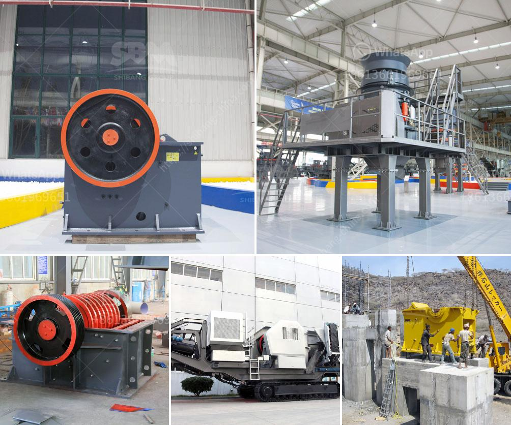

<h3>معدات سحق الصناعات الثقيلة في ماليزيا</h3>
تُعد ماليزيا واحدة من الدول النامية الرائدة في جنوب شرق آسيا، وتتمتع بقطاعات صناعية متنوعة ومزدهرة. وتعد صناعة التعدين واحدة من القطاعات الرئيسية في ماليزيا، حيث يتم استخراج المعادن المختلفة وتجهيزها للاستخدام في العديد من الصناعات المختلفة.

تتطلب صناعات التعدين والبناء معدات سحق ثقيلة وفعالة لتكسير الصخور والمعادن والاحجار الكبيرة إلى قطع صغيرة قابلة للاستخدام. تعرف هذه المعدات بمعدات سحق الصخور وتشمل المطاحن الكسارات الفكية والمطاحن المخروطية والكسارات الصدمية وكسارات المطرقة.

تتميز معدات سحق الصخور الثقيلة في ماليزيا بالجودة العالية والكفاءة العالية. حيث يتم تصنيع هذه المعدات باستخدام أحدث التقنيات والمواد عالية الجودة لضمان الأداء الأمثل والمتانة. كما توفر تقنيات التحكم الحديثة إمكانية التحكم الدقيق في عملية السحق وإنتاجية عالية توفر الكثير من الوقت والجهد.

تأخذ الشركات الماليزية دورًا رائدًا في تصنيع وتوريد معدات سحق الصخور الثقيلة للسوق الماليزي والعالمي. تتميز هذه الشركات بخبرة طويلة في مجال الصناعة وفرق متخصصة في البحث والتطوير لتحسين التصميمات وتلبية احتياجات العملاء المتنوعة.

تعتبر صناعة البناء والتعدين في ماليزيا مجالًا حيويًا ويشهد طلبًا مستمرًا على معدات سحق الصخور الثقيلة. وتستخدم هذه المعدات في عدد من التطبيقات مثل التعدين، والبناء، والطرق، وإعادة التدوير. وبفضل التطورات التكنولوجية المستمرة، فإن هذه المعدات أصبحت أكثر فعالية واقتصادية في استخدام الطاقة وتقليل التلوث البيئي.

وفي الختام، تعد معدات سحق الصناعات الثقيلة في ماليزيا أساسية لصناعة التعدين والبناء. حيث توفر هذه المعدات الكفاءة والمتانة والأداء العالي الذي يحتاجه المستخدمون في هذه الصناعات. ومع استمرار تطور التكنولوجيا والابتكار، من المتوقع أن تتطور هذه المعدات بشكل مستمر لتلبية الاحتياجات المتنوعة للعملاء وللمساهمة في نمو الصناعات الثقيلة في ماليزيا.
<h3>Contact us</h3><ul><li><strong>Whatsapp:&nbsp;<a href="https://wa.me/8613661969651">+8613661969651</a></strong></li><li><a href="https://swt.shibang-china.com/?git&amp;zhl&amp;معدات سحق الصناعات الثقيلة في ماليزيا"><strong>Online Service(chat now)</strong></a></li></ul><h3>Related</h3><ul><li><a href='مصنع تكسير المحاجر الكامل في جنوب أفريقيا.md'>مصنع تكسير المحاجر الكامل في جنوب أفريقيا</a></li><li><a href='آلة تكسير وطحن مناجم الذهب.md'>آلة تكسير وطحن مناجم الذهب</a></li><li><a href='أريد شراء كسارة البوزولان.md'>أريد شراء كسارة البوزولان</a></li><li><a href='طاحونة الكرة الرطبة في الصين.md'>طاحونة الكرة الرطبة في الصين</a></li><li><a href='كسارة للبيع في بيرو.md'>كسارة للبيع في بيرو</a></li></ul>