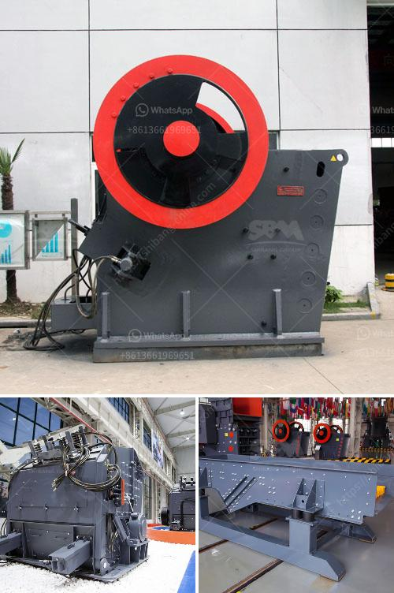

<h3>معدات سحق للإيجار</h3>
يعد قطاع البناء والتشييد والتعدين والتجميع والتحقيق واحدًا من القطاعات التي تتطلب استخدام معدات سحق عالية الجودة وفعالة لتنفيذ المشاريع بنجاح. ولكن ليس لدى جميع الشركات الميزانية الكافية لشراء هذه المعدات بأسعارها العالية. هنا يأتي دور تأجير معدات السحق ، حيث يتاح للشركات استئجار هذه المعدات لاستخدامها في المشاريع المؤقتة.

إن معدات سحق مثل كسارات الفك ، وكسارات الصدم ، وكسارات المخروط ، وغرابيل الاهتزاز ، والمصانع المحمولة وغيرها من المعدات المتخصصة ، تعتبر من العتاد الرئيسي في صناعات البناء والتعدين. يمكن استخدام هذه المعدات لسحق المواد الخام وتخليق مختلف الحصى والركام والحصى ، وفرز المنتجات وتحسين جودتها.

إن استئجار معدات السحق يوفر العديد من المزايا للشركات ، لاسيما الشركات الصغيرة والمتوسطة الحجم. فعند استئجار المعدات ، لا تحتاج الشركة إلى شراء المعدات المكلفة ، وصيانتها ، وتخزينها ، ولا تحتاج إلى التفكير في بيعها عندما تصبح قديمة أو غير صالحة للاستخدام. بالإضافة إلى ذلك ، يمكن للشركة استئجار المعدات التي تلبي المتطلبات الفنية الخاصة بها وفقًا لحجم المشروع واحتياجاتها المحددة.

تؤدي معدات السحق المستأجرة أيضًا إلى زيادة الكفاءة وتقليل التكاليف. فعند استئجار معدات السحق ، تتيح الشركة لنفسها الفرصة للحصول على معدات حديثة ومتطورة توفر أداء أفضل وكفاءة أكبر في العمليات. كما أن الشركة توفر تكاليف الصيانة وقطع الغيار والاستبدال ، التي ممكن أن تكون باهظة في حالة امتلاك المعدات.

ومن المهم أيضًا أن نلاحظ أن استئجار معدات السحق يتيح للشركات المرونة في التعامل مع تغيرات حجم الطلب ونوعية المشروعات. ففي حالة زيادة الحاجة إلى المعدات ، يمكن للشركة طلب مزيد من المعدات المستأجرة بدون تأخير ، وعند الانتهاء من المشروع ، يمكن للشركة إعادة المعدات المستأجرة بدون أي التزامات.

في النهاية ، استئجار معدات السحق هو خيار مثالي للشركات التي تبحث عن تحقيق الكفاءة والاقتصاد في العمليات. يتيح لك استئجار هذه المعدات إمكانية استفادة من أحدث التكنولوجيا والمعدات الحديثة دون الحاجة إلى شراءها ، مما يتيح لك التركيز على العمل وتحقيق أهدافك بنجاح.
<h3>Contact us</h3><ul><li><strong>Whatsapp:&nbsp;<a href="https://wa.me/8613661969651">+8613661969651</a></strong></li><li><a href="https://swt.shibang-china.com/?git&amp;zhl&amp;معدات سحق للإيجار"><strong>Online Service(chat now)</strong></a></li></ul><h3>Related</h3><ul><li><a href='موردين لسحق الصخور في بريتوريا.md'>موردين لسحق الصخور في بريتوريا</a></li><li><a href='أسعار مطحنة الطوابع في الصين.md'>أسعار مطحنة الطوابع في الصين</a></li><li><a href='معدات معالجة مسحوق الجرافيت.md'>معدات معالجة مسحوق الجرافيت</a></li><li><a href='معالجة الذهب بنطاق صغير باستخدام طريقة CIP.md'>معالجة الذهب بنطاق صغير باستخدام طريقة CIP</a></li><li><a href='عملية صنع الكوارتز.md'>عملية صنع الكوارتز</a></li></ul>