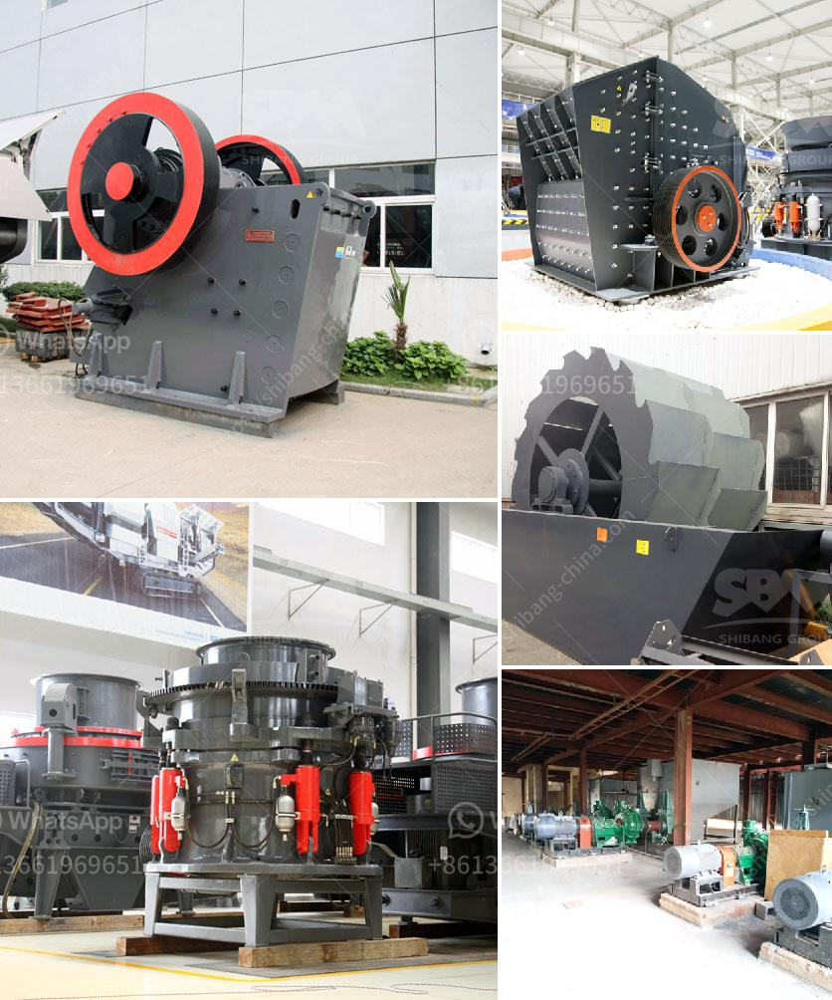

<h3>معدات صنع الحصى</h3>
تُعتبر معدات صنع الحصى من الأدوات الأساسية في صناعة البناء والتشييد، حيث يتم استخدامها في عملية تحويل الصخور الضخمة إلى قطع صغيرة من الحصى المتنوعة في الحجم. تشمل هذه المعدات العديد من الأجهزة والآلات التي تعمل بواسطة الديناميكا والضغط العالي لتكسير الصخور، مما يسهل التعامل معها في مراحل البناء المختلفة.

تتكون مجموعة المعدات المستخدمة في عملية صنع الحصى من الكسارات والغرابيل والمغاسل والناقلات. 

- الكسارات: تعد الكسارات من أهم المعدات في صناعة الحصى، حيث تقوم بتكسير الصخور الكبيرة إلى قطع صغيرة بأحجام مختلفة. توجد عدة أنواع من الكسارات، مثل كسارات الفك وكسارات الصدم وكسارات المخروط، حسب الاحتياجات المحددة لكل مشروع.

- الغرابيل: تُستخدم الغرابيل في الفصل والتصنيف بين حصى مختلف الأحجام، حيث تقوم بفرز الحصى حسب حجمها المطلوب. تتواجد الغرابيل بأحجام وطاقات مختلفة لتتناسب مع متطلبات المشروع الفردي.

- المغاسل: تعد المغاسل جزءًا مهمًا في عملية إنتاج الحصى، إذ تغسل الحصى وتزيل الطين والشوائب عنها. توفر المغاسل نتائج نظيفة وعالية الجودة، وتساهم في تحسين خصائص الحصى قبل استخدامها في المشروع.

- الناقلات: تستخدم الناقلات لنقل الحصى المكسور إلى المواقع المطلوبة، حيث تُعد وسيلة سهلة وفعالة لنقل الكميات الكبيرة من الحصى في فترة زمنية قصيرة.

يُشير لاستخدام معدات صنع الحصى إلى العديد من المزايا، حيث تسهل عملية إنتاج الحصى وتوفر كفاءة عالية ووقتًا أقل. تعمل هذه المعدات على تقليل تكلفة العمالة وتزيد من الإنتاجية لمشروعات البناء. علاوة على ذلك، يمكن تصميم وتخصيص المعدات وفقًا لاحتياجات المشروع والخصائص المطلوبة للحصى.

باختصار، تعتبر معدات صنع الحصى أدوات حاسمة في صناعة البناء والتشييد. توفر هذه المعدات أداءً عاليًا ونتائج موثوقة في إنتاج الحصى بأحجام متنوعة وجودة عالية. استخدام هذه المعدات يعزز الكفاءة والإنتاجية ويقلل التكاليف العمالية، مما يسهم في تنفيذ مشاريع البناء بنجاح وفي وقت أقل.
<h3>Contact us</h3><ul><li><strong>Whatsapp:&nbsp;<a href="https://wa.me/8613661969651">+8613661969651</a></strong></li><li><a href="https://swt.shibang-china.com/?git&amp;zhl&amp;معدات صنع الحصى"><strong>Online Service(chat now)</strong></a></li></ul><h3>Related</h3><ul><li><a href='كسارة الفك المحمولة في غرب أفريقيا تجار.md'>كسارة الفك المحمولة في غرب أفريقيا تجار</a></li><li><a href='مصنع الكرة.md'>مصنع الكرة</a></li><li><a href='آلة مطحنة الكرة في الصين.md'>آلة مطحنة الكرة في الصين</a></li><li><a href='غسيل الرمال الصغيرة.md'>غسيل الرمال الصغيرة</a></li><li><a href='كسارات للإيجار في سينسيناتي.md'>كسارات للإيجار في سينسيناتي</a></li></ul>