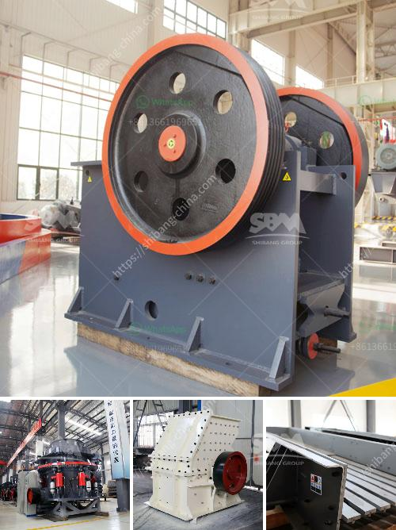

<h3>معدات صنع مسحوق كربونات الكالسيوم في ألمانيا</h3>
تعتبر معدات صنع مسحوق كربونات الكالسيوم من أهم الصناعات في ألمانيا. تستخدم هذه المعدات لتحويل الحجر الجيري إلى مسحوق كربونات الكالسيوم، وهو المكون الرئيسي في صناعة الأسمنت والطلاءات والدهانات والمواد البلاستيكية.

تعد ألمانيا واحدة من أكبر منتجي الكربونات الكالسيوم في العالم. تمتلك العديد من الشركات الألمانية مصانع تصنيع متقدمة تستخدم أحدث التقنيات في هذا المجال. تعتمد عملية صنع مسحوق كربونات الكالسيوم على سحق الحجر الجيري الخالي من الملوثات وتخميره وتجفيفه بعناية.

تتضمن المعدات المستخدمة في صناعة كربونات الكالسيوم آلات السحق والطحن والتصنيف. يتم سحق الحجر الجيري الخام في آلة سحق قوية للحصول على حبيبات صغيرة. ثم يتم طحن الحبيبات المسحوقة في مطحنة للحصول على حبيبات دقيقة جدًا. يتم تصنيف المسحوق المتحصل عليه بواسطة آلة تصنيف حسب حجم الجسيمات.

تعتبر ألمانيا رائدة في توفير تقنيات الطحن المتقدمة. تعتمد الشركات الألمانية على استخدام مطاحن عالية الدقة وفواصل ذات جودة عالية للحصول على مسحوق كربونات الكالسيوم ذو جودة عالية وموحدة.

بالإضافة إلى ذلك، تسعى الشركات الألمانية الرائدة في صناعة معدات صنع مسحوق كربونات الكالسيوم لتطوير حلول صديقة للبيئة. يتم تحسين عمليات التصنيع لتقليل انبعاثات الغازات الضارة واستهلاك الطاقة. تعكس هذه الجهود التزام ألمانيا بالتنمية المستدامة والحفاظ على البيئة.

في الختام، تعد معدات صنع مسحوق كربونات الكالسيوم في ألمانيا جزءًا أساسيًا من الصناعة التحويلية في البلاد. تحظى الشركات الألمانية بسمعة عالية في هذا المجال بفضل تكنولوجيا صناعية متطورة ومنتجات ذات جودة عالية. تواصل ألمانيا الابتكار والتطوير في هذا القطاع للمساهمة في احتياجات السوق العالمية لكربونات الكالسيوم.
<h3>Contact us</h3><ul><li><strong>Whatsapp:&nbsp;<a href="https://wa.me/8613661969651">+8613661969651</a></strong></li><li><a href="https://swt.shibang-china.com/?git&amp;zhl&amp;معدات صنع مسحوق كربونات الكالسيوم في ألمانيا"><strong>Online Service(chat now)</strong></a></li></ul><h3>Related</h3><ul><li><a href='آلة كسارة الحجر 250 400.md'>آلة كسارة الحجر 250 400</a></li><li><a href='سعر كسارة الحصى في رانشي.md'>سعر كسارة الحصى في رانشي</a></li><li><a href='كسارة حجر مستعملة في أونتاريو.md'>كسارة حجر مستعملة في أونتاريو</a></li><li><a href='معدات تأثير المحجر.md'>معدات تأثير المحجر</a></li><li><a href='مصنع معالجة الصخور.md'>مصنع معالجة الصخور</a></li></ul>