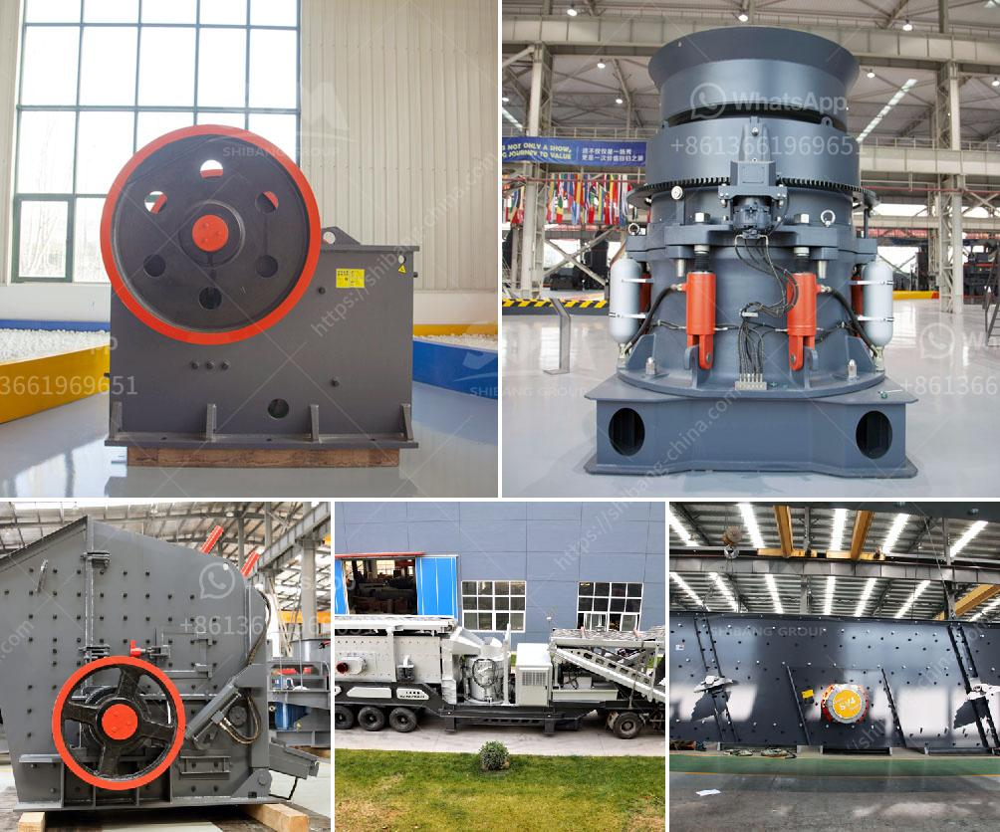

<h3>معدات طحن الباريت</h3>
تعد معدات طحن الباريت أحد المعدات الأساسية لصناعة معالجة المعادن. يتكون الباريت من كبريتات الباريوم ويعتبر مصدرا مهما للشركات المصنعة للحديد والصلب والزجاج. تستخدم معدات طحن الباريت لسحق الباريت إلى قطع صغيرة يمكن استخدامها في العمليات التصنيعية المختلفة.

تتكون معدات طحن الباريت عادةً من آلة طحن رئيسية وناقل تغذية ونظام تهوية. يتم استخدام الآلة الرئيسية لسحق الباريت بشكل أساسي، حيث يتم تجهيزها بطحانة عالية الكفاءة تعمل بالطاقة الكهربائية. تتميز الطحانة بقدرتها على ضبط حجم الجسيمات وفقا لمتطلبات المستخدم. تستخدم الطحانة أيضًا نظامًا متقدمًا للتحكم في درجة الحرارة والرطوبة للحفاظ على أداء الآلة وجودة الإنتاج.

نظام التغذية هو مسؤول عن نقل الباريت إلى الطحانة بشكل متواصل ومنتظم. فإنه يحافظ على تدفق المواد ويضبط سرعة التغذية للتأكد من عدم حدوث تجمع أو توقف في العملية. بالإضافة إلى ذلك، يحتوي نظام التغذية على مناخل لفصل المواد الغريبة أو الكبيرة قبل أن تدخل الطحانة.

أما نظام التهوية فإنه يتحكم في تدفق الهواء داخل الطحانة ويزيل الشوائب والرواسب المتراكمة. يعمل النظام على تهوية الطحانة ومناطق السحق الأخرى لتأمين تشتيت الجسيمات المطحونة وتجريدها من أي شوائب يمكن أن تؤثر على جودة الإنتاج.

لا يمكن الإغفال أيضًا للأجزاء الأخرى المهمة في معدات طحن الباريت مثل الشاشات والفواصل المغناطيسية. تستخدم الشاشات لفصل الجسيمات المطحونة وفقًا لحجمها، بينما تستخدم الفواصل المغناطيسية لإزالة الشوائب المغناطيسية من المنتج النهائي.

باختصار، تلعب معدات طحن الباريت دوراً محورياً في صناعة معالجة المعادن. تساهم في تحسين جودة المنتج النهائي وتعزز كفاءة العمليات التصنيعية. تتكون هذه المعدات من آلة طحن رئيسية ونظام تغذية ونظام تهوية وأجزاء أخرى مهمة مثل الشاشات والفواصل المغناطيسية. تعتبر دقة وكفاءة هذه المعدات مؤشراً على تحقيق النجاح والاستدامة في صناعة معالجة المعادن.
<h3>Contact us</h3><ul><li><strong>Whatsapp:&nbsp;<a href="https://wa.me/8613661969651">+8613661969651</a></strong></li><li><a href="https://swt.shibang-china.com/?git&amp;zhl&amp;معدات طحن الباريت"><strong>Online Service(chat now)</strong></a></li></ul><h3>Related</h3><ul><li><a href='سعر آلة صنع الرمل الاصطناعي.md'>سعر آلة صنع الرمل الاصطناعي</a></li><li><a href='كسارة الخرسانة المستعملة للبيع.md'>كسارة الخرسانة المستعملة للبيع</a></li><li><a href='خطة عمل محجر الجرانيت.md'>خطة عمل محجر الجرانيت</a></li><li><a href='مطحنة ريموند 4 أسطوانات.md'>مطحنة ريموند 4 أسطوانات</a></li><li><a href='مصنع الإسمنت بسعة 100 طن في الهند.md'>مصنع الإسمنت بسعة 100 طن في الهند</a></li></ul>