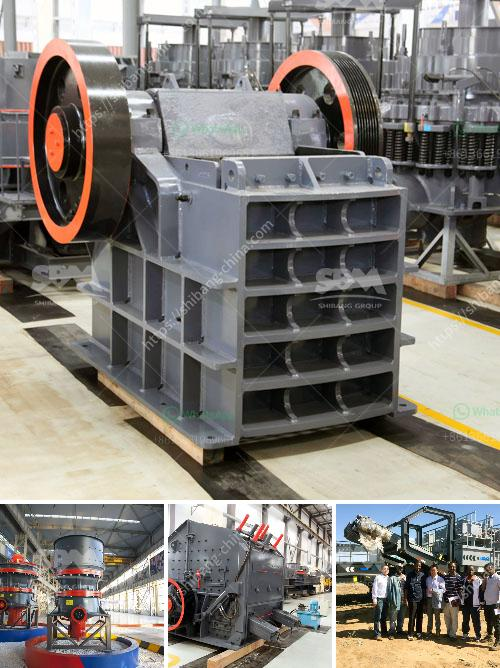

<h3>معدات طحن الرماد الخشن</h3>
يُعتبر طحن الرماد الخشن من المعدات الهامة في مجال الصناعة والإنتاج. يتم استخدام هذه المعدات لطحن الرماد الخام إلى حجم صغير يمكن استخدامه في العديد من التطبيقات الصناعية.

يتم استخدام الرماد الخشن بشكل رئيسي في صناعة البناء والإنشاءات. فهو يستخدم في إنتاج الخرسانة والأسمنت، حيث يعمل كملء للفراغات بين الركام ويحسن من قوة الخرسانة واستقرارها. يعتبر الرماد الخشن بديلاً مستدامًا للرمال التقليدية، مما يساهم في تقليل استهلاك الموارد الطبيعية وتقليل النفايات.

تعتبر معدات طحن الرماد الخشن من أهم المعدات المستخدمة في صناعة طحن الرماد. تتكون هذه المعدات عادةً من طاحونة أو مطحنة، حيث يتم وضع الرماد الخشن في هذه المعدات ويتم طحنه حتى يتم الحصول على حجم المطلوب.

تعمل هذه المعدات عن طريق تقديم الرماد الخام إلى مجموعة من الأسطوانات أو الأسطوانات الدوارة. يتم دفع الرماد الخام بين هذه الأسطوانات، حيث يتم ضغطه وطحنه بفعل قوات الضغط والاحتكاك. تتمثل الميزة الرئيسية لهذه المعدات في قدرتها على تحويل الرماد الخشن إلى جسيمات صغيرة ومتجانسة، مما يجعلها أكثر ملاءمة للاستخدام في الصناعة.

تأتي معدات طحن الرماد الخشن بأحجام مختلفة وقدرات مختلفة، حيث يمكن اختيار المعدات المناسبة وفقًا لاحتياجات الإنتاج ومتطلبات الجودة. يجب أيضًا مراعاة العوامل الأخرى مثل التكلفة والكفاءة وصيانة المعدات.

في الختام، تعد معدات طحن الرماد الخشن أداة هامة في صناعة طحن الرماد. تساهم في تحويل الرماد الخشن إلى جسيمات صغيرة ومتجانسة، مما يجعلها ملائمة للاستخدام في صناعة البناء والإنشاءات. يجب على الشركات الاهتمام بالاختيار الصحيح للمعدات وصيانتها للحصول على أفضل النتائج وتحقيق الكفاءة العالية.
<h3>Contact us</h3><ul><li><strong>Whatsapp:&nbsp;<a href="https://wa.me/8613661969651">+8613661969651</a></strong></li><li><a href="https://swt.shibang-china.com/?git&amp;zhl&amp;معدات طحن الرماد الخشن"><strong>Online Service(chat now)</strong></a></li></ul><h3>Related</h3><ul><li><a href='سعر كسارة الفك في نيجيريا.md'>سعر كسارة الفك في نيجيريا</a></li><li><a href='سعر كسارة الحجر المحمول في باكستان.md'>سعر كسارة الحجر المحمول في باكستان</a></li><li><a href='مصانع فحص الركام.md'>مصانع فحص الركام</a></li><li><a href='آلة تصنيع مسحوق الميكا.md'>آلة تصنيع مسحوق الميكا</a></li><li><a href='رسم تخطيطي لعملية إنتاج الأسمنت.md'>رسم تخطيطي لعملية إنتاج الأسمنت</a></li></ul>