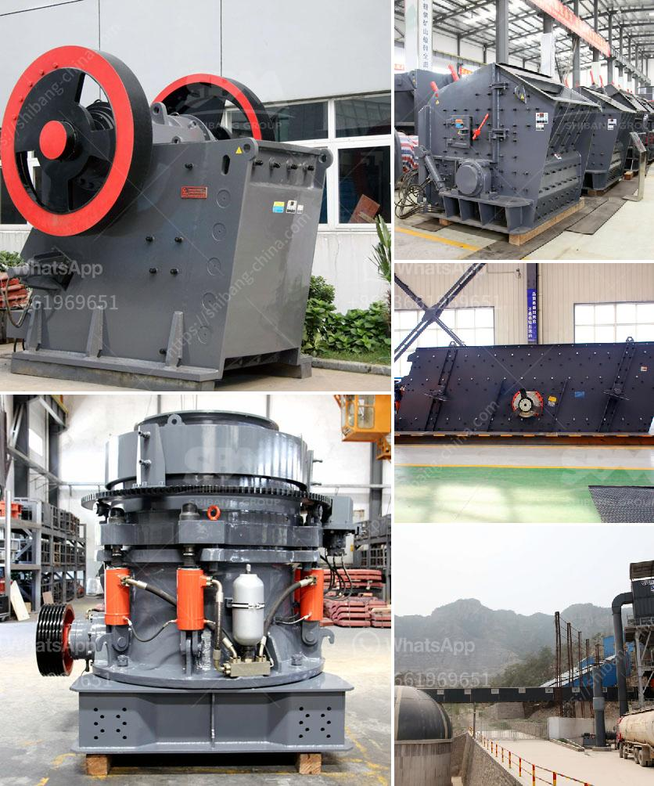

<h3>معدات طحن الكلنكر لسعة ٥٠٠ طن يومياً</h3>
تلعب معدات طحن الكلنكر دورًا حيويًا في صناعة الأسمنت. وتهدف هذه المعدات إلى طحن الكلنكر، وهو المكون الرئيسي في صناعة الأسمنت، للحصول على مسحوق ناعم يستخدم في إنتاج الأسمنت. ويتم تحسين الكفاءة وجمع الكلنكر لإنتاج أفضل جودة للأسمنت.

إن معدات طحن الكلنكر ذات سعة ٥٠٠ طن يوميًا تتكون عادةً من عدة مكونات رئيسية. يشمل ذلك الكسارات الأولية التي تستخدم لسحق الكلنكر الخام وتقسيمه إلى قطع صغيرة قبل دخولها إلى المعدات الطحن الأخرى. يتم ضبط حجم التغذية المناسب للكسارات الأولية لضمان حجم الجسيمات المثالي للطحن اللاحق.

تتضمن المعدات الأخرى المستخدمة في عمليات طحن الكلنكر المطاحن الأفقية، والتي تستخدم لطحن الكلنكر الخام إلى مسحوق ناعم بمساعدة الاسطوانة الطحن والكرات الصلب. وتحتوي على نظام تحكم دقيق لضمان حجم الجسيمات المطلوبة وتوحيد الجودة.

كما تتضمن المعدات أيضًا الفاصلة الدوارة، وهي تستخدم لفصل الجسيمات الناعمة من الجسيمات الأكبر بعد عملية الطحن. وتثبت الفاصلة الدوارة الناجحة أهميتها في ضمان توحيد الجودة وتحسين الكفاءة في إنتاج الأسمنت.

عملية طحن الكلنكر تتطلب أيضًا النقل المتكامل، وذلك لضمان تدفق الكلنكر بين معدات الطحن دون انقطاع. يتم استخدام المجاري الناقلة لنقل الكلنكر من مكان إلى آخر بسهولة وسرعة.

أخيراً، يجب أن يتم التحكم في عملية الطحن بواسطة نظام تحكم متقدم. يتم استخدام الحواسيب والبرمجيات لضبط تشغيل المعدات ورصد العمليات الحيوية. يمكن ضبط معلمات العمل حسب الحاجة وتنفيذ التغييرات بدقة لتحقيق أعلى جودة للأسمنت.

باختصار، تلعب معدات طحن الكلنكر دورًا حاسمًا في صناعة الأسمنت. وتتضمن هذه المعدات العديد من المكونات الرئيسية التي تعمل معًا لطحن الكلنكر وتجهيزه لإنتاج الأسمنت. وتكون الطاقة والسعة والدقة أمورًا حاسمة لتحسين النتائج وضمان توحيد الجودة في عملية الإنتاج.
<h3>Contact us</h3><ul><li><strong>Whatsapp:&nbsp;<a href="https://wa.me/8613661969651">+8613661969651</a></strong></li><li><a href="https://swt.shibang-china.com/?git&amp;zhl&amp;معدات طحن الكلنكر لسعة ٥٠٠ طن يومياً"><strong>Online Service(chat now)</strong></a></li></ul><h3>Related</h3><ul><li><a href='معدات التعدين في جنوب أفريقيا.md'>معدات التعدين في جنوب أفريقيا</a></li><li><a href='سعر مطحنة الحجر في المغرب.md'>سعر مطحنة الحجر في المغرب</a></li><li><a href='آلات وتجهيزات تسمين الجير.md'>آلات وتجهيزات تسمين الجير</a></li><li><a href='مصنع جفاف الفحم في الهند.md'>مصنع جفاف الفحم في الهند</a></li><li><a href='مصنع كسارة الحصى بالقرب من مانيلا.md'>مصنع كسارة الحصى بالقرب من مانيلا</a></li></ul>