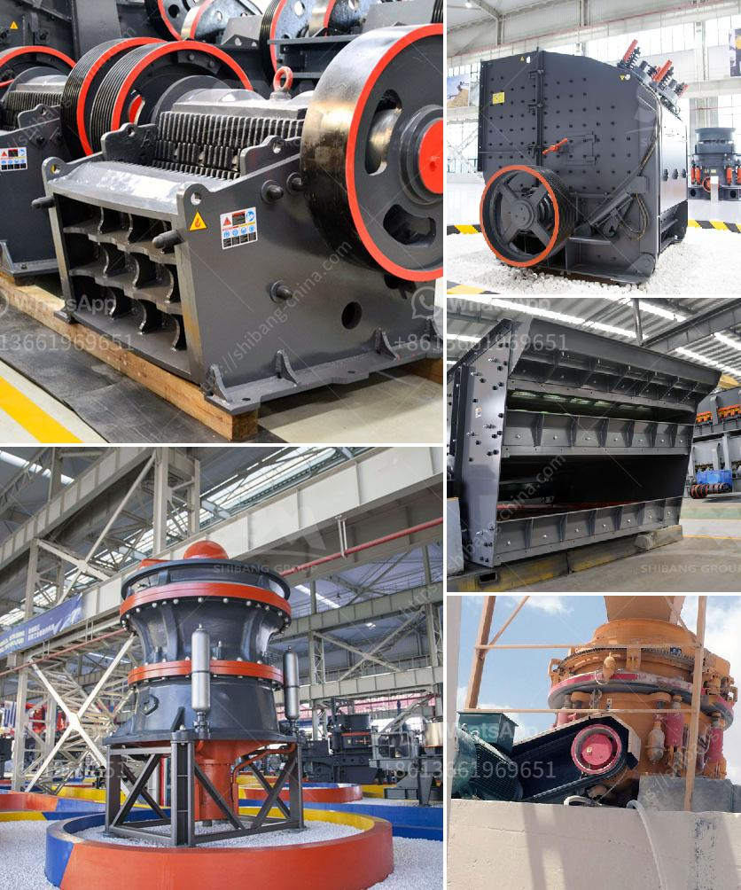

<h3>معدات طحن صناعية وأسعار معدات الطحن</h3>
يتعدد استخدام معدات الطحن الصناعية في العديد من الصناعات المختلفة مثل صناعة الأغذية والمشروبات، وصناعة البلاستيك، وصناعة الأسمدة، حيث تلعب دورًا حاسمًا في عمليات التحبيب والتقطيع والطحن. من خلال هذه المعدات، يتم تحويل المواد الخام إلى مساحيق وجسيمات صغيرة قابلة للتداول والاستخدام في العمليات الإنتاجية الأخرى.

تتكون معدات الطحن الصناعية من مجموعة متنوعة من الآلات التي تتفاوت في حجمها وقدرتها على الطحن. تشمل هذه الآلات الطواحين، والكسارات، والفرازات الهوائية، والخلاطات، والمناخل وغيرها. تختلف أسعار هذه المعدات بناءً على الحجم والنوع والمواصفات التقنية المرغوبة من العميل.

في حالة الطحن الدقيق والمتقدم، تستخدم الكسارات والمطاحن المستمرة لتحويل المواد الخام إلى مساحيق فائقة النعومة. تتراوح أسعار هذه المعدات في العادة بين 200 إلى 400 ألف دولار، حيث تعتبر معدات طحن الفحم والأسمنت مثالًا على ذلك. ومن جهة أخرى، يتراوح سعر مطحنة الكرة الأسطوانية البسيطة بين 20 إلى 30 ألف دولار.

قد يتساءل البعض عن الأسباب التي تؤدي إلى هذه التفاوت في الأسعار. تعتمد الأسعار على العوامل التالية:

1- المواصفات التقنية المطلوبة: تختلف المعدات في الحجم والطاقة وجودة المواد المستخدمة في البناء، مما يؤثر على سعرها.

2- قدرة الإنتاج: يرتبط سعر المعدات أيضًا بالكمية المطلوبة من الإنتاج.

3- التكنولوجيا المستخدمة: تعتمد بعض المعدات على تقنيات وأفكار حديثة مبتكرة، مما يجعلها أعلى في السعر.

بشكل عام، يجب أن يتم تذكر أن تكلفة معدات الطحن الصناعية تعتبر استثمارًا في إنتاجية وكفاءة مصنعك أو منشأتك، حيث تساهم في تحسين أداء العمليات وزيادة الإنتاجية. لذا، يجب على الشركات الاهتمام بالجودة والتقنية المناسبة لمتطلبات الانتاج وعدم الاكتفاء بالسعر فقط. يفضل الاستشارة مع خبراء صناعة التجهيزات الصناعية لاختيار المعدات المناسبة والتحقق من سمعة الشركة المصنعة قبل القرار النهائي.

لذا، يجب التأكد من حصولك على اقتباسات مفصلة ومقارنة الأسعار والاحتياجات المطلوبة قبل اتخاذ أي قرار. استثمار الوقت والجهد في اختيار معدات الطحن الصناعية الصحيحة يعتبر أمراً حاسماً لتحقيق النجاح والتفوق في السوق الصناعي.
<h3>Contact us</h3><ul><li><strong>Whatsapp:&nbsp;<a href="https://wa.me/8613661969651">+8613661969651</a></strong></li><li><a href="https://swt.shibang-china.com/?git&amp;zhl&amp;معدات طحن صناعية وأسعار معدات الطحن"><strong>Online Service(chat now)</strong></a></li></ul><h3>Related</h3><ul><li><a href='خطة التحكم في تصنيع مطحنة الكرة.md'>خطة التحكم في تصنيع مطحنة الكرة</a></li><li><a href='سعر كسارة الحجر.md'>سعر كسارة الحجر</a></li><li><a href='مورد مصنع التكسير والفرز في الصين.md'>مورد مصنع التكسير والفرز في الصين</a></li><li><a href='مطحنة الكرة مطرقة مطحنة مطحنة أسطوانية آلة.md'>مطحنة الكرة مطرقة مطحنة مطحنة أسطوانية آلة</a></li><li><a href='رسم توضيحي لآلة الطحن.md'>رسم توضيحي لآلة الطحن</a></li></ul>