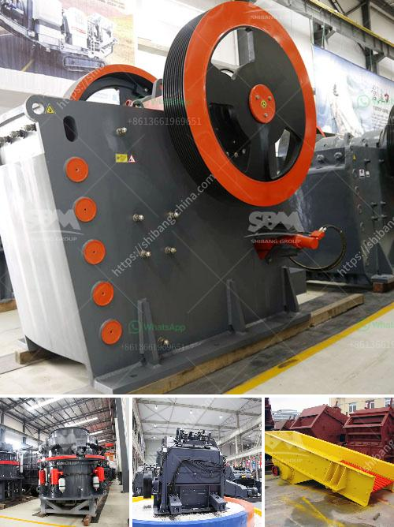

<h3>معدات طحن في أستراليا</h3>
تعرف أستراليا بكونها واحدة من أكبر البلدان في العالم من حيث الإنتاج الزراعي والتعديني. تعتبر صناعة الطحن واحدة من الصناعات الحيوية في البلاد، حيث تلعب دورًا هامًا في تحويل المحاصيل الزراعية والحبوب إلى منتجات ذات قيمة مضافة.

تعتبر المعدات الحديثة والفعالة مهمة لعمليات الطحن في أستراليا. تستخدم العديد من الشركات المتخصصة في الطحن معدات متطورة لتحقيق النتائج المرجوة وضمان جودة المنتجات.

من بين المعدات الأكثر استخدامًا في صناعة الطحن في أستراليا هي مطاحن الحبوب والمطاحن الدقيقة. تعتبر المطاحن الحبوب المستخدمة في أستراليا أحدث التقنيات وتتميز بالدقة والسرعة في الطحن. تعتمد هذه المطاحن على تكنولوجيا المسح والفرز البصري لتحقيق أقصى درجات الدقة وإزالة الشوائب بما في ذلك الحجارة والمعادن.

تُستخدم المطاحن الدقيقة في أستراليا لإنتاج الدقيق ذو الجودة العالية التي تستخدم في العديد من المنتجات الغذائية مثل الخبز والبسكويت والمعجنات. تعمل هذه المطاحن بطرق متقدمة تشمل الطحن البطيء والتبريد بالهواء وعمليات التجزئة الميكانيكية للحصول على حجم الجسيمات المطلوب.

مع زيادة الطلب على المنتجات العضوية والطبيعية، باتت المطاحن في أستراليا تستخدم المعدات الحديثة لطحن المنتجات العضوية ومنتجات البهارات والتوابل. تستخدم هذه العمليات مزيجًا من التجفيف والطحن للحفاظ على جودة المواد العضوية والحصول على نكهة مميزة.

إن استخدام المعدات المتطورة في صناعة الطحن يسهم في زيادة الإنتاجية وتحسين جودة المنتجات. كما تساهم في تقليل تكاليف الإنتاج وتوفير العمالة وتحسين الكفاءة العامة لعمليات الطحن. بفضل هذه المعدات الحديثة، استطاعت أستراليا أن تستدامة مكانتها كواحدة من أكبر البلدان المُصدِّرة للمنتجات الزراعية والمحاصيل الزراعية.

في الختام، تلعب المعدات الحديثة والفعالة في صناعة الطحن في أستراليا دورًا حاسمًا في تحويل المحاصيل الزراعية إلى منتجات قيمة مضافة. بفضل تقنيات الطحن المتقدمة والمعدات الحديثة، يمكن للشركات الاستفادة من العديد من الفرص الاقتصادية وتلبية احتياجات السوق المتزايدة في الداخل والخارج.
<h3>Contact us</h3><ul><li><strong>Whatsapp:&nbsp;<a href="https://wa.me/8613661969651">+8613661969651</a></strong></li><li><a href="https://swt.shibang-china.com/?git&amp;zhl&amp;معدات طحن في أستراليا"><strong>Online Service(chat now)</strong></a></li></ul><h3>Related</h3><ul><li><a href='سعر كسارة حجر البازلت.md'>سعر كسارة حجر البازلت</a></li><li><a href='سعة مطحنة الكرة 10 تف في ماليزيا.md'>سعة مطحنة الكرة 10 تف في ماليزيا</a></li><li><a href='كسارات متنقلة مجنزرة.md'>كسارات متنقلة مجنزرة</a></li><li><a href='تاجر آلة طحن في بنجلاديش.md'>تاجر آلة طحن في بنجلاديش</a></li><li><a href='معدات معالجة الحجر الكاملة محطم 100 طن.md'>معدات معالجة الحجر الكاملة محطم 100 طن</a></li></ul>