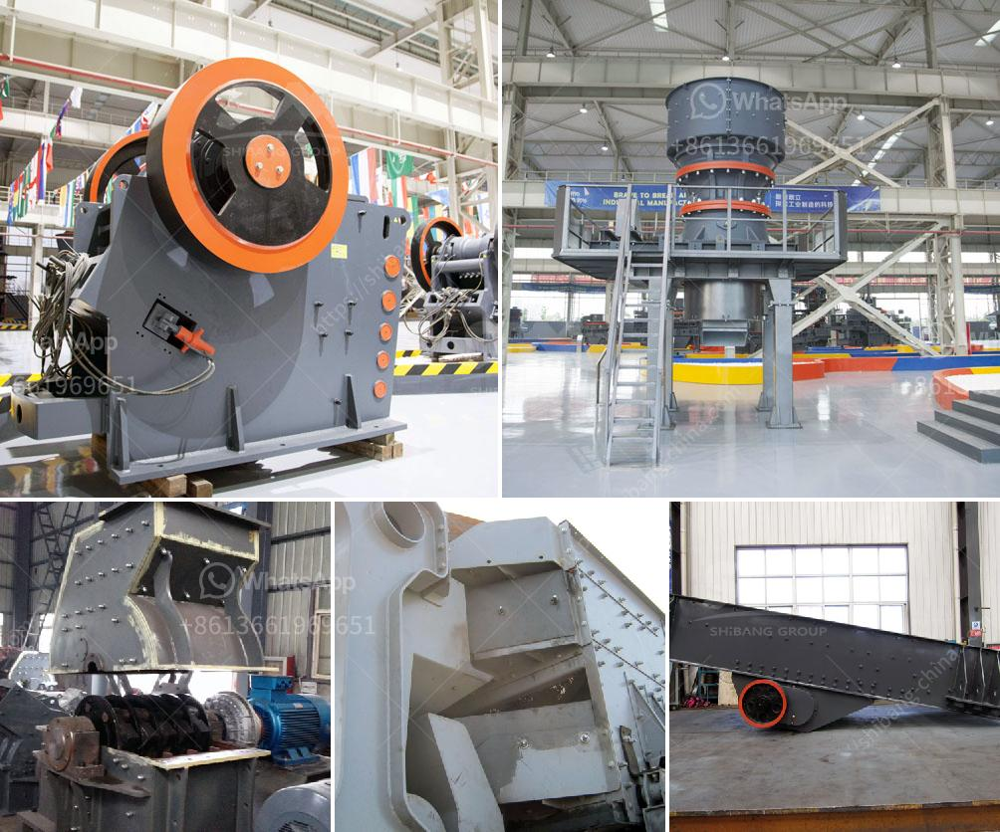

<h3>معدات طحن لمسحوق التلك</h3>
تستخدم معدات الطحن لإنتاج مسحوق التلك، وهي صناعة أساسية في عدة قطاعات مثل صناعة الورق والبلاستيك ومستحضرات التجميل. يعتبر التلك مادة معدنية طبيعية تتألف من مجموعة متنوعة من المعادن مثل السيليكا والألمنيوم والماغنسيوم والحديد.

تستخدم معدات الطحن لتحويل الحجارة الخشنة من التلك إلى حبيبات دقيقة جدًا. وتتكون هذه المعدات عادةً من آلة طحن رئيسية تعمل عن طريق الضغط والتصادم والقص، وتتميز بأداء قوي وفعالية عالية في الطحن. كما تتطلب هذه المعدات تقنيات متقدمة وتصاميم محسنة لتحسين كفاءة الطحن وتحقيق التوازن الدقيق بين الإنتاجية وجودة المنتج النهائي.

تعتمد معدات الطحن لمسحوق التلك على مبدأ السحق والغربلة. حيث يتم سحق الحجارة الخشنة بواسطة الآلة الرئيسية ويتم تجهيزها للطحن النهائي. ومن ثم يتم تمرير المواد المجروشة بواسطة غربال للحصول على حبيبات مسحوق تلك مطلوبة. تختلف نسبة السحق والغربلة وفقًا لغاية الاستخدام المطلوبة للتلك، فقد يكون الطلب على جسيمات ناعمة أو خشنة.

تتنوع معدات الطحن لمسحوق التلك وفقًا لإمكانيات الإنتاج والتقنيات المستخدمة. تتضمن بعض الأمثلة الشائعة لمعدات الطحن لمسحوق التلك الكسارات الفكية والطواحين العمودية والمطاحن الكروية ومطاحن MTM ومطاحن MTW وغيرها. تعتمد اختيار المعدات على عدة عوامل مثل حجم الإنتاج المطلوب ونوعية التلك ومستوى التكنولوجيا المتاحة.

بصفة عامة، تعتبر معدات الطحن لمسحوق التلك ضرورية لصناعات متعددة وتلبي احتياجات السوق المتزايدة. فهي تساهم في تعزيز جودة المنتج وتقديمه للعملاء بأفضل حالاته. وتحظى هذه الصناعة بتطور مستمر، حيث يتم تطوير معدات الطحن باستمرار لتلبية احتياجات العملاء المتغيرة وتطلعاتهم.
<h3>Contact us</h3><ul><li><strong>Whatsapp:&nbsp;<a href="https://wa.me/8613661969651">+8613661969651</a></strong></li><li><a href="https://swt.shibang-china.com/?git&amp;zhl&amp;معدات طحن لمسحوق التلك"><strong>Online Service(chat now)</strong></a></li></ul><h3>Related</h3><ul><li><a href='شركة تصنيع لوحات الجبس في سنغافورة.md'>شركة تصنيع لوحات الجبس في سنغافورة</a></li><li><a href='سعر مركز تركيز خام النحاس.md'>سعر مركز تركيز خام النحاس</a></li><li><a href='تقليل حجم مطحنة المطرقة.md'>تقليل حجم مطحنة المطرقة</a></li><li><a href='كسارة الفك sp 60x100.md'>كسارة الفك sp 60x100</a></li><li><a href='مطحنة الأسطوانة في نيجيريا.md'>مطحنة الأسطوانة في نيجيريا</a></li></ul>