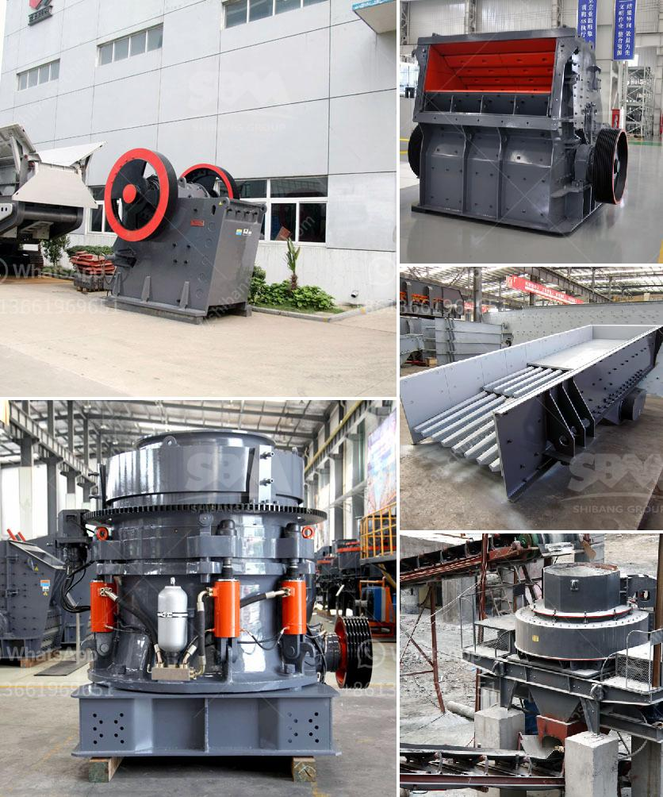

<h3>معدات طحن مستعملة في أوروبا</h3>
تعتبر معدات الطحن المستعملة في أوروبا من العناصر ذات الأهمية الكبيرة في صناعة التصنيع والتجهيزات الغذائية. يتم استخدام هذه المعدات لطحن المكونات الأساسية مثل الحبوب والقمح والذرة والشعير والأرز، وتعتبر من العوامل الأساسية في صناعة الأغذية.

يعود طلب المعدات المستعملة في صناعة الطحن في أوروبا إلى العديد من العوامل المؤثرة، مثل الانتعاش الاقتصادي، والتوجه نحو الاستدامة البيئية، وتنامي حجم صناعة الطعام والمشروبات في المنطقة.

توفر العديد من الشركات في أوروبا معدات طحن مستعملة عالية الجودة والتي تتوافق مع المعايير الدولية. يتم فحص وصيانة المعدات بعناية لضمان أدائها المؤهل في مكان العمل. في العديد من الأحيان، يكون سعر المعدات المستعملة أرخص بكثير من المعدات الجديدة، مما يتيح للشركات توفير التكاليف والحصول على قيمة أعلى على استثمارها.

مع مرور الوقت، تطورت تقنيات وأساليب الطحن، وظهرت معدات طحن مبتكرة. في الوقت نفسه، يتم تطبيق تكنولوجيا حديثة في توفير المعدات المستعملة التي تتمتع بالأداء الممتاز وتلبي احتياجات الشركات المصنعة.

لا يقتصر استخدام هذه المعدات في صناعة الأغذية فحسب، بل يمكن استخدامها أيضاً في مجموعة متنوعة من الصناعات الأخرى مثل تصنيع المواد الكيميائية ومواد البناء وصناعة اللاسلكي. يمكن استخدام المعدات المستعملة في المصانع الصغيرة والمصانع الكبيرة على حد سواء، مما يعزز توفير الوقت والجهد والمال في عملية الإنتاج.

باختصار، المعدات المستعملة للطحن في أوروبا تعتبر خيارًا مثاليًا للشركات التي ترغب في تحسين إنتاجيتها وتحقيق التكلفة المناسبة. إن توافر معدات طحن ذات جودة عالية وبأسعار معقولة يدعم الشركات في تحقيق رؤيتها وتحقيق النجاح في صناعتها. إذا كنت تبحث عن معدات الطحن المستعملة، فإن أوروبا تقدم مجموعة واسعة من الخيارات التي يُمكن أن تلبي احتياجاتك بكفاءة وكفاءة عالية.
<h3>Contact us</h3><ul><li><strong>Whatsapp:&nbsp;<a href="https://wa.me/8613661969651">+8613661969651</a></strong></li><li><a href="https://swt.shibang-china.com/?git&amp;zhl&amp;معدات طحن مستعملة في أوروبا"><strong>Online Service(chat now)</strong></a></li></ul><h3>Related</h3><ul><li><a href='معدات تعدين كاملة في أكرا، غانا.md'>معدات تعدين كاملة في أكرا، غانا</a></li><li><a href='معدات تعدين مستخدمة.md'>معدات تعدين مستخدمة</a></li><li><a href='محطات غسيل الذهب المحمولة.md'>محطات غسيل الذهب المحمولة</a></li><li><a href='كيف يعمل مطحنة الهامر.md'>كيف يعمل مطحنة الهامر</a></li><li><a href='عملية تشكيل الأسمنت.md'>عملية تشكيل الأسمنت</a></li></ul>