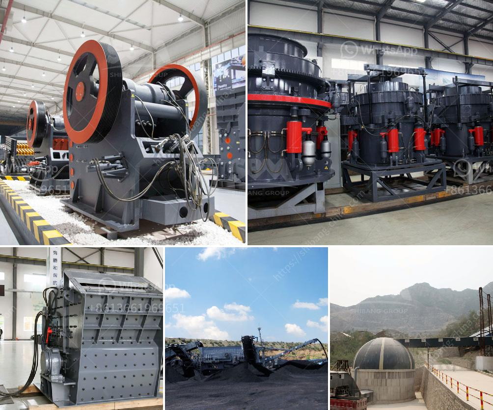

<h3>معدات طحن مسحوق المطحنة</h3>
تعتبر معدات طحن مسحوق المطحنة من الأدوات الأساسية في صناعة التحبيب والتجهيز الصناعي. تستخدم هذه المعدات لطحن المواد الخام إلى جسيمات صغيرة جدًا مع درجة نعومة محددة. وهناك عدة أنواع من المطاحن المتاحة في السوق، مثل المطاحن الكروية والمطاحن الدقيقة والمطاحن الرأسية.

تعمل المطاحن الكروية عن طريق وجود جسم كروي يدور داخل الجهاز، حيث يتم طحن المواد بفعل قوة الطرد المركزي المتولدة خلال الدوران. تستخدم هذه المطاحن عادة لطحن المواد الخام الأكبر حجماً، وتعمل بكفاءة عالية وتنتج مسحوقًا ناعمًا.

أما المطاحن الدقيقة، فهي تستخدم لطحن المواد ذات الصلابة العالية، مثل الفحم والجبس والزجاج. تتميز هذه المطاحن بتقنية الطحن الدقيقة بواسطة نظام الشفرات الدوارة، حيث يتم سحق المواد ضمن فتحات صغيرة وتتحول إلى مسحوق ناعم.

أما المطاحن الرأسية، فهي معدات طحن تستخدم في صناعة الأسمنت والطين. تعمل هذه المطاحن عن طريق أسطوانة عمودية تدور بفعل التيار الهوائي أو الضغط الهيدروليكي. تتميز هذه المطاحن بكفاءة عالية ودقة في الطحن، وتنتج مسحوقًا ناعمًا بدرجة نعومة محددة.

تستخدم معدات طحن مسحوق المطحنة في عدة صناعات، مثل صناعة الأغذية والصناعات الكيماوية وصناعة الدهانات والأسمنت. إن استخدام هذه المعدات يزيد من كفاءة الإنتاج ويحسن من جودة المنتج النهائي. كما تتيح هذه المعدات للشركات تحقيق توفير في التكاليف وتحقيق أهداف الإنتاج بشكل أكثر كفاءة.

بشكل عام، فإن معدات طحن مسحوق المطحنة تلعب دورًا حيويًا في صناعة التحبيب وتجهيز المواد الصناعية. تساعد في تحويل المواد الخام إلى مسحوق ناعم بدرجة نعومة محددة، مما يسهم في تحسين العملية الإنتاجية وزيادة الكفاءة. بالإضافة إلى ذلك، فإن استخدام هذه المعدات يساعد في تحسين جودة المنتج النهائي وتحقيق التوفير في التكاليف.
<h3>Contact us</h3><ul><li><strong>Whatsapp:&nbsp;<a href="https://wa.me/8613661969651">+8613661969651</a></strong></li><li><a href="https://swt.shibang-china.com/?git&amp;zhl&amp;معدات طحن مسحوق المطحنة"><strong>Online Service(chat now)</strong></a></li></ul><h3>Related</h3><ul><li><a href='المعدات المطلوبة لإنشاء محجر الجرانيت.md'>المعدات المطلوبة لإنشاء محجر الجرانيت</a></li><li><a href='عمليات مصنع كسارة الصخور.md'>عمليات مصنع كسارة الصخور</a></li><li><a href='كسارات حجر محمولة أوغندا للبيع.md'>كسارات حجر محمولة أوغندا للبيع</a></li><li><a href='آلات كسارة الحجر في ماليزيا.md'>آلات كسارة الحجر في ماليزيا</a></li><li><a href='شراء كسارة الحجر sbm في الفلبين.md'>شراء كسارة الحجر sbm في الفلبين</a></li></ul>