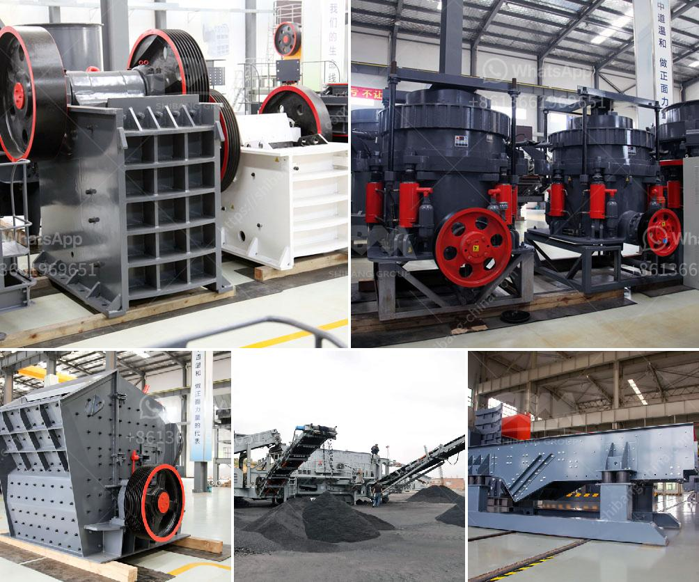

<h3>معدات طحن مطحنة ريموند</h3>
مطحنة ريموند هي واحدة من أشهر وأكثر المعدات استخداماً في صناعة الطحن. تعتبر هذه المطحنة جزءًا هامًا من معدات الطحن الصناعية التي تستخدم لطحن مجموعة متنوعة من المواد الغير قابلة للاشتعال وغير القابلة للتفجير، مثل الفحم والمعادن والمواد الكيميائية والمواد البناء والمواد الغذائية والكاولين والبنتونيت والحجر الجيري والمورتير والغث والزركون وغيرها.

تتميز مطحنة ريموند بالعديد من الخصائص الفريدة والمميزة التي تميزها عن غيرها من مطاحن الطحن. من أبرز هذه الخصائص:

1. كفاءة عالية: تتميز مطحنة ريموند بكفاءة عالية في عملية الطحن. يتم طحن المواد بشكل متساوٍ ومنتظم، مما يضمن الحصول على منتج نهائي عالي الجودة وذو حجم حبيبات متناسق.

2. سهولة الاستخدام: تتميز مطحنة ريموند بسهولة الاستخدام والتشغيل. يمكن ضبط حجم الطحن وسرعة الدوران بسهولة، مما يتيح للمشغل تحقيق النتائج المطلوبة.

3. متعددة الاستخدامات: تعتبر مطحنة ريموند متعددة الاستخدامات، حيث يمكن استخدامها لطحن مجموعة واسعة من المواد. يعني ذلك أنه يمكن استخدامها في العديد من الصناعات المختلفة ولمجموعة متنوعة من التطبيقات.

4. نظام التحكم الدقيق: تتميز مطحنة ريموند بنظام تحكم دقيق يسمح للمشغل بضبط معلمات عملية الطحن بدقة. يمكن ضبط درجة الطحن وحجم الحبيبات وسرعة الدوران بدقة عالية، مما يتيح للمشغل التحكم الكامل في عملية الطحن.

من المهم أن نلاحظ أن مطحنة ريموند تعتبر معدة آمنة وموثوقة، حيث تتوافق مع معايير السلامة الصناعية والبيئية. كما أنها تعتبر مؤثرة من حيث الطاقة، حيث تستخدم كمية أقل من الطاقة عند عملية الطحن مقارنة ببعض المعدات الأخرى.

باختصار، تعتبر مطحنة ريموند معدة فعالة وموثوقة لعملية الطحن في العديد من الصناعات المختلفة. تمتاز بسهولة الاستخدام والتشغيل والتحكم الدقيق، مما يجعلها الاختيار الأمثل للعديد من الشركات التي تحتاج إلى عملية طحن ذات كفاءة عالية.
<h3>Contact us</h3><ul><li><strong>Whatsapp:&nbsp;<a href="https://wa.me/8613661969651">+8613661969651</a></strong></li><li><a href="https://swt.shibang-china.com/?git&amp;zhl&amp;معدات طحن مطحنة ريموند"><strong>Online Service(chat now)</strong></a></li></ul><h3>Related</h3><ul><li><a href='كسارة الفك المحمولة في ماليزيا.md'>كسارة الفك المحمولة في ماليزيا</a></li><li><a href='مطحنة طحن دقيقة للبيع.md'>مطحنة طحن دقيقة للبيع</a></li><li><a href='مصنع كسارة حجر محمول في تركيا.md'>مصنع كسارة حجر محمول في تركيا</a></li><li><a href='استخدام مسحوق الجبس في البناء.md'>استخدام مسحوق الجبس في البناء</a></li><li><a href='مصانع الإسمنت للبيع في باكستان.md'>مصانع الإسمنت للبيع في باكستان</a></li></ul>