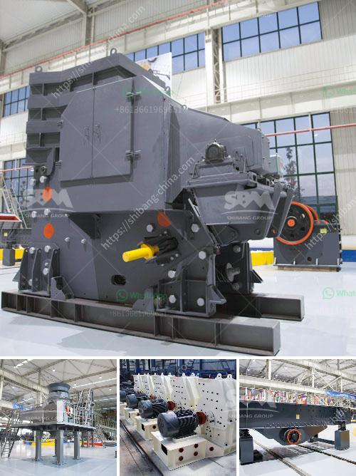

<h3>معدات غسيل الباريت</h3>
يعتبر الباريت من المعادن المهمة في صناعة النفط والغاز والتعدين. وتوجد العديد من المناجم حول العالم التي تستخرج الباريت للاستفادة منه في العمليات الصناعية المختلفة. ومن أجل الاستفادة القصوى من الباريت، يتم تنقية وغسيل المعدن قبل استخدامه في العمليات الصناعية. ويستخدم في ذلك معدات غسيل الباريت المتطورة.

تعتبر معدات غسيل الباريت ضرورية لتنقية المعدن والتخلص من الشوائب المختلفة التي قد تكون موجودة في الباريت المستخرج. ومن بين المعدات الأساسية المستخدمة في عملية غسيل الباريت هي شاشة الاهتزاز والفاصل المغناطيسي وآلة الفاصل الهوائي.

- شاشة الاهتزاز: تستخدم شاشة الاهتزاز لفصل المجموعات المختلفة من الجسيمات الموجودة في الباريت المستخرج. يتم نقل الباريت خلال الشاشة بواسطة اهتزاز فائق السرعة، مما يسمح بتحسين فعالية عملية الفصل والتنقية.

- الفاصل المغناطيسي: يهدف الفاصل المغناطيسي إلى إزالة الشوائب المغناطيسية من الباريت المستخرج. يعمل الجهاز عن طريق إنشاء حقل مغناطيسي قوي يجذب الشوائب المغناطيسية ويفصلها عن الباريت النقي.

- آلة الفاصل الهوائي: تستخدم آلة الفاصل الهوائي لفصل الشوائب الخفيفة والأخف من الباريت المستخرج. يتم القيام بذلك بواسطة توليد تيار هوائي قوي يمكنه طرد الجسيمات الخفيفة من الباريت الثقيل.

بجمع هذه المعدات المختلفة معًا، يمكن تنقية الباريت وفصله عن الشوائب بشكل فعال. ويتوجب على الشركات المعدنية وغيرها الاستثمار في هذه المعدات لضمان حصولها على باريت نقي وذو جودة عالية. وباستخدام معدات غسيل الباريت المتطورة، يمكن الحصول على فوائد اقتصادية كبيرة من خلال تحسين عملية الإنتاج وتقليل تكاليف التعدين وتقديم المواد الخام ذات الجودة العالية لصناعة النفط والغاز والتعدين.

باختصار، معدات غسيل الباريت أمر لا غنى عنه لتنقية وتحسين جودة المعدن قبل استخدامه في العمليات الصناعية المختلفة. يجب على الشركات الاستثمار في هذه المعدات المتطورة لتحقيق أقصى استفادة من الباريت والحفاظ على جودة المنتج النهائي.
<h3>Contact us</h3><ul><li><strong>Whatsapp:&nbsp;<a href="https://wa.me/8613661969651">+8613661969651</a></strong></li><li><a href="https://swt.shibang-china.com/?git&amp;zhl&amp;معدات غسيل الباريت"><strong>Online Service(chat now)</strong></a></li></ul><h3>Related</h3><ul><li><a href='سعر كسارة الصخور.md'>سعر كسارة الصخور</a></li><li><a href='كسارة حجرية للبيع.md'>كسارة حجرية للبيع</a></li><li><a href='كسارة الفك للبيع في جنوب أفريقيا.md'>كسارة الفك للبيع في جنوب أفريقيا</a></li><li><a href='سعر مطحنة الكسارة سعر الحجر.md'>سعر مطحنة الكسارة سعر الحجر</a></li><li><a href='مطحنة كرات مخروطية للبيع.md'>مطحنة كرات مخروطية للبيع</a></li></ul>