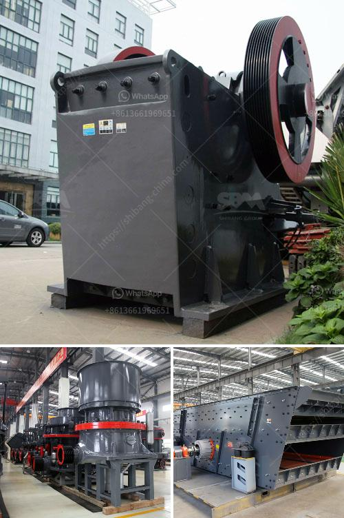

<h3>معدات غسيل الذهب في غانا</h3>
تعتبر معدات غسيل الذهب في غانا من أهم الأدوات التي يستخدمها عاملو التنقيب عن الذهب في هذا البلد الأفريقي. يعود التاريخ الطويل لإنتاج الذهب في غانا إلى فترة ما قبل الاستعمار، حيث كانت الألغام الصغيرة والمتوسطة تقدم فرص عيش للعديد من السكان.

تعتبر معدات غسيل الذهب في غانا من العوامل الرئيسية في تعزيز دور التعدين الصغير والمتوسط في الاقتصاد الغاني. وتشمل هذه المعدات غرابيل لفصل الصخور والرمل، وطاولات تهز لفصل الذهب عن المواد الأخرى، ومضخات نقل المياه، ومولدات الديزل لتزويد الطاقة اللازمة للآلات. بالإضافة إلى ذلك، يستخدم العاملون في قطاع التعدين الصغير والمتوسط أجهزة الكترونية متقدمة للتنقيب عن الذهب تعمل بتقنيات الجيوفيزياء والجيوكيمياء.

تعتبر معدات غسيل الذهب في غانا ضرورية لتحقيق كفاءة أعلى في إنتاج الذهب، حيث تسمح بفصل الذهب عن الصخور والرمال المحمولة بالمياه. تعاني عمليات الغسيل اليدوي من نسبة انخفاض في استخلاص الذهب، وبالتالي يمكن أن تؤدي إلى هدر العديد من الموارد والوقت. لذلك، فإن استخدام معدات غسيل الذهب يساعد على زيادة معدلات الاستخلاص وبالتالي زيادة الإنتاجية والأرباح.

ومع ذلك، يجب الإشارة إلى أن استخدام هذه المعدات مرتبط بالعديد من التحديات والمشكلات البيئية والاقتصادية والاجتماعية. فمعظم عمال التنقيب عن الذهب في غانا هم عمال غير مؤهلين وذوو دخل منخفض، وهم يعانون غالبًا من ظروف عمل قاسية وعلى نطاق صغير. بالإضافة إلى ذلك، يجب التركيز على ممارسات التنقيب غير المنظمة التي تؤثر على البيئة وتسهم في تدهور الموارد الطبيعية مثل الغابات والنهر.

من أجل حماية العمال والبيئة، وتعزيز استدامة قطاع التعدين الصغير والمتوسط في غانا، يجب توفير التدريب المهني والتعليم البيئي للعمال وتعزيز الوعي بممارسات التشغيل الجيدة. يجب أيضًا تشجيع العمل على تطوير تكنولوجيا التنقيب الجديدة والمستدامة التي تحقق استخلاصًا أعلى للذهب مع الحد الأدنى من التأثير على البيئة.

باختصار، تعتبر معدات غسيل الذهب في غانا أدوات حيوية لعمليات التعدين الصغير والمتوسط في هذا البلد. ومع ذلك، يجب أن تذهب جهودنا أيضًا في تعزيز ممارسات التشغيل الجيدة والاستدامة لضمان حماية العمال والبيئة وتحقيق مزيد من التقدم الاقتصادي لقطاع التعدين في غانا.
<h3>Contact us</h3><ul><li><strong>Whatsapp:&nbsp;<a href="https://wa.me/8613661969651">+8613661969651</a></strong></li><li><a href="https://swt.shibang-china.com/?git&amp;zhl&amp;معدات غسيل الذهب في غانا"><strong>Online Service(chat now)</strong></a></li></ul><h3>Related</h3><ul><li><a href='مطحنة الكرة للذهب في إندونيسيا.md'>مطحنة الكرة للذهب في إندونيسيا</a></li><li><a href='كسارة محمولة كليمان.md'>كسارة محمولة كليمان.</a></li><li><a href='سعر كسارة مخروطية هيدروليكية.md'>سعر كسارة مخروطية هيدروليكية</a></li><li><a href='كسارة صغيرة متنقلة للحصى.md'>كسارة صغيرة متنقلة للحصى</a></li><li><a href='تكلفة مصنع كسارة الحجر الجيري.md'>تكلفة مصنع كسارة الحجر الجيري</a></li></ul>