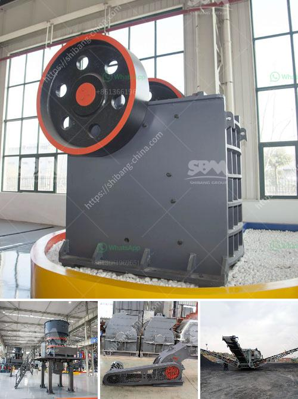

<h3>معدات غسيل الذهب</h3>
تعتبر معدات غسيل الذهب أدوات حاسمة في عملية استخراج الذهب من خاماته. تستخدم هذه المعدات لفصل الشوائب والرواسب عن الذهب وتحويله إلى صورة نقية قابلة للتصنيع. بعض المعدات الشائعة المستخدمة في غسل الذهب تشمل الكسارات والوحات الجاذبة والشفاطات وجداول تشتت الغرينية.

في البداية، يتم استخدام الكسارات لكسر الصخور الكبيرة التي تحتوي على الذهب. يتم إضافة الماء إلى الكسارات لتكون صخور مبللة، مما يسهل غسل الذهب الموجود فيها. ثم، يتم نقل المادة إلى الوحات الجاذبة.

تقوم الوحات الجاذبة بفصل الذهب عن الصخور والشوائب الأخرى من خلال خصائصها الكيميائية المميزة. يُضاف مزيج من الماء والمواد الكيميائية إلى الوحات الجاذبة، وعندها يقوم الذهب بالالتصاق بالوحات في حين يتم استبعاد الشوائب الأخرى.

بعد تنظيف الذهب بواسطة الوحات الجاذبة، يتم نقله إلى الشفاطات. تقوم الشفاطات بالاستفادة من خاصية الطفو للذهب لجمعه في القاع السفلي للشفاطة. عندما تمتلئ الشفاطة بكمية كافية من الذهب، يتم إزالته لتجهيزه للمرحلة التالية.

المرحلة النهائية في عملية غسيل الذهب هي استخدام جداول تشتت الغرينية. تعتبر هذه الجداول أكثر معدات الغسيل تطوراً ودقة، حيث يتم تفتيت قطع الذهب إلى جسيمات صغيرة جداً. ثم، يتم وضع الجسيمات الصغيرة على الجدول الشبكي الذي يهتز بتردد محدد لفصل الذهب من الشوائب.

تعد معدات غسيل الذهب من العناصر الرئيسية التي تساهم في عملية استخلاص الذهب بكفاءة عالية. بواسطة تلك المعدات، يتم تغليف الذهب بالسبائك العبوة التي لا تضمن فقط تنقية الذهب من الرواسب والشوائب، ولكن أيضاً زيادة إنتاجية العملية. إن استخدام معدات غسيل الذهب المتطورة يلعب دورًا حاسمًا في تحسين كفاءة صناعة التعدين وزيادة الناتج.
<h3>Contact us</h3><ul><li><strong>Whatsapp:&nbsp;<a href="https://wa.me/8613661969651">+8613661969651</a></strong></li><li><a href="https://swt.shibang-china.com/?git&amp;zhl&amp;معدات غسيل الذهب"><strong>Online Service(chat now)</strong></a></li></ul><h3>Related</h3><ul><li><a href='مصانع غسيل الفحم المستخدمة للبيع في الهند.md'>مصانع غسيل الفحم المستخدمة للبيع في الهند</a></li><li><a href='إعداد مصفاة الكروم.md'>إعداد مصفاة الكروم</a></li><li><a href='سعر مصنع كربونات الكالسيوم.md'>سعر مصنع كربونات الكالسيوم</a></li><li><a href='قائمة أسعار كسارة الجرانيت.md'>قائمة أسعار كسارة الجرانيت</a></li><li><a href='آلة معالجة خام المنغنيز بسعر.md'>آلة معالجة خام المنغنيز بسعر</a></li></ul>