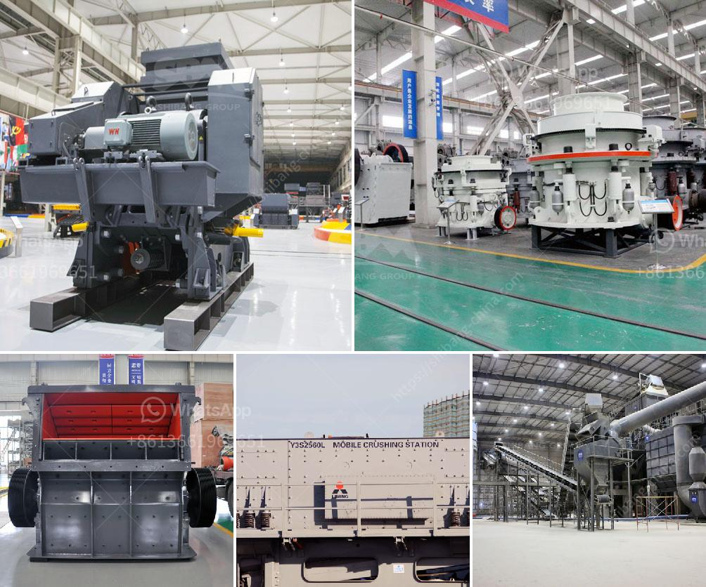

<h3>معدات فاصل المغناطيس للبيع</h3>
إن معدات فاصل المغناطيس للبيع هي أدوات فعالة تستخدم في عمليات فصل المواد المغناطيسية عن المواد غير المغناطيسية. تستخدم هذه المعدات في العديد من الصناعات مثل التعدين والمعادن ومعالجة النفايات والصناعات الغذائية والكيماوية، حيث يتم استخدامها لفصل المواد المغناطيسية من المواد الأخرى.

تتكون معدات فاصل المغناطيس من جهاز قابل للتعديل وقابل للتدوير يتم تركيبه على شكل قضيب أو شريط، ويحتوي على مغناطيس قوي يستخدم لجذب المواد المغناطيسية. تعتمد فاعلية هذه المعدات على قوة المغناطيس وقابلية التعديل وقوة الجاذبية التي يمكن أن يتم ضبطها لتناسب الاحتياجات المحددة لكل سلسلة من المواد.

يمكن العثور على معدات فاصل المغناطيس للبيع بتكلفة تتراوح بين 200 و 400 دولار، وتعتمد التكلفة الفعلية على الحجم والمواصفات المحددة للمعدات المطلوبة. تتوفر هذه المعدات بأحجام وأشكال مختلفة لتناسب احتياجات العميل وتتوفر في العديد من الشركات المصنعة في السوق.

يعتبر فاصل المغناطيس أداة هامة في عمليات الإنتاج والتصنيع، حيث يسمح بفصل وتنقية المواد المغناطيسية بكفاءة وسهولة. يعمل هذا الجهاز عن طريق توليد شدة مغناطيسية عالية ويتم وضعها بالقرب من المخلفات أو المواد المراد فصلها. عند تشغيل الجهاز، يجذب المغناطيس المواد المغناطيسية ويفصلها عن المواد غير المغناطيسية المحيطة بها.

تعتبر معدات فاصل المغناطيس مثالية للعديد من التطبيقات، بما في ذلك تنقية المعادن المغناطيسية مثل الحديد والنحاس والزنك والألمنيوم، وفصل المواد البلاستيكية المغناطيسية من النفايات الصلبة، وإزالة الشوائب المغناطيسية من المواد الغذائية مثل الأرز والسكر.

باختيار معدات فاصل المغناطيس المناسبة، يمكن للشركات تحسين كفاءة إنتاجها وتحسين جودة المنتج النهائي. كما أن استخدام هذه المعدات يساهم في حماية البيئة عن طريق تقليل التلوث وإعادة التدوير الفعال للمواد القابلة للفصل.

باختصار، تُعد معدات فاصل المغناطيس للبيع أدوات فعالة في صناعات متعددة. يتم استخدامها لفصل المواد المغناطيسية عن المواد الغير مغناطيسية. تتوفر هذه المعدات بأشكال وأحجام مختلفة وبتكلفة تتراوح بين 200 و 400 دولار، ويُمكن استخدامها في العديد من التطبيقات مثل التعدين والمعادن ومعالجة النفايات والصناعات الغذائية والكيماوية.
<h3>Contact us</h3><ul><li><strong>Whatsapp:&nbsp;<a href="https://wa.me/8613661969651">+8613661969651</a></strong></li><li><a href="https://swt.shibang-china.com/?git&amp;zhl&amp;معدات فاصل المغناطيس للبيع"><strong>Online Service(chat now)</strong></a></li></ul><h3>Related</h3><ul><li><a href='الحجر الجيري المستخدم لصنع الزجاج.md'>الحجر الجيري المستخدم لصنع الزجاج</a></li><li><a href='مطحنة ليستر في كينيا.md'>مطحنة ليستر في كينيا</a></li><li><a href='التكلفة الرأسمالية لمصنع تحسين خام الكروم.md'>التكلفة الرأسمالية لمصنع تحسين خام الكروم</a></li><li><a href='جهاز كسر الصخور في جنوب أفريقيا.md'>جهاز كسر الصخور في جنوب أفريقيا</a></li><li><a href='كسارات الفك بسعة 120 طن في الساعة.md'>كسارات الفك بسعة 120 طن في الساعة</a></li></ul>