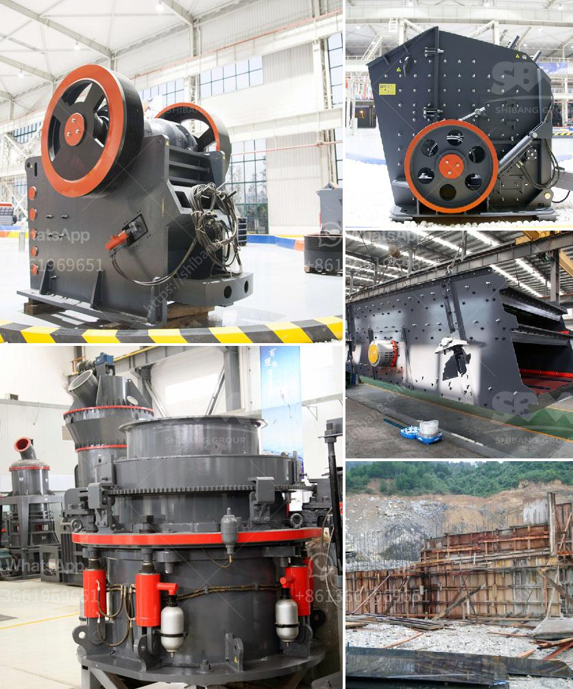

<h3>معدات فحص الرمال للبيع في جنوب أفريقيا</h3>
تعتبر جنوب أفريقيا من أهم الدول المنتجة للرمال في العالم، حيث تمتلك البلاد موارد طبيعية كبيرة من الرمال النقية التي تستخدم في العديد من الصناعات مثل صناعة الزجاج والبناء. ومن أجل استخراج وفحص هذه الرمال بشكل صحيح وفعال، يتم استخدام معدات فحص الرمال. هذه المعدات تساهم في تصفية وتنقية الرمال وفصل الشوائب عنها بطريقة سريعة ودقيقة، مما يجعلها جاهزة للاستخدام في الصناعات المختلفة.

تتوفر معدات فحص الرمال للبيع في جنوب أفريقيا بمختلف الأحجام والقدرات والمواصفات، مما يسمح للشركات والمصانع بالاختيار المناسب لاحتياجاتهم. تشمل هذه المعدات المناخل والغرابيل وأجهزة الفصل الذي تستخدم لفصل الشوائب الكبيرة والصغيرة عن الرمال. وتعد المناخل الاهتزازية واحدة من أكثر المعدات استخداماً في صناعة فحص الرمال. تتميز هذه المناخل بتصميمها البسيط والفعال وقدرتها على فحص الرمال بدقة وفعالية عالية.

بالإضافة إلى ذلك، تحتوي معدات فحص الرمال على أنظمة سلامة متقدمة تضمن عدم تلوث الرمال بالشوائب أو النفايات الضارة. ومن الممكن تشغيل هذه المعدات بشكل آلي أو يدوي، حسب الاحتياجات والمتطلبات. تعتبر هذه المعدات سهلة الصيانة والتشغيل، بحيث يمكن للشركات الحصول على النتائج المرجوة بشكل سريع وفعال.

فيما يتعلق بالأسعار، فإن المعدات المستخدمة في فحص الرمال للبيع تتراوح بين 200 و 400 دولار، وقد تتفاوت الأسعار بناءً على الحجم والقدرات والمواصفات المطلوبة. لذا، ينبغي للشركات والمصانع اختيار المعدات التي تتناسب مع احتياجاتهم وتوقعاتهم بناءً على الميزانية المتاحة.

في النهاية، تعد معدات فحص الرمال للبيع في جنوب أفريقيا أداة أساسية لاستخراج وتنقية الرمال بشكل صحيح وفعال. توفر هذه المعدات فحصًا دقيقًا وسريعًا للرمال، مما يسهم في تحسين جودة المنتج النهائي وتوفير العملية الإنتاجية وتقليل الهدر. إذا كنت تبحث عن معدات فحص الرمال لاستخدامها في عملك، فإن جنوب أفريقيا هي وجهة مناسبة للحصول على معدات عالية الجودة التي تناسب احتياجاتك وميزانيتك.
<h3>Contact us</h3><ul><li><strong>Whatsapp:&nbsp;<a href="https://wa.me/8613661969651">+8613661969651</a></strong></li><li><a href="https://swt.shibang-china.com/?git&amp;zhl&amp;معدات فحص الرمال للبيع في جنوب أفريقيا"><strong>Online Service(chat now)</strong></a></li></ul><h3>Related</h3><ul><li><a href='إجراء إنتاج الأسمنت في المطحنة العمودية.md'>إجراء إنتاج الأسمنت في المطحنة العمودية</a></li><li><a href='مصنع تكسير الجرانيت 200 طن في الساعة للبيع.md'>مصنع تكسير الجرانيت 200 طن في الساعة للبيع</a></li><li><a href='ميزات كسارة الفك.md'>ميزات كسارة الفك</a></li><li><a href='شركة تصنيع آلة طحن لمسحوق ٣٠٠ شبكة.md'>شركة تصنيع آلة طحن لمسحوق ٣٠٠ شبكة</a></li><li><a href='نموذج 2D لمطحنة الكرة.md'>نموذج 2D لمطحنة الكرة</a></li></ul>